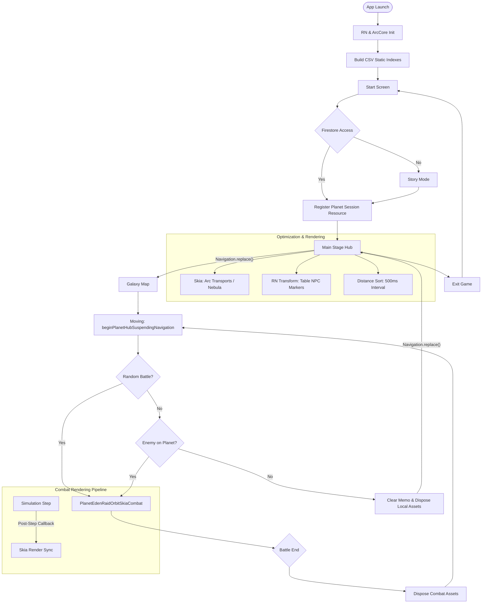

# 🎮 Arcfire Online — 통합 게임 플로우 문서

> **Version**: v2026.05  
> **Stack**: React Native + Skia + Firestore  
> **원칙**: Table-First · Session-Based Memory · Hybrid Rendering

---

## 목차

1. [앱 초기화 및 부트스트랩](#1-앱-초기화-및-부트스트랩)
2. [사용자 인증 및 세션 활성화](#2-사용자-인증-및-세션-활성화)
3. [메인 스테이지 허브](#3-메인-스테이지-허브)
4. [게임플레이 루프: 출격 및 전투](#4-게임플레이-루프-출격-및-전투)
5. [Mermaid 플로우차트](#5-mermaid-플로우차트)
6. [기술 명세](#6-기술-명세)

---

## 1. 앱 초기화 및 부트스트랩

**단계 순서**

| 순서 | 단계 | 설명 |
|------|------|------|
| 1 | **앱 실행** | 어플리케이션 엔진 가동 |
| 2 | **기술 초기화** | React Native 환경 및 Skia 엔진, 네이티브 모듈 초기화 |
| 3 | **테이블 데이터 인덱싱** ⭐ | CSV(함선, 무기, NPC) 데이터를 읽어 `Map` 구조의 핫 패스(`O(1)`) 캐시 빌드 |
| 4 | **시작 화면** | 메인 타이틀 화면 진입 |

> ⭐ **Table-First 원칙**: 앱 시작 시점에 모든 정적 테이블 데이터를 인덱싱하여 런타임 검색 비용을 `O(1)`로 고정한다.

---

## 2. 사용자 인증 및 세션 활성화

### 2-1. 계정 확인 분기

```
Firestore 접속 → arcfire_player_v1 프로필 조회
       │
       ├─ [신규 유저] → 스토리 모드 재생 → 닉네임 생성 → 초기 데이터 생성
       │
       └─ [기존 유저] → 프로필 로드 → ship.equipSlots 장착 정보 로드
```

### 2-2. 행성 세션 등록 ⭐

- **호출 시점**: 메인 스테이지 진입 **직전**
- **호출 함수**: `registerPlanetSessionResource()`
- **역할**: 현재 행성에 필요한 메모리 자원 할당 및 렌더링 준비 완료 처리

---

## 3. 메인 스테이지 허브

> ArcCore와 UI 레이어가 결합된 고성능 허브

### 3-1. 렌더링 파이프라인

| 레이어 | 담당 역할 | 기술 |
|--------|-----------|------|
| **Skia Layer** | 대량 아크 수송선 / 성운(Nebula) 효과 | `@shopify/react-native-skia` |
| **RN Layer** | 테이블 기반 NPC 마커(Captain 마크 등) 애니메이션 | `Animated.transform` |

### 3-2. 허브 기능

| 기능 | 설명 | 비고 |
|------|------|------|
| **스캔** | 주변 정보 거리순 정렬 확인 | 500ms 주기 최적화 |
| **선술집 / 조선소 / 무역소** | 행성 내부 시설 이용 | `PLANET_MAIN_BOTTOM_FEATURE_RESERVE_PX` 레이아웃 규칙 적용 |
| **종료** | 세션 자원 `dispose` 후 시작 화면 복귀 | 메모리 누수 방지 |

---

## 4. 게임플레이 루프: 출격 및 전투

### 4-1. 출격 (Departure)

```javascript
// 스택을 비우며 은하계 지도로 전환 (뒤로가기 방지)
Navigation.replace() → Galaxy Map
```

### 4-2. 이동 (In-Transit)

```javascript
// 이동 시뮬레이션 시작
beginPlanetHubSuspendingNavigation()
```

### 4-3. 전투 파이프라인 (Combat Pipeline)

```
전투 발생
    │
    ▼
PlanetEdenRaidOrbitSkiaCombat  ← 단일 렌더러
    │
    ├─ Simulation Step
    │       │ postStepRef 콜백 (구독)
    │       ▼
    └─ Skia Render Sync  ← 물리-프레임 완벽 동기화
```

**시각 규칙**

- 미사일 명중 시 탄두 **즉시 제거** (`!m.hitApplied`)
- 궤적(trail)만 잔상으로 유지

### 4-4. 복귀 및 정리 (Cleanup)

```javascript
// 전투 또는 이동 종료 후
dispose()                    // 세션 자원 해제
Navigation.replace()         // 메인 스테이지 복귀 (메모리 누수 원천 차단)
```

---

## 5. Mermaid 플로우차트



---

## 6. 기술 명세

### 6-1. 메모리 관리 (Memory Management)

| 항목 | 규칙 |
|------|------|
| **Session-Based** | 행성 전환 시 `planetCoreRuntimeStore`를 제외한 모든 휘발성 세션 리소스는 명시적으로 `dispose` 처리 |
| **Anti-Leak** | 모든 `useEffect`는 cleanup 함수 포함, `cancelAnimationFrame`으로 Skia 루프 확실히 종료 |

```typescript
// 패턴 예시
useEffect(() => {
  const frameId = requestAnimationFrame(loop);
  return () => {
    cancelAnimationFrame(frameId);  // ✅ Anti-Leak
    dispose();                       // ✅ Session Cleanup
  };
}, []);
```

---

### 6-2. 로딩 최적화 (Loading Optimization)

| 기법 | 설명 | 효과 |
|------|------|------|
| **Table-First Indexing** | 앱 시작 시 CSV 데이터를 `Map` 구조로 인덱싱 | 검색 성능 `O(1)` 확보 |
| **Throttling** | 거리순 정렬 및 리스트 업데이트를 `500ms ~ 5000ms` 단위로 제한 | CPU 점유율 감소 |

```typescript
// Throttle 패턴 예시
const throttledSort = useCallback(
  throttle(() => sortByDistance(targets), 500),
  []
);
```

---

### 6-3. 렌더링 파이프라인 (Rendering Pipeline)

#### Hybrid Rendering 구조

```
┌─────────────────────────────────────┐
│           Rendering Layer           │
├──────────────────┬──────────────────┤
│   Skia Layer     │    RN Layer      │
│                  │                  │
│ • 배경           │ • NPC 마커       │
│ • 대량 수송선    │ • 상호작용 UI    │
│ • Nebula 효과   │ • Animated.      │
│                  │   transform      │
└──────────────────┴──────────────────┘
```

#### Combat Sync 메커니즘

```
Physics Simulation
       │
       │  postStepRef 콜백 (구독)
       ▼
  Skia Renderer  ←  프레임 단위 동기화 보장
```

---

*문서 끝 — Arcfire Online v2026.05*
