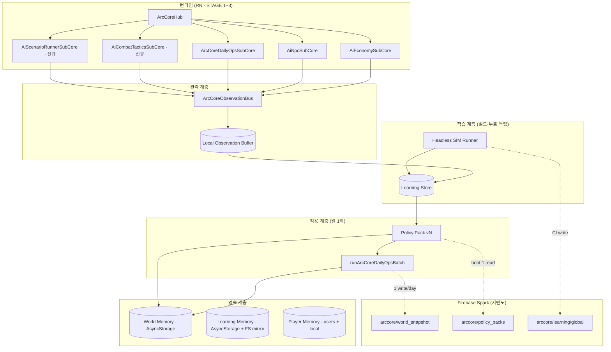

# ArcCore 지속가능 학습 모델 v1.0 — 설계 정본

> **문서 버전**: v1.0  
> **작성**: 2026-06-26  
> **상태**: **설계 완료 · 구현 대기**  
> **목표**: 빌드·계정 초기화와 **분리된** 아크코어 월드·학습 축 → 서브코어·AI봇 → 경제·전투·전술 **자율 반복 학습**  
> **헌법**: v4.0 §10·§14 · `Local-AI-First` · Firestore **단발 `.get()`/`.set()`** · `onSnapshot` 금지 · 일 1회 배치

---

## 0. 한 줄 요약

**런타임 행성 store ≠ 아크코어의 기억.**  
관측(Observation) → Headless SIM → Policy Pack(버전) → **일 1회 ingest** 파이프라인을 **World / Learning / Player** 3계층 저장으로 분리하고, Firebase는 **저빈도 스냅샷·정책 배포·KPI 아카이브**만 담당한다.

---

## 1. 문제 정의

| 현상 | 원인 | 설계 대응 |
|------|------|-----------|
| 빌드·Metro 후 행성 지표·경제가 “처음으로” | `planetCoreRuntimeStore` hydrate + CSV 시드 | **World Memory** 분리·cloud cold hydrate |
| `learning-state.json`이 게임과 단절 | CI/로컬 audit 전용 | **Learning Store** 런타임 버스 연동 |
| 서브코어 관측 포맷 파편 | fabric·telemetry·AABS 각각 | **Observation Bus** 단일 스키마 |
| 전투·전술 학습 축 없음 | Territorial pass만, tactics SubCore 없음 | **AiCombatTacticsSubCore** + ScenarioRunner |
| Firebase `arccore` 거의 미사용 | config 시드만 | **Policy Pack + World Snapshot** read path |
| 계정 초기화 시 `planetCoreRuntimeStore` reset | player purge에 world 포함 | **purge 범위 재분류** (§4) |

---

## 2. 목표 아키텍처



---

## 3. 3계층 메모리 계약

### 3-1. 분류

| 계층 | `ArcCoreMemoryScope` | 내용 | 빌드 reinstall | 계정 초기화 | Dev world reset |
|------|----------------------|------|----------------|-------------|-----------------|
| **World** | `world` | 21행성 코어·fabric window·faction vault·galaxy unlock·AABS overlay 적용 결과·inbound 캠페인 | **유지** (cloud hydrate) | **유지** (v1.0부터) | `ARC_DEV_WORLD_RESET=1` 시만 purge |
| **Learning** | `learning` | 관측 append·SIM run·KPI·policy draft·ingest 이력 | **유지** | **유지** | 선택 purge |
| **Player** | `player` | profile·mission·inventory·planet_holds·스킬·전투 텔레메트리(계정용) | 유지(cloud) | **purge** | purge |

### 3-2. 저장소 매핑 (현행 → 목표)

| 현행 키/모듈 | 목표 scope | 비고 |
|--------------|------------|------|
| `arcfire_planet_core_runtime_v1` | **world** | 계정 purge에서 **제외** (breaking change, §8 Phase 1) |
| faction vault · trade fee ledger | **world** | 이미 purge 제외 |
| `arcfire_combat_match_telemetry_v1` | **learning** (+ player 요약) | cap 80 → learning store로 이관 |
| `arcfire_balance_overlay_delta_ingest_v1` | **learning** | ingest 이력 |
| `arcfire_arc_core_daily_ops_v1` | **world** | lastBatchDayKey |
| `arcfire_player_v1` | **player** | Firestore `users` |
| `learning-state.json` (tools) | **learning** | 디바이스/CI mirror → `arccore/learning/global` |

### 3-3. 레지스트리 API (신규)

**파일**: `src/arcCore/memory/arcCoreMemoryRegistry.ts`

```typescript
export type ArcCoreMemoryScope = 'world' | 'learning' | 'player';

export type ArcCoreMemoryEntry = {
  storageKey: string;
  scope: ArcCoreMemoryScope;
  hydrateOnBoot: boolean;
  cloudMirror?: 'none' | 'snapshot' | 'policy_read';
  purgeOnAccountReset: boolean;
  purgeOnDevWorldReset: boolean;
};

export function listArcCoreMemoryEntries(): readonly ArcCoreMemoryEntry[];
export async function purgeArcCoreMemoryByScope(
  scope: 'player' | 'world' | 'learning',
  reason: string,
): Promise<void>;
```

**부트 순서** (고정):

1. Table-First CSV index  
2. **Learning Store** hydrate (read-only for runtime)  
3. **World Memory** hydrate (local → empty면 cloud snapshot 1회 `.get()`)  
4. Player hydrate  
5. `arcCoreHub.start()` — SubCore `onBoot` **경량만** (§7)

---

## 4. Observation Bus

### 4-1. 역할

- 모든 서브코어·STAGE3 종료·플레이어 교역이 **동일 envelope**로 이벤트 발행  
- 고빈도 tick publish **금지** — **구조 변경·일일 window·전투 종료·시나리오 step**만  
- 로컬 ring buffer → Learning Store 일/주 flush

### 4-2. 이벤트 envelope

**파일**: `src/arcCore/observation/arcCoreObservationTypes.ts`

```typescript
export type ArcCoreObservationKind =
  | 'economy.trade_player'
  | 'economy.convoy_settlement'
  | 'economy.attack_signal'
  | 'economy.fabric_daily'
  | 'combat.match_summary'
  | 'combat.tactics_trial'
  | 'territorial.pass_result'
  | 'npc.traffic_snapshot'
  | 'scenario.step'
  | 'scenario.verdict'
  | 'daily_ops.batch_complete'
  | 'policy.ingest_applied';

export type ArcCoreObservationEvent = {
  schemaVersion: 1;
  eventId: string;           // uuid v4
  kind: ArcCoreObservationKind;
  wallTimeMs: number;
  planetId?: string;
  systemId?: string;
  subCoreId: string;
  payload: Record<string, unknown>;  // kind별 typed narrow는 Zod/수동 guard
  simTag?: string;           // headless run id (optional)
};
```

### 4-3. Bus API

**파일**: `src/arcCore/observation/arcCoreObservationBus.ts`

```typescript
export function publishArcCoreObservation(
  event: Omit<ArcCoreObservationEvent, 'eventId' | 'wallTimeMs' | 'schemaVersion'>,
): void;

export function flushObservationsToLearningStore(): Promise<number>;

/** Headless SIM 전용 — RN 부트 없이 buffer 파일 append */
export function appendObservationFile(path: string, event: ArcCoreObservationEvent): void;
```

### 4-4. kind별 payload (최소 필드)

| kind | payload 필수 |
|------|----------------|
| `economy.trade_player` | sku, qty, credits, planetId |
| `economy.fabric_daily` | supplyStockScale, reconcileMeta |
| `combat.match_summary` | engageSec, playerWon, loadoutId |
| `combat.tactics_trial` | tacticId, winRate, avgEngageSec |
| `territorial.pass_result` | campaignId, planetId, holdChanged |
| `scenario.step` | scenarioId, stepIndex, action |
| `scenario.verdict` | scenarioId, pass, kpiSnapshot |
| `daily_ops.batch_complete` | dayKey, passResults[] |

### 4-5. 기존 코드 브릿지

| 현행 | → Observation |
|------|----------------|
| `recordPlanetEconomyPlayerTrade` | `economy.trade_player` |
| `recordMatchSummary` | `combat.match_summary` |
| `runPlanetEconomyFabricDailyPass` | `economy.fabric_daily` |
| `runArcCoreDailyOpsBatch` 종료 | `daily_ops.batch_complete` |

---

## 5. Learning Store

### 5-1. 역할

- **append-only** 관측·SIM·audit KPI  
- Policy Pack **생성 입력** (SIM/분석기만 쓰기, 런타임 read-only)  
- 빌드·Metro와 **별도 AsyncStorage namespace**

### 5-2. 로컬 스키마

**키**: `arcfire_arc_core_learning_v1`

```typescript
export type ArcCoreLearningStore = {
  schemaVersion: 1;
  observations: {
    tail: ArcCoreObservationEvent[];  // max 2000, FIFO
    lastFlushDayKey: string | null;
  };
  simRuns: {
    runId: string;
    startedAt: number;
    finishedAt: number;
    kpi: Record<string, number>;
    deltaId: string | null;
  }[];
  kpiTimeline: {
    dayKey: string;
    economy: { f2pWhaleRatio?: number; bandDrift?: number };
    combat: { avgEngageSec?: number; globalEngageHpMul?: number };
    memory?: { pssFloorMb?: number };
  }[];
  policyHistory: {
    packId: string;
    ingestedAt: number;
    source: 'local_sim' | 'firestore' | 'ci';
  }[];
  lastUpdatedAt: number;
};
```

### 5-3. Headless SIM Runner

**CLI** (RN 부트 없음):

```bash
npm run sim:economy              # 기존 macro
npm run sim:arc-core:observation # observation 파일 → learning merge
npm run sim:tactics:sandbox      # Phase 3 — loadout grid search
```

**출력**: `tools/economy-sim/out/` · `tools/arc-core-sim/runs/{runId}/`  
**학습 merge**: `node tools/arc-core-sim/merge-run-into-learning.cjs`

### 5-4. KPI → Policy Pack 생성

| 입력 | 처리 | 출력 |
|------|------|------|
| `sim:economy` delta | 기존 `economySimOverlayDelta` | `BalanceOverlayDelta` |
| tactics sandbox | engageSec·winRate grid | `TacticsPolicyDelta` (신규, optional) |
| balance-ops audit | `learning-state.json` merge | 권장 조치 → human review |

**Policy Pack** (통합):

```typescript
export type ArcCorePolicyPack = {
  packId: string;              // e.g. 2026-06-26T12-kim-econ-01
  schemaVersion: 1;
  issuedAt: string;              // ISO
  issuedBy: 'sim' | 'audit' | 'human';
  safeModeCap: boolean;        // true = AABS ±5% cap enforced
  balanceOverlay?: BalanceOverlayDelta;
  tacticsOverlay?: TacticsPolicyDelta;
  subCoreHints?: Record<string, { timeScale?: number; enabled?: boolean }>;
  signature?: string;          // Phase 4 — optional ed25519
};
```

---

## 6. Policy Pack 적용 파이프라인

### 6-1. 흐름 (v4.0 준수)

```text
[SIM/Audit] → Policy Pack draft (git or Firestore)
     ↓ human/김경제 review (kim-economy-handoff)
     ↓ publish to arccore/policy_packs/{packId}
[App boot] → optional 1× getDoc(latest approved packId from arccore/config)
     ↓ local Learning Store policyHistory
[Daily 12:00 KST] runArcCoreDailyOpsBatch
     ↓ ingestBalanceOverlayDeltaIfPending (기존)
     ↓ applySubCoreHints (신규, 1회)
     ↓ publishArcCoreObservation('policy.ingest_applied')
```

### 6-2. 금지 (헌법)

- Policy Pack 런타임 **고빈도** 재적용  
- `price_elasticity ≠ 0` 실시간 시장  
- SIM delta **CSV 정본 overwrite**  
- AABS 누적 **0.7~1.3** 캡 초과

### 6-3. Rollback

- `arccore/config.activePolicyPackId` 이전 버전 pointer  
- Learning Store `policyHistory` + `ingestBalanceOverlayDelta` lastDeltaId  
- `safeMode: true` on Firestore → ingest skip, observe only

---

## 7. 서브코어 확장

### 7-1. 현행 등록 (`registerDefaultArcSubCores`)

| SubCore | 학습 역할 | Observation |
|---------|-----------|-------------|
| `ArcCoreDailyOpsSubCore` | 일 1회 배치 orchestrator | `daily_ops.batch_complete` |
| `AiEconomySubCore` | 무역소·시장 | `economy.*` |
| `AiAabsSubCore` | engage HP mul | batch only |
| `AiNpcSubCore` | 궤도 트래픽 연출 | `npc.traffic_snapshot` (phase change) |
| `ArcCoreTerritorialCombatSubCore` | 접전 pass | `territorial.pass_result` |
| `ArcInboundDroneSubCore` | inbound | `economy.attack_signal` |
| `AiPlanetsSubCore` | 코어 DB bootstrap | world seed only |
| `WorldExpansionSubCore` | galaxy unlock | world event |

### 7-2. 신규 SubCore

#### `AiCombatTacticsSubCore` (`ai_combat_tactics_subcore`)

| 항목 | 내용 |
|------|------|
| **역할** | loadout·engage·도주 **trial** scoring (로컬 물리·기존 `ShipPerformanceCalculator`) |
| **틱** | passInterval 3600s 또는 ScenarioRunner 트리거 |
| **출력** | `combat.tactics_trial` → Learning Store |
| **적용** | Policy Pack `tacticsOverlay` → AABS engage cap 연동 (일 1회) |

#### `AiScenarioRunnerSubCore` (`ai_scenario_runner_subcore`)

| 항목 | 내용 |
|------|------|
| **역할** | `npc_ai_captains.csv` + graph **시나리오 카탈로그** 무한 실행 |
| **시나리오** | `tables/balance/arc_core_scenario_catalog.csv` (신규) |
| **모드** | `headless` (CI) · `shadow` (앱 idle, 저부하) |
| **출력** | `scenario.step` · `scenario.verdict` |
| **연동** | [`ARC_CORE_TACTICAL_AUTOMATION_AND_GALAXY_STRATEGY.md`](./ARC_CORE_TACTICAL_AUTOMATION_AND_GALAXY_STRATEGY.md) Phase 2+ |

### 7-3. SubCore 학습 contract (신규 interface)

```typescript
export interface ArcSubCoreLearningCapable extends ArcSubCore {
  getLearningSnapshot(): Record<string, unknown>;
  applyPolicyPackHints(hints: Record<string, unknown>): void;
}
```

`BaseArcSubCore` default: noop. Economy·Tactics·Territorial만 구현.

### 7-4. onBoot 격리 (2026-06-16 회귀 방지)

| 허용 (onBoot) | 금지 (onBoot) |
|---------------|---------------|
| Map/index cache | 전 행성 loop |
| schedule probe 등록 | SIM·ingest·catalog rebuild |
| hydrate flag read | `runArcCoreDailyOpsBatch` 직접 호출 |

무거운 pass: `InteractionManager.runAfterInteractions` 또는 DailyOpsSubCore probe.

---

## 8. Firebase (Spark 무료 한도) 스키마

> **원칙**: read/write **예산表** 준수 · **onSnapshot 금지** · 게임 루프와 분리

### 8-1. 예산 (1 기기 · 1일)

| 작업 | 횟수/일 | 누적/월 |
|------|---------|---------|
| `getDoc` policy + config + snapshot | ≤ 5 | ~150 |
| `setDoc` telemetry batch | ≤ 2 | ~60 |
| `setDoc` world_snapshot (merge) | 1 | ~30 |
| CI `setDoc` sim_runs | 1 | ~30 |
| **합계 write** | **≤ 4/일/기기** | **≪ 20K/일 한도** |

### 8-2. 컬렉션

```
arcfore/
  config          # 단일 doc — merge
  schedule        # 단일 doc — merge
  subcores        # 단일 doc — Remote Config 대체 가능
  policy_packs/   # {packId} — read-only after publish
  world_snapshot  # 단일 doc — 21행성 KPI 요약 (~4KB)
  learning/
    global        # KPI rollup (CI + optional device batch)
  telemetry/
    {yyyyMMdd}    # bounded daily batch (optional opt-in)
  sim_runs/
    {runId}       # CI only

users/{uid}       # 기존 — player scope only
battles/{id}      # 기존 — 저빈도 전투 로그
```

### 8-3. `world_snapshot` doc (예시)

```typescript
{
  schemaVersion: 1,
  dayKey: '2026-06-26',
  planetKpi: Record<planetId, { R,P,D,T,E, fabricScale?: number }>,
  galaxy: { unlockedSystemCount: number },
  economy: { globalPriceIndex?: number },
  updatedAt: Timestamp,
  sourceDeviceId: string;  // anonymous, not uid
}
```

### 8-4. `policy_packs/{packId}`

```typescript
{
  schemaVersion: 1,
  packId: string,
  status: 'draft' | 'approved' | 'retired',
  balanceOverlay?: object,
  tacticsOverlay?: object,
  subCoreHints?: object,
  approvedBy?: string,
  approvedAt?: Timestamp,
}
```

### 8-5. 사용 **하지 않음**

- Realtime Database live mirror  
- Firestore `onSnapshot`  
- per-tick / per-trade write  
- AI 궤도 좌표·multiplayer presence  
- planet core **전체** 21행성 full dump (용량·비용)

### 8-6. Remote Config (권장)

- SubCore `enabled` · `timeScale` · `safeMode`  
- Fetch **1/session** — Firestore read 절약

---

## 9. AI봇 · 무한 테스트 루프

```text
Scenario Catalog (CSV)
     ↓
AiScenarioRunnerSubCore
     ├─ headless: npm run sim:scenario -- --max 1000
     └─ shadow: hub idle 5min+ → 1 scenario/step
     ↓
Observation Bus
     ↓
Learning Store KPI
     ↓
Kim-Economy SIM / tactics sandbox
     ↓
Policy Pack draft → review → Daily ingest
     ↓
World Memory (행성·경제·AABS)
     ↓
AiNpcSubCore · Territorial · Combat (플레이어가 체험)
```

**시나리오 catalog 컬럼 (신규 CSV)**:

| column | 설명 |
|--------|------|
| `scenario_id` | PK |
| `archetype` | `economy_loop` · `worldmap_transit` · `combat_transit` · `territorial_1hop` |
| `seed_captain_id` | `npc_ai_captains.csv` |
| `from_system` · `to_system` | graph |
| `repeat_budget` | headless max iterations |
| `pass_kpi_json` | verdict thresholds |

---

## 10. Dev · Build · Account 분리

| 이벤트 | World | Learning | Player |
|--------|-------|----------|--------|
| Metro `r` | 유지 | 유지 | 유지 |
| `expo run:android` reinstall | cloud hydrate | 유지 | cloud restore |
| 계정 초기화 (v1.0+) | **유지** | **유지** | purge |
| `ARC_DEV_WORLD_RESET=1` | purge | optional | — |
| `ARC_DEV_LEARNING_RESET=1` | — | purge | — |
| Table `build:*-tables` | overlay only | — | — |

**마이그레이션 (Phase 1)**:  
`purgeLocalAccountData`에서 `resetLocalPlanetCoreRuntime()` **제거** → player-owned planet **holds**만 clear.  
World 코어는 ArcCore world instance로 유지 (싱글 디바이스 샌드박스 1 galaxy).

---

## 11. 구현 로드맵

### Phase 0 — 계약·레지스트리 (1주)

| # | 산출 | DoD |
|---|------|-----|
| 0.1 | `arcCoreMemoryRegistry.ts` + 문서表 | tsc · purge 단위 테스트 |
| 0.2 | `purgeLocalAccountData` world 분리 | 계정 reset 후 planet core **유지** 실측 |
| 0.3 | `ARC_DEV_*` env flags | dev menu or env |

### Phase 1 — Observation + Learning Store (2주)

| # | 산출 | DoD |
|---|------|-----|
| 1.1 | Observation types + Bus | 기존 4 bridge emit |
| 1.2 | Learning Store persist | cap·FIFO·hydrate |
| 1.3 | `flushObservationsToLearningStore` daily | DailyOps batch hook |
| 1.4 | `merge-run-into-learning.cjs` | sim:economy 연동 |

### Phase 2 — Policy Pack v1 (2주)

| # | 산출 | DoD |
|---|------|-----|
| 2.1 | `ArcCorePolicyPack` type + local file | ingest 기존 delta 호환 |
| 2.2 | Firestore `policy_packs` publish script | CI/manual |
| 2.3 | Boot 1× policy read (optional) | offline fallback local |
| 2.4 | `audit:balance-ops` → learning merge | learning-state.json 통합 |

### Phase 3 — SubCore · SIM (3주)

| # | 산출 | DoD |
|---|------|-----|
| 3.1 | `AiCombatTacticsSubCore` | tactics_trial obs |
| 3.2 | `arc_core_scenario_catalog.csv` + runner | headless 100 scenario |
| 3.3 | `npm run sim:tactics:sandbox` | KPI report |
| 3.4 | Territorial + GalaxyTacticalGraph gate | strategy doc Phase 1 |

### Phase 4 — Cloud mirror · AGDS (2주)

| # | 산출 | DoD |
|---|------|-----|
| 4.1 | world_snapshot daily upload (opt-in) | ≤1 write/day |
| 4.2 | cold hydrate on empty world | 1 getDoc |
| 4.3 | `audit:arc-self-optimize:pack` + learning | handoff 자동 |
| 4.4 | safeMode · rollback | Firestore config |

---

## 12. 파일·모듈 인덱스 (신규)

```text
src/arcCore/
  memory/
    arcCoreMemoryRegistry.ts
    arcCoreWorldHydrate.ts
    arcCoreCloudMirror.ts
  observation/
    arcCoreObservationTypes.ts
    arcCoreObservationBus.ts
  learning/
    arcCoreLearningStore.ts
    arcCorePolicyPackTypes.ts
    applyPolicyPack.ts
  subcores/
    AiCombatTacticsSubCore.ts
    AiScenarioRunnerSubCore.ts

tables/balance/
  arc_core_scenario_catalog.csv

tools/arc-core-sim/
  merge-run-into-learning.cjs
  publish-policy-pack.cjs
  README.md

docs/
  ARC_CORE_SUSTAINABLE_LEARNING_MODEL_v1.md  ← 본 문서
```

---

## 13. 검증·운영 게이트

| 게이트 | 명령 |
|--------|------|
| 경제 contract | `npm run audit:balance-ops` |
| 일일 배치 | `runArcCoreDailyOpsBatch` 12:00 KST |
| SIM | `npm run sim:economy` |
| 김팀장 | `npm run audit:team-lead:daily` |
| 부트 부하 | economy onBoot audit (김팀장 handoff §) |
| Firebase | write/day counter dev log |

---

## 14. 교차 참조

| 문서 | 관계 |
|------|------|
| [ARC_CORE_ECONOMY_FABRIC.md](../ARC_CORE_ECONOMY_FABRIC.md) | fabric → observation |
| [ARC_CORE_TACTICAL_AUTOMATION_AND_GALAXY_STRATEGY.md](./ARC_CORE_TACTICAL_AUTOMATION_AND_GALAXY_STRATEGY.md) | territorial · graph |
| [KIM_TEAM_ECONOMY_WORKFLOW.md](../KIM_TEAM_ECONOMY_WORKFLOW.md) | Policy review |
| v4.0 §10·§14 | 일 1회 · no onSnapshot |
| `arcfire-main-lead-agent.mdc` | purge 분류 |

---

## 15. 설계 완료 선언

- [x] 3계층 메모리·purge 재분류  
- [x] Observation Bus 스키마  
- [x] Learning Store · Policy Pack  
- [x] SubCore 2종 · Scenario catalog  
- [x] Firebase Spark 스키마·예산  
- [x] Headless SIM · AGDS 연동  
- [x] Phase 0~4 로드맵 · DoD  

**다음 구현 착수**: **Phase 0.1** `arcCoreMemoryRegistry.ts` + purge 분리.

---

*ArcCore Sustainable Learning Model v1.0 — END*
