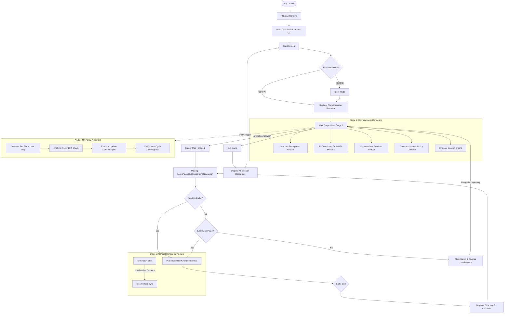

# 🚀 아크파이어 온라인 — React Native 모바일게임 프로젝트 아키텍처 구조설계서

> **문서 버전**: v1.1  
> **최종 업데이트**: 2026-05-13  
> **문서 상태**: 구현 확정  
> **통합 출처**: flowchart v2026.05 · Memory Spec v1.0 · AABS v2.2 · Post-AABS Roadmap · AGDS · Master Spec v1.0  
> **핵심 원칙**: `Table-First` · `Session-Based Memory` · `Hybrid Rendering` · `Navigation.replace()`

---

## 🎯 0. 게임 핵심 컨셉 정의 (Core Concept)

> **이 섹션은 모든 설계 판단의 최상위 기준이다. 구현 방향이 모호할 때 반드시 이 컨셉으로 돌아와 판단한다.**

### 0-1. 게임 장르 및 규모

| 항목 | 정의 |
|------|------|
| **장르** | **MO (Massively Online lite)** — MMORPG가 아님. 소규모 동시접속 기반 멀티플레이 |
| **플랫폼** | React Native 모바일 (iOS / Android) |
| **서버 구조** | **서버리스 (Serverless)** — 전용 게임 서버 없음. Firestore + 클라이언트 자율 처리 |
| **동시 접속** | 채널당 최대 **100명** |

### 0-2. 채널 구조

```
메인 스테이지(Planet Hub) 1개 = 채널 1개 = 최대 100명 수용

채널 A (행성 X) ─── 유저 최대 100명
채널 B (행성 Y) ─── 유저 최대 100명
채널 N (행성 Z) ─── 유저 최대 100명
```

- 채널 초과 시 → 신규 채널 자동 생성 (구현 필요 — 현재 설계 공백)
- 유저는 채널(행성)을 이동하며 플레이

### 0-3. 멀티플레이 방식 (핵심)

| 항목 | 방식 | 비고 |
|------|------|------|
| **공유 데이터** | 전함 전투 데이터만 공유 | 위치·상태·결과값 등 최소 페이로드 |
| **인터랙션** | **실시간 유저 간 인터랙션 없음** | 유저끼리 직접 반응하지 않음 |
| **전투 방식** | **자동전투 (Auto-Combat)** | 클라이언트가 독립 시뮬레이션 후 결과 공유 |
| **동기화 대상** | 전함 데이터만 (위치·HP·상태) | 채팅·스킬·이동 명령 등 실시간 동기화 없음 |

### 0-4. 그래픽 방침

```
이미지 기반 최소화 원칙:
  ├─ 전함·무기·NPC → 이미지 에셋 사용 (3D 렌더링 없음)
  ├─ 효과 (성운·궤적·파티클) → Skia 벡터/쉐이더로 경량 처리
  └─ UI 마커 → RN Animated (이미지 스프라이트 기반)
```

### 0-5. Firestore 역할 명확화

```
Firestore 사용 범위 (유저 데이터만):
  ✅ arcfire_player_v1 (유저 프로필)
  ✅ ship.equipSlots (함선 장착 정보)
  ✅ 게임 진행 저장 데이터
  
  ❌ 실시간 전투 동기화 → 클라이언트 자율 처리
  ❌ 채널 내 실시간 상태 공유 → 별도 경량 방식 필요 (설계 공백)
```

---

## ⚠️ 0-A. 컨셉-문서 매칭 분석 (Gap Analysis)

> 핵심 컨셉과 기존 설계 문서를 대조한 결과. **빨간 항목은 보완이 필요한 공백이다.**

### 매칭 결과

| 핵심 컨셉 | 문서 반영 여부 | 위치 | 비고 |
|---------|------------|------|------|
| MO급 장르 정의 | ❌ **없음** | — | 장르·규모 명시 필요 → **섹션 0 신규 추가** |
| 채널 = 메인 스테이지 | ❌ **없음** | — | 채널 개념 전무 → **설계 공백** |
| 채널당 100명 제한 | ❌ **없음** | — | 제한 로직 없음 → **구현 필요** |
| 서버리스 구조 | ❌ **없음** | — | "서버리스"라는 단어 미등장 → **섹션 0 신규 추가** |
| 전투 데이터만 공유 | ⚠️ **불명확** | 섹션 7 | 무엇을 어떻게 공유하는지 구현 방식 없음 |
| Firestore = 유저 데이터만 | ⚠️ **혼용** | 섹션 2 기술스택 | "세션 관리"로 오기 → Firestore 역할 명확화 필요 |
| 자동전투 | ✅ **반영** | 섹션 7 | PlanetEdenRaidOrbitSkiaCombat |
| 실시간 인터랙션 없음 | ❌ **없음** | — | 명시적 선언 없음 → **섹션 0 신규 추가** |
| 이미지 기반 그래픽 최소화 | ⚠️ **불명확** | 섹션 9 | Skia가 이미지를 렌더링하는지 벡터인지 구분 없음 |
| Table-First 원칙 | ✅ **반영** | 섹션 3 | 완벽히 설계됨 |
| Session-Based Memory | ✅ **반영** | 섹션 8 | 완벽히 설계됨 |
| Hybrid Rendering | ✅ **반영** | 섹션 9 | Skia + RN 분리 |
| Navigation.replace() | ✅ **반영** | 전체 | 일관되게 적용됨 |
| AABS 밸런싱 | ✅ **반영** | 섹션 10 | 잘 설계됨 |
| 메모리 예산 관리 | ✅ **반영** | 섹션 5,8 | 스테이지별 예산 정의됨 |

### 설계 공백 요약 (구현 필요)

```
[공백 1] 채널 관리 로직
  - 채널 생성/입장/초과 처리 방식 미정
  - 100명 초과 시 신규 채널 분기 로직 없음
  - 유저가 어느 채널에 배정될지 기준 없음

[공백 2] 전함 전투 데이터 공유 방식
  - 채널 내 유저들이 서로의 전함 데이터를 어떻게 받는가?
  - Firestore 실시간 리스너? 별도 경량 소켓? 결정되지 않음
  - 공유 데이터의 스키마(어떤 필드를 공유하는가) 미정

[공백 3] 채널 내 다른 유저 렌더링
  - 내 전함은 자동전투로 처리되지만
    같은 채널의 타 유저 전함을 화면에 어떻게 표시하는가?
  - 현재 문서는 NPC만 다루고 있음
```

---

## 목차

1. [시스템 개요 및 핵심 원칙](#1-시스템-개요-및-핵심-원칙)
2. [기술 스택](#2-기술-스택)
3. [앱 초기화 및 부트스트랩](#3-앱-초기화-및-부트스트랩)
4. [사용자 인증 및 세션 활성화](#4-사용자-인증-및-세션-활성화)
5. [스테이지 구조 및 메모리 예산](#5-스테이지-구조-및-메모리-예산)
6. [메인 스테이지 허브 (Stage 1)](#6-메인-스테이지-허브-stage-1)
7. [게임플레이 루프: 출격·이동·전투 (Stage 2~3)](#7-게임플레이-루프-출격이동전투-stage-23)
8. [메모리 관리 핵심 설계](#8-메모리-관리-핵심-설계)
9. [렌더링 파이프라인](#9-렌더링-파이프라인)
10. [AABS: 능동형 밸런싱 시스템](#10-aabs-능동형-밸런싱-시스템)
11. [AGDS: 자율형 개발 운영 시스템](#11-agds-자율형-개발-운영-시스템)
12. [Post-AABS 운영 로드맵](#12-post-aabs-운영-로드맵)
13. [파일 구조](#13-파일-구조)
14. [절대 금지 사항 (Do Not Drift)](#14-절대-금지-사항-do-not-drift)
15. [Cursor 개발 체크리스트](#15-cursor-개발-체크리스트)
16. [전체 플로우차트 (Mermaid)](#16-전체-플로우차트-mermaid)

---

## 1. 시스템 개요 및 핵심 원칙

아크파이어 온라인은 **React Native** 기반 모바일 우주 전략 게임이다. AI 엔진 **ArcCore**가 게임 밸런스를 능동적으로 조절하고, 유저가 내러티브 인터랙션을 통해 세계관에 개입하는 **유저 주도형 샌드박스** 환경을 제공한다.

### 4대 설계 원칙

| 원칙 | 내용 | 위반 시 결과 |
|------|------|-------------|
| **Table-First** | CSV 정본 데이터를 앱 시작 시 `Map`으로 인덱싱, 런타임 중 정본 수정 금지 | 검색 성능 저하, 데이터 불일치 |
| **Session-Based Memory** | 스테이지 전환 시 이전 세션 자원 명시적 `dispose`, 영속 스토어만 유지 | 200MB → 800MB 메모리 누수, 크래시 |
| **Hybrid Rendering** | 대량 객체는 Skia, 상호작용 UI는 RN Animated로 레이어 분리 | 프레임 드롭, 렌더 desync |
| **Navigation.replace()** | 모든 주요 스테이지 전환은 `replace()` 강제, `navigate()` 사용 금지 | 스택 누적, 이전 스테이지 언마운트 안됨 |

---

## 2. 기술 스택

| 영역 | 기술 | 역할 |
|------|------|------|
| **프레임워크** | React Native | 앱 전체 기반 |
| **렌더링 (대량)** | `@shopify/react-native-skia` | 수송선·성운·전투 이펙트 |
| **렌더링 (UI)** | `Animated.transform` | NPC 마커·UI 애니메이션 |
| **데이터베이스** | Firebase Firestore | **유저 데이터 전용** (프로필·함선 장착 정보·진행 저장) |
| **정적 데이터** | CSV + `Map<id, row>` 인덱스 | 함선·무기·NPC 테이블 |
| **상태 관리** | `planetCoreRuntimeStore` | 영속 런타임 상태 (AABS 보정값) |
| **세션 캐시** | `planetMemoCache` | 휘발성 세션 데이터 |
| **네비게이션** | `Navigation.replace()` | 스택 관리 |

---

## 3. 앱 초기화 및 부트스트랩

앱 실행 시 아래 순서를 **반드시** 준수한다.

| 순서 | 단계 | 설명 |
|------|------|------|
| 1 | **앱 실행** | 어플리케이션 엔진 가동 |
| 2 | **기술 초기화** | RN 환경 + Skia 엔진 + 네이티브 모듈 초기화 |
| 3 | **테이블 데이터 인덱싱** ⭐ | CSV(함선·무기·NPC) → `Map` 구조 핫 패스 캐시 빌드 (`O(1)`) |
| 4 | **시작 화면** | 메인 타이틀 화면 진입 |

> ⭐ **Table-First 원칙**: 인덱싱은 앱 생명주기 동안 **단 1회**만 실행. 스테이지 전환 시 재인덱싱 절대 금지.

```typescript
// store/staticTableStore.ts
const shipMap = new Map<string, ShipRow>();
const weaponMap = new Map<string, WeaponRow>();
const npcMap = new Map<string, NpcRow>();

export function buildStaticIndexes(csvData: CsvBundle): void {
  csvData.ships.forEach(row => shipMap.set(row.id, row));
  csvData.weapons.forEach(row => weaponMap.set(row.id, row));
  csvData.npcs.forEach(row => npcMap.set(row.id, row));
}

// O(1) 조회 — findIndex() 사용 금지
export const getShip = (id: string) => shipMap.get(id);
export const getWeapon = (id: string) => weaponMap.get(id);
export const getNpc = (id: string) => npcMap.get(id);
```

---

## 4. 사용자 인증 및 세션 활성화

### 4-1. 계정 확인 분기

```
Firestore 접속 → arcfire_player_v1 프로필 조회
       │
       ├─ [신규 유저] → 스토리 모드 재생 → 닉네임 생성 → 초기 데이터 생성
       │
       └─ [기존 유저] → 프로필 로드 → ship.equipSlots 장착 정보 로드
       │
       └─ [공통] → registerPlanetSessionResource() → 메인 스테이지 진입
```

### 4-2. 행성 세션 등록

- **호출 시점**: 메인 스테이지 진입 **직전** (인증 완료 후)
- **호출 함수**: `registerPlanetSessionResource()`
- **역할**: 현재 행성 메모리 자원 할당 + 렌더링 준비 완료

---

## 5. 스테이지 구조 및 메모리 예산

> **배경**: 앱 초기 메모리 ~200MB → 전투 반복 후 ~800MB → 스마트폰 크래시  
> **원인**: 스테이지 전환 시 Skia 인스턴스·rAF 루프·Animated 객체·콜백 구독 미해제 누적

```
┌─────────────────────────────────────────────────────────────┐
│  STAGE 0: Splash / Auth              목표: < 50MB           │
│  STAGE 1: Planet Hub (Main)          목표: < 200MB          │
│  STAGE 2: Galaxy Map                 목표: < 120MB          │
│  STAGE 3: Combat                     목표: < 250MB          │
│  SUB-STAGE: 행성 시설 (Hub 위 Modal) 목표: < 80MB           │
└─────────────────────────────────────────────────────────────┘
```

**규칙**: 스테이지 전환 시 이전 스테이지의 메모리 예산을 **반드시 해제 후** 다음 스테이지를 초기화한다.

### 5-1. 스테이지별 콘텐츠 분류 및 Cleanup 요구사항

| 콘텐츠 | 스테이지 | 진입 방식 | Cleanup 요구사항 |
|--------|----------|-----------|----------------|
| 필드 전투 / 은신처 소탕 / 공성전 | Stage 3 (Combat) | `Navigation.replace()` | Skia dispose + rAF 취소 + 콜백 null |
| 토너먼트 / 약탈·범죄 | Stage 3 (Combat 변형) | `Navigation.replace()` | Combat과 동일 |
| 용병 모집 / 부대 육성 / 포로 관리 | SUB-STAGE (Hub Modal) | `Modal.present()` | 모달 자체 상태 초기화 |
| 교역 / 작업장 / 수송단 | SUB-STAGE (Hub Modal) | `Modal.present()` | 교역 캐시 해제 |
| 대장기술 (무기 제작) | SUB-STAGE (Hub Modal) | `Modal.present()` | 제작 폼 상태 해제 |
| 도시 관리 / 정책 수립 | SUB-STAGE (Hub Modal) | `Modal.present()` | 정책 로컬 상태 초기화 |
| 가문 등급 / 동료 영입 / 외교 | SUB-STAGE (Hub Modal) | `Modal.present()` | NPC 리스트 참조 해제 |
| 퀘스트 | SUB-STAGE (Hub Modal) | `Modal.present()` | 진행 상태 저장 후 로컬 해제 |

---

## 6. 메인 스테이지 허브 (Stage 1)

> ArcCore와 UI 레이어가 결합된 고성능 허브. 메모리 예산 **< 200MB**.

### 6-1. 렌더링 파이프라인

| 레이어 | 담당 역할 | 기술 |
|--------|-----------|------|
| **Skia Layer** | 대량 아크 수송선 / 성운(Nebula) 효과 | `@shopify/react-native-skia` |
| **RN Layer** | 테이블 기반 NPC 마커(Captain 마크 등) | `Animated.transform` |

### 6-2. 허브 기능

| 기능 | 설명 | 비고 |
|------|------|------|
| **스캔** | 주변 정보 거리순 정렬 확인 | `INFO_DISTANCE_SORT_INTERVAL_MS = 5000ms` |
| **선술집 / 조선소 / 무역소** | 행성 내부 시설 (Modal/BottomSheet) | `PLANET_MAIN_BOTTOM_FEATURE_RESERVE_PX` 적용 |
| **Governor System** | NPC 대화 → 행성 운영 방침 결정 | `planetCoreRuntimeStore.globalMultipliers` 즉시 반영 |
| **종료** | `dispose` 후 시작 화면 복귀 | 메모리 누수 방지 |

### 6-3. Governor System (내러티브 정책 결정)

유저가 성계 허브 핵심 NPC와 대화하여 행성 운영 방침을 결정한다.

| 정책 시나리오 | 효과 |
|-------------|------|
| **[치안 강화]** | 난이도 + 경험치 배율 상향 (전투 중심) |
| **[자유 무역]** | 세금 인하 + 무역 NPC 유입 증가 (경제 중심) |
| **[기술 발굴]** | 고티어 장비 드랍 가중치 상향 (파밍 중심) |

### 6-4. Stage 1 메모리 계약

**진입 시 (onMount)**
```
1. registerPlanetSessionResource() 호출
2. CSV 인덱스 캐시 확인 — 이미 빌드된 경우 재사용
3. PlanetHubOrbitSkiaLayer 초기화
4. orbitClockMs rAF 루프 시작 (rafId 저장 필수)
5. 거리 정렬 타이머 시작 (5000ms 간격)
```

**이탈 시 (onUnmount)**
```
1. cancelAnimationFrame(rafId)       — orbitClockMs 루프 종료
2. clearInterval(distanceSortTimer)  — 거리 정렬 타이머 종료
3. PlanetHubOrbitSkiaLayer.dispose() — Skia canvas 해제
4. Animated.stop()                   — NPC 마커 애니메이션 전체 정지
5. planetMemoCache.clear()           — 세션 캐시 초기화
6. nearbyNpcList = null              — 참조 해제
```

**SUB-STAGE (시설 진입)**
```
진입: Modal.present() — Hub rAF 루프 유지, 거리 정렬 타이머 일시 정지 가능
이탈: Modal.dismiss() → 각 시설 컴포넌트 자체 cleanup 실행
```

---

## 7. 게임플레이 루프: 출격·이동·전투 (Stage 2~3)

### 7-1. 출격 (Departure)

```typescript
// 스택을 비우며 은하계 지도로 전환 (뒤로가기 방지)
Navigation.replace('GalaxyMap');
```

### 7-2. 이동 (In-Transit / Stage 2)

```typescript
beginPlanetHubSuspendingNavigation(); // 이동 시뮬레이션 시작
```

**Stage 2 메모리 계약**

| 단계 | 처리 내용 |
|------|---------|
| 진입 | 은하계 지도 정적 데이터 로드 (CSV 인덱스 재활용, 재인덱싱 금지), 이동 시뮬레이션 타이머 시작 |
| 이탈 | 이동 타이머 정지, 렌더링 상태 초기화, 로컬 이동 경로 배열 참조 해제 |

> ⚠️ Galaxy Map은 메모리 예산이 낮다(120MB). **전투 진입 전 Galaxy Map 자원을 먼저 해제하고 Combat을 초기화한다.**

### 7-3. 전투 파이프라인 (Stage 3)

```
전투 발생
    │
    ▼
PlanetEdenRaidOrbitSkiaCombat  ← 단일 렌더러
    │
    ├─ Simulation Step
    │       │ postStepRef 콜백 (구독)
    │       ▼
    └─ Skia Render Sync  ← 물리-프레임 완벽 동기화
```

**시각 규칙 (수정 금지)**
```typescript
// 미사일 명중 시 탄두 즉시 제거, 궤적만 잔상 유지
const shouldRenderHead = !m.hitApplied; // 이 조건 변경 금지
```

**Stage 3 메모리 계약 — 전투 종료마다 반드시 실행**

```
진입:
  1. 전투 자산 초기화 (함선·미사일·궤적 배열)
  2. PlanetEdenRaidOrbitSkiaCombat Skia canvas 초기화
  3. combatOrbitPostStepRef 콜백 등록
  4. 시뮬레이션 루프 시작

이탈:
  1. 시뮬레이션 루프 정지
  2. combatOrbitPostStepRef.current = null  ← 콜백 참조 해제 필수
  3. PlanetEdenRaidOrbitSkiaCombat.dispose() ← Skia canvas 명시적 해제
  4. missiles.length = 0                     ← 미사일 배열 초기화
  5. 함선 객체 배열 참조 해제
  6. cancelAnimationFrame(combatRafId)
  7. DISPOSE 완료 후 Navigation.replace() 호출
```

### 7-4. 복귀 및 정리

```typescript
dispose();               // 세션 자원 해제
Navigation.replace('PlanetHub'); // 메인 스테이지 복귀 (메모리 누수 원천 차단)
```

---

## 8. 메모리 관리 핵심 설계

### 8-1. useStageMemory 훅 — 모든 스테이지 공통 계약

```typescript
// hooks/useStageMemory.ts
export function useStageMemory(
  stageId: string,
  onMount: () => void | Promise<void>,
  onUnmount: () => void,
): void

// 사용 예시
useStageMemory(
  'COMBAT',
  () => {
    registerCombatResources();
    subscribeCombatCallbacks();
  },
  () => {
    disposeCombatResources();    // Skia canvas 해제
    cancelAllAnimationFrames();  // rAF 루프 종료
    unsubscribeCallbacks();      // postStepRef 구독 해제
  }
);
```

### 8-2. dispose() 체이닝 — 자원 등록과 해제는 항상 쌍으로

```typescript
// ✅ 올바른 패턴
useEffect(() => {
  const rafId = requestAnimationFrame(renderLoop);
  const subscription = eventEmitter.addListener('step', onStep);
  return () => {
    cancelAnimationFrame(rafId);
    subscription.remove();
  };
}, []);

// ❌ 금지 패턴 (cleanup 없음)
useEffect(() => {
  requestAnimationFrame(renderLoop); // rafId 저장 안 함 → 취소 불가
}, []);
```

### 8-3. planetMemoCache 범위 제한

```typescript
// ✅ 허용: 현재 행성 세션 데이터
planetMemoCache.set('nearbyNpcs', [...]);

// ❌ 금지: 영속 데이터를 memoCache에 저장
planetMemoCache.set('playerProfile', profile); // → planetCoreRuntimeStore 사용

// 세션 종료 시 전체 초기화 (dispose에서 반드시 호출)
planetMemoCache.clear();
```

| 스토어 | 생명주기 | dispose 대상 | 용도 |
|--------|----------|-------------|------|
| `staticTableStore` | 앱 전체 | ❌ 제외 | CSV 정적 인덱스 |
| `planetCoreRuntimeStore` | 앱 전체 | ❌ 제외 | AABS 보정값, 영속 상태 |
| `planetMemoCache` | 행성 세션 | ✅ 포함 | 휘발성 세션 캐시 |

### 8-4. RN Animated 관리 규칙

```typescript
// ✅ 올바른 패턴
const animX = useRef(new Animated.Value(0)).current;
useEffect(() => {
  const anim = Animated.loop(Animated.sequence([...]));
  anim.start();
  return () => {
    anim.stop();
    animX.setValue(0); // 값 초기화 (참조는 유지, 재사용 가능)
  };
}, []);

// ❌ 금지: 렌더마다 new Animated.Value() 생성 → 메모리 누수
const animX = new Animated.Value(0); // 직접 선언 금지
```

**위치 이동 규칙**: `transform: [{ translateX }, { translateY }]` 사용 (`left`/`top` layout 금지)

### 8-5. 누수 의심 패턴 체크리스트

```
□ useEffect에 return cleanup 함수가 없는 경우
□ setInterval / setTimeout의 clearInterval 누락
□ requestAnimationFrame의 cancelAnimationFrame 누락
□ Animated.loop().start() 후 .stop() 없는 경우
□ EventEmitter.addListener() 후 .remove() 없는 경우
□ combatOrbitPostStepRef.current = null 미실행
□ Navigation.navigate() 사용 (replace() 미사용)
□ planetMemoCache.clear() 미호출
□ Skia canvas dispose() 미호출
```

### 8-6. 메모리 디버깅 가이드

```bash
# 메모리 상태 감사
npm run audit:memory

# 밸런스 + 메모리 동시 감사
npm run audit:balance && npm run audit:memory
```

```typescript
// 코드 내 체크포인트 (DEV 모드 한정)
if (__DEV__) {
  global.gc?.();
  console.log(`[MEM] ${stageId} disposed. Heap: ${performance.memory?.usedJSHeapSize}`);
}
```

---

## 9. 렌더링 파이프라인

### 9-1. Hybrid Rendering 구조

```
┌────────────────────────────────────────┐
│            Rendering Layer             │
├───────────────────┬────────────────────┤
│    Skia Layer     │     RN Layer       │
│                   │                    │
│  • 배경           │  • NPC 마커        │
│  • 대량 수송선    │  • 상호작용 UI     │
│  • Nebula 효과   │  • Animated.       │
│  • 전투 이펙트    │    transform       │
│  • Beacon 효과   │  • Captain 캡션    │
└───────────────────┴────────────────────┘
```

### 9-2. Combat Sync 메커니즘

```
Physics Simulation
       │
       │  postStepRef 콜백 (구독)  ← 독립 rAF 루프 추가 금지
       ▼
  Skia Renderer  ←  프레임 단위 동기화 보장
```

### 9-3. Skia 레이어 공통 규칙

```typescript
// ① Canvas ref는 언마운트 시 반드시 해제
const canvasRef = useRef<SkiaCanvas>(null);
useEffect(() => {
  return () => { canvasRef.current?.dispose?.(); };
}, []);

// ② Arc packing 업데이트는 시그니처 변경 시에만 실행 (매 프레임 repack 금지)
if (currentSignature !== prevSignatureRef.current) {
  repackArcs();
  prevSignatureRef.current = currentSignature;
}

// ③ 거리 정렬: 매 프레임 sort 금지, 5000ms 간격 스로틀링 준수
const arcShip = arcShipMap.get(shipId); // O(1) — findIndex() 금지
```

### 9-4. Strategic Beacon Engine

유저가 아이템을 월드 좌표에 직접 배치하여 국지적 환경 변화를 유도한다.

| 비콘 종류 | 효과 | 기술 연동 |
|---------|------|---------|
| **유인 비콘 (Lure)** | 특정 레벨대 NPC를 해당 좌표로 유인 | `ArcCore.issueCaptainMoveCommand()` |
| **번영 비콘 (Prosperity)** | 설치 구역 내 자원 채굴 효율 + 드랍 가중치 상향 | `globalMultipliers` 갱신 |

**시각 피드백**: `postStepRef` 콜백을 통해 성운(Nebula) 색상 및 파티클 밀도 실시간 변경

---

## 10. AABS: 능동형 밸런싱 시스템

> ArcCore가 개발자 개입 없이 게임 밸런스를 자동으로 정책 목표치로 수렴시키는 시스템

### 10-1. 연동 원칙

| 원칙 | 내용 |
|------|------|
| **정책 기반 항상성** | `planetCoreRuntimeStore` + 봇 시뮬레이션 지표로 `level_band_targets.csv` 목표치 수렴 |
| **Table-First 보정** | CSV 정본 수정 금지. 모든 조정은 런타임 스토어의 **GlobalMultiplier**만 사용 |
| **감사 연동** | `npm run audit:balance` 탐지 정책 이탈을 24시간 주기로 자동 보정 |
| **세션 자원 관리** | 분석 데이터는 `planetMemoCache` 활용, 세션 종료 시 자동 정리 |

### 10-2. 핵심 하위 모듈

#### A. 봇 시뮬레이션 엔진 (Sim-Bot 200)
- 전투·무역·탐사 성향의 가상 봇 200명이 레벨업 예상 시간 달성 여부 검증
- 목표 수익/경험치 대비 **20% 이상 격차** 발생 시 `CRITICAL_DRIFT` 플래그 생성

#### B. 성장 곡선 동기화 엔진
- `player_level_exp.csv` 목표 대비 정체 시 경험치 배율 **1.0~1.1x** 범위 내 미세 조정
- `weapon_list.csv` 기반 드랍 가중치 조절로 장비 도달률 관리

#### C. 경제 및 배치 정책 집행기
- 무역소 세금·수리비·채굴 효율 조정으로 시간당 목표 수익 준수
- 권장 레벨 정책 위반 NPC는 아크코어가 `issueCaptainMoveCommand`로 재배치

### 10-3. 24시간 자동 운영 스케줄

```
1. 관측 (Observe)  : 봇 시뮬레이션 + 유저 로그 수합 → audit:daily 리포트 생성
2. 분석 (Analyze)  : level_band_targets.csv 대조 → 보정 필요 섹터 식별
3. 집행 (Execute)  : planetCoreRuntimeStore GlobalMultiplier 갱신
4. 검증 (Verify)   : 다음 주기 시뮬레이션에서 목표치 수렴 확인
```

### 10-4. 보정 제약 및 안전장치

| 항목 | 규칙 |
|------|------|
| **보정폭** | 1회 최대 **5%**, 누적 최대 **±15%** |
| **미구현 제외** | `effectPending` / `pending` 상태 아이템은 보정 대상 제외 |
| **Safe Mode** | 임계치 초과 시 `safeModeEnabled` 가동 → 배율 **1.0** 강제 복구 |

---

## 11. AGDS: 자율형 개발 운영 시스템

> Cursor와 ArcCore가 상호작용하여 코드 수정·테이블 갱신·밸런스 최적화를 자율 수행

### 단계별 구현 목표

| 단계 | 명칭 | 핵심 내용 |
|------|------|---------|
| **Stage 1** | 데이터 중심 자율 분석 엔진 | `audit:balance` 결과를 `logic_input.json`으로 병렬 출력 + 의사결정 트리 구축 |
| **Stage 2** | 테이블 자동 패치 | `dynamic_overlay.csv` 자동 생성 + `reloadTableIndices` 핫스왑 + Git 자동 커밋 |
| **Stage 3** | 커서 연동 코드 수정 | 성능 병목 감지 시 `.cursorrules` / `optimization_guide.md` 자동 생성 |
| **Stage 4** | 실시간 DB 동기화 | `planetCoreRuntimeStore` 변경 브로드캐스트 + 유저 데이터 안전 병합 |
| **Stage 5** | 자율형 루프 + Guardian | 24시간 Cron Job + 경제 붕괴 감지 시 즉시 롤백 |

### 자율 구동 시나리오

```
1. 관측: AABS → 유저 성장이 로드맵보다 느림 → JSON 보고
2. 분석: ArcCore → 경험치 보상 15% 부족 판단
3. 수정: dynamic_overlay.csv 생성 → 경험치 배율 1.15 자동 적용
4. 적용: 인덱싱 엔진이 실시간 새 배율 로드 → 모든 행성 반영
5. 확인: 다음날 시뮬레이션에서 성장 속도 정상 범위 복구 확인
```

---

## 12. Post-AABS 운영 로드맵

### 추가 작업 (Launch 전)

**A. 유저 행동 분석 기반 정밀 보정**
- 특정 레벨 구간 체류 시간이 정책 대비 **1.5배** 이상 시 난이도 계수 자동 하향
- 어뷰징 채굴·비정상 무역 감지 시 해당 지역 보정 계수 즉시 긴급 조정

**B. 자연스러운 플레이 유도 (UX/Onboarding)**
- 미션-밸런싱 연동: 유저 전투력 부족 시 주변에 약한 적·고효율 잔해 자동 배치
- 동적 튜토리얼: 성장 속도 현저히 느릴 경우 인게임 가이드 시스템 활성화

**C. 생태계 고도화**
- 동시 접속자 수에 따른 NPC 함선 밀도 자동 조절
- 특정 진영 과강세 시 NPC 세력 배치 빈도 조절로 세계관 긴장감 유지

### Roadmap to Launch

| 단계 | 작업 항목 | 핵심 내용 |
|------|---------|---------|
| **Stage 1** | 실데이터 튜닝 | Sim-Bot 데이터 → 실제 유저 초기 테스트 데이터로 교체 |
| **Stage 2** | 이벤트 시스템 연동 | 특정 기간 AABS 배율 강제 조정 이벤트 모드 구현 |
| **Stage 3** | 통합 감사 대시보드 | `audit:balance` 결과 웹 대시보드 시각화 |
| **Stage 4** | 글로벌 서버 최적화 | 지역별(한국/일본/동남아) 세그먼트 밸런싱 적용 |

---

## 13. 파일 구조

```
src/
├── hooks/
│   ├── useStageMemory.ts           ← 스테이지 공통 메모리 훅
│   └── useDisposable.ts            ← 자원 등록/해제 래퍼 훅
├── store/
│   ├── staticTableStore.ts         ← CSV 정적 인덱스 (앱 전체, dispose 제외)
│   ├── planetCoreRuntimeStore.ts   ← 영속 런타임 스토어 (AABS 보정값)
│   └── planetMemoCache.ts          ← 휘발성 세션 캐시 (스테이지 이탈 시 clear)
├── components/
│   ├── planet/
│   │   ├── PlanetHubOrbitSkiaLayer.tsx      ← Skia 레이어 (dispose 계약)
│   │   └── PlanetTableOrbitMark.tsx         ← RN Animated 마커 (cleanup 계약)
│   └── combat/
│       ├── PlanetEdenRaidOrbitSkiaCombat.tsx ← Combat Skia (dispose 계약)
│       └── PlanetEdenRaidTestLayer.tsx        ← 시뮬레이션 루프
├── screens/
│   ├── planet.tsx      ← STAGE 1: useStageMemory 적용
│   ├── galaxyMap.tsx   ← STAGE 2: useStageMemory 적용
│   └── combat.tsx      ← STAGE 3: useStageMemory 적용
└── tables/
    └── content/        ← CSV 정본 데이터 (수정 금지)
```

---

## 14. 절대 금지 사항 (Do Not Drift)

아래 항목은 **어떠한 이유로도** 변경하거나 우회하지 않는다.

```
① CSV 정본 데이터 직접 수정 금지 → AABS GlobalMultiplier만 사용
② Navigation.navigate() 사용으로 스택 누적 금지 → replace() 강제
③ Combat Skia에 독립 rAF 루프 추가 금지 → postStepRef 콜백 방식 유지
④ 미사일 탄두 제거 조건(!m.hitApplied) 변경 금지
⑤ 거리 정렬을 매 프레임 실행 금지 → INFO_DISTANCE_SORT_INTERVAL_MS 준수
⑥ NPC 마커 위치 이동을 layout left/top 방식으로 변경 금지 → transform 유지
⑦ arc 조회를 findIndex() O(n)으로 구현 금지 → Map O(1) 유지
⑧ AABS 보정폭 1회 5% / 누적 ±15% 초과 금지
```

---

## 15. Cursor 개발 체크리스트

### P0 — 즉시 수정 (크래시 직결)

- [ ] `Navigation.navigate()` → `Navigation.replace()` 전환 (모든 주요 스테이지)
- [ ] `combatOrbitPostStepRef.current = null` 추가 (전투 종료 시)
- [ ] `PlanetEdenRaidOrbitSkiaCombat.dispose()` 확인 및 추가
- [ ] `orbitClockMs` rAF 루프 `cancelAnimationFrame` 확인

### P1 — 구조 보강 (반복 누수 방지)

- [ ] `useStageMemory` 훅 구현 및 3개 스테이지 적용
- [ ] `planetMemoCache.clear()` 스테이지 이탈 시 보장
- [ ] `distanceSortTimer` `clearInterval` 확인
- [ ] `UserModController`를 ArcCore 부트스트랩에 주입하고 `applyPolicyShift` 함수 구현
- [ ] `StrategicBeacon` 사용 시 Skia 쉐이더 값 변경 `postStepRef` 구독 로직 작성
- [ ] 유저 설정 데이터가 행성 이동 시에도 `planetMemoCache`에 유지되도록 처리

### P2 — 확장성 (신규 콘텐츠 대비)

- [ ] `useDisposable` 훅 구현 (자원 등록/해제 쌍 강제)
- [ ] SUB-STAGE Modal 컴포넌트 cleanup 계약 표준화
- [ ] DEV 모드 메모리 체크포인트 추가
- [ ] `audit:balance` + `audit:memory` 스크립트 연동

### P3 — 설계 공백 해소 (컨셉 매칭)

- [ ] **채널 관리 로직 설계**: 채널 입장 기준, 100명 초과 시 신규 채널 분기 방식 결정
- [ ] **전함 데이터 공유 스키마 정의**: 채널 내 공유할 전함 데이터 필드 목록 확정
- [ ] **전함 데이터 공유 구현 방식 결정**: Firestore 리스너 vs 경량 소켓 등 방식 선택
- [ ] **타 유저 전함 렌더링 방식 설계**: 같은 채널 유저의 전함을 화면에 표시하는 방법

### 최종 목표 점검

- [ ] 모든 성계 `enemyLevel`이 유저 레벨과 유기적으로 반응하는가?
- [ ] ArcCore 함장 이동 명령이 물리적으로 타당하고 자연스러운가?
- [ ] 인플레이션 없이 유저가 지속적으로 장비를 교체할 동기가 부여되는가?
- [ ] 전투 반복 후 메모리가 목표 예산 이내로 유지되는가?

---

## 16. 전체 플로우차트 (Mermaid)



---

*본 문서는 아크파이어 온라인의 최상위 기술 정책 문서이며, 모든 추가 개발은 본 명세서의 규칙을 최우선으로 따른다.*  
*신규 콘텐츠 추가 또는 렌더링 변경 전 반드시 본 문서를 참조한다.*

---

**Arcfire Online Architecture Master Spec v1.0 — END**
