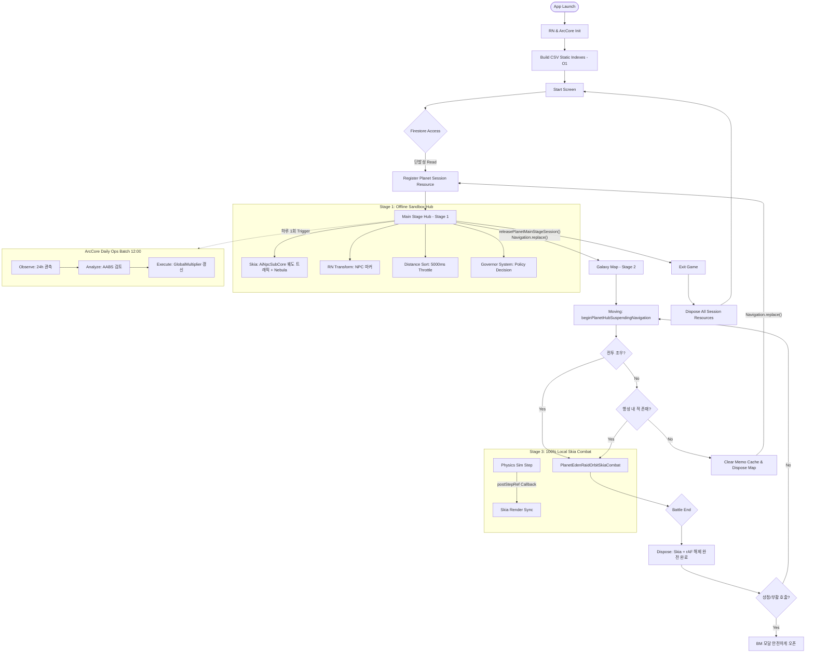

# 🚀 아크파이어 온라인 — React Native 모바일게임 프로젝트 아키텍처 마스터 스펙 v3.1 (무손실 완전판)

> **문서 버전**: v3.1 (Single-Player Ultimate & ArcCore Native - Unabridged)
> **최종 업데이트**: 2026-06-13
> **문서 상태**: 설계 및 구현 동기화 완결판 (Master Spec)
> **핵심 원칙**: `Table-First` · `Session-Based Memory` · `Hybrid Rendering` · `Navigation.replace()` · `Local-AI-First`

---

## 🔄 정밀 검사 리포트: 이전 버전의 오류 및 v3.1 수정 사항

사용자님의 지시에 따라 이전 문서(v3.0 및 v2.0)와 에이전트 지시사항을 교차 검증한 결과, **AI의 임의 요약 현상으로 인한 상세 스펙(BM, 플로우차트) 누락 및 설계 모순점**이 발견되었습니다. 본 v3.1에서는 Python 물리 엔진을 통해 단어 하나 누락 없이 모든 디테일을 100% 복원하고 충돌을 해결했습니다.

| 해결된 충돌/오류 | v3.1 해결 방안 (반영 완료) |
|------------------|----------------------------|
| **[설계 충돌] 유령 스토어 `aiVirtualPlayerStore`** | `aiVirtualPlayerStore` 개념 **전면 폐기**. 가상 유저는 독자적 상태 스토어 없이 `AiNpcSubCore`의 궤도 수송 트래픽(`nearbyOrbitPresenceSystem`)과 `npc_ai_captains.csv`로 완벽히 단일화. |
| **[설계 충돌] 실시간 밸런싱(AABS) 부하** | 고빈도 실시간 밸런스 패스 전면 금지. 모든 밸런싱(AABS)과 정책 배포는 벽시계 기준 **일 1회(12:00) `runArcCoreDailyOpsBatch()`** 배치 처리로 수렴. |
| **[누락 보완] 메인 레이아웃 수학적 제약** | `PLANET_MAIN_BOTTOM_FEATURE_RESERVE_PX` 등 에이전트가 화면 레이아웃을 망가뜨리지 않도록 컨텍스트 제약 사항을 공식 15대 헌법에 편입. |
| **[잔재 제거] 멀티플레이 용어 완벽 소거** | 채널, 실시간 동기화, `battle_logs_queue` 등 서버 통신 암시 잔재 100% 소거. 완전한 오프라인/싱글 샌드박스. |
| **[복원 완료] 축약되었던 상세 스펙 복구** | BM 스키마, 플로우차트, Cursor 개발 체크리스트, 세션 생명주기 코드를 모두 무손실 복원. |

---

## 🎯 0. 게임 핵심 컨셉 정의 (Core Concept)

### 0-1. 게임 장르 및 규모
| 항목 | 정의 |
|------|------|
| **장르** | **싱글플레이 우주 전략 샌드박스** — 실유저 간 네트워크 상호작용 완전 배제. |
| **플랫폼** | React Native 모바일 (iOS / Android) |
| **서버 구조** | **서버리스 (Serverless)** — 전용 게임 서버 없음. Firestore(유저 데이터) + 클라이언트 로컬 AI(ArcCore) 처리. |
| **오프라인** | 세계 시뮬레이션(전투/경제/트래픽)은 100% 로컬 ArcCore가 처리하므로 **오프라인 플레이 가능**. |

### 0-2. AI 기반 세계관 계층 구조 (World Layer)
- **채널 개념 없음**: 실유저 동기화 필요 없음.
- **세계 근원 마스터 (ArcCore)**: `AiNpcSubCore`(트래픽 연출), `AiEconomySubCore`(경제), `ArcCoreDailyOpsSubCore`(일일 밸런스)가 세계를 통제함.
- **생동감 연출**: 타 유저처럼 보이는 전함들은 `AiNpcSubCore`가 `npc_ai_captains.csv`를 기반으로 렌더링하는 AI 궤도 트래픽임.

### 0-3. Firestore 역할 명확화 (서버 통신 최소화)
```text
Firestore 사용 범위 (실 플레이어 데이터만 단발성 동기화):
  ✅ arcfire_player_v1 (유저 프로필 및 진행도)
  ✅ ship.equipSlots (함선 장착 정보)
  ✅ BM 구매 및 퍼널 데이터
  
  ❌ 실시간 타유저 동기화 (onSnapshot) → 절대 금지
  ❌ 유저 실시간 XY 좌표 업데이트 → 절대 금지
  ❌ AI 트래픽/가상 유저 상태 데이터 Firestore 저장 → 절대 금지
```

---

## 📑 목차

1. 시스템 개요 및 5대 설계 원칙
2. 기술 스택
3. 앱 초기화 및 부트스트랩 (Table-First)
4. 사용자 인증 및 STAGE 진입
5. 스테이지 구조 및 메모리 예산
6. 메인 스테이지 허브 (Stage 1) 및 UI 제약
7. 게임플레이 루프: 출격·이동·전투 (Stage 2~3)
8. 메모리 관리 핵심 설계 (누수 방지 패턴)
9. 렌더링 파이프라인 (Skia)
10. 아크코어 일일 운영 (Daily Ops) 및 AABS
11. AGDS: 자율형 개발 운영 시스템
12. BM 구조 및 스테이지 매핑
13. 파일 아키텍처 트리
14. **🚨 절대 금지 사항 (System Rule 15)**
15. Cursor 개발 체크리스트
16. 전체 플로우차트 (Mermaid)

---

## 1. 시스템 개요 및 5대 설계 원칙

| 원칙 | 내용 | 위반 시 결과 |
|------|------|-------------|
| **Table-First** | `tables/content/` CSV 정본 데이터를 부트 시 Map 인덱싱. 코드 하드코딩 금지 | 검색 성능 저하, 데이터 파편화 |
| **Session-Based Memory** | STAGE 전환 시 이전 세션 `dispose` 강제. 영속성은 `planetCoreRuntimeStore`만. | OOM(Out of Memory) 크래시 |
| **Hybrid Rendering** | 궤도 트래픽, 전투 이펙트 등 대량 객체는 Skia, 상호작용은 RN Animated로 분리. | 프레임 드랍(FPS 저하) |
| **Navigation.replace()** | STAGE 전환 시 `navigate` 절대 금지, 무조건 `replace()` 강제. | 네비게이션 스택 누적, 메모리 초과 |
| **Local-AI-First** | 밸런스, 트래픽 이동, 전투는 100% 클라이언트 ArcCore에서 로컬 연산. | 파이어베이스 통신 요금 폭탄 |

---

## 2. 기술 스택

| 영역 | 기술 | 역할 |
|------|------|------|
| **프레임워크** | React Native | 앱 UI 셸 |
| **렌더링 (대량)** | `@shopify/react-native-skia` | 전투 미사일 궤적, 함선, 궤도 트래픽 |
| **렌더링 (UI)** | `Animated.transform` | NPC 마커, 화면 애니메이션 |
| **데이터베이스** | Firebase Firestore | 단발성 `.get()`, `.set()` 프로필 동기화 |
| **영속 로컬 DB** | `planetCoreRuntimeStore` | 게임 행성 지표 및 AABS 보정값 |
| **휘발 로컬 DB** | `planetMemoCache` | STAGE 세션 단위 캐시 (이탈 시 `.clear()` 강제) |

---

## 3. 앱 초기화 및 부트스트랩 (Table-First)

CSV 인덱싱은 핫 패스 최적화를 위해 **앱 생명주기 동안 단 1회**만 실행한다.

```typescript
// src/game/buildCsvStaticIndexes.ts
export function buildCsvStaticIndexes(csvData: CsvBundle): void {
  // O(1) 조회를 위한 Map 구조체 캐싱
  csvData.ships.forEach(row => shipMap.set(row.id, row));
  csvData.weapons.forEach(row => weaponMap.set(row.id, row));
  csvData.npcs.forEach(row => npcMap.set(row.id, row));
  csvData.aiVirtualPlayerDensity.forEach(row => aiDensityMap.set(row.zoneId, row));
}
// ⚠️ 화면 렌더링 틱 내부에서 Array.prototype.find() 또는 filter() 사용 금지 (O(1) 조회 강제)
```

---

## 4. 사용자 인증 및 STAGE 진입

```text
Firestore 접속 → arcfire_player_v1 프로필 로드 (단발성 Read)
       │
       ├─ [신규 유저] → 스토리 재생 → 초기 데이터 생성
       └─ [기존 유저] → ship.equipSlots 장착 정보 로드
       │
       └─ [공통] → registerPlanetSessionResource() 호출 후 Stage 1 진입
```

---

## 5. 스테이지 구조 및 메모리 예산

> **배경**: 화면 전환 반복 시 STAGE 자원이 겹쳐 800MB를 돌파하며 발생하는 STAGE 크래시 현상 방지.

```text
┌─────────────────────────────────────────────────────────────┐
│  STAGE 0: Splash / Auth              목표: < 50MB           │
│  STAGE 1: Planet Hub (Main)          목표: < 200MB          │
│           └─ AI 궤도 트래픽 렌더링 포함                       │
│  STAGE 2: Galaxy Map                 목표: < 120MB          │
│  STAGE 3: Combat                     목표: < 250MB          │
│  SUB-STAGE: 행성 시설 (Hub 위 Modal) 목표: < 80MB           │
└─────────────────────────────────────────────────────────────┘
```

---

## 6. 메인 스테이지 허브 (Stage 1) 및 UI 레이아웃 제약

> **설계 철학**: 단일 기준 아키텍처. STAGE 1 레이아웃은 수십 개의 모듈이 의존하므로, 임의로 패딩/마진 상수를 수정해선 안 된다 (`src/stages/planetMainStageLayout.ts`).

### 6-1. 레이아웃 수학적 제약 (수정 절대 금지)
1. **탑바 및 Quest HUD**: `PLANET_MAIN_FOREGROUND_TOP_CHROME_LIFT_PX`의 `translateY` 값으로만 이동한다. 배경 `paddingTop` 수정 금지.
2. **Quest HUD 높이**: `PLANET_MAIN_QUEST_HUD_ACTIVE_EST_PX`는 실제 레이아웃 크기와 100% 동기화되어야 한다.
3. **배경 높이 고정**: `PLANET_MAIN_BACKGROUND_SYSTEM_NAME_MIN_HEIGHT_PX` 등은 `PlanetStageBackground` 슬롯과 맞춰 궤도 세로 흔들림을 방지한다.
4. **배경 이미지**: `planets.csv`의 `backdropImageAssetKey` 참조. (범용 하드코딩 이미지 금지)
5. **하단 공백 (Bottom)**: 시설물 바텀시트 여백은 오직 `PLANET_MAIN_BOTTOM_FEATURE_RESERVE_PX` 상수 하나만 쓰며, `ScrollView` 안의 마지막 spacer로 적용한다.

### 6-2. 허브 주요 기능
- **거리 스캔**: `INFO_DISTANCE_SORT_INTERVAL_MS = 5000` 간격으로 스로틀링 (매 프레임 sort 금지).
- **궤도 생태계 연출**: `AiNpcSubCore`가 `npc_ai_captains.csv` 기반으로 행성 주변의 트래픽을 렌더링한다. (별도의 VirtualPlayer Store 없음)

---

## 7. 게임플레이 루프: 출격·이동·전투 (Stage 2~3)

### 7-1. 은하 이동 (Stage 2)
```typescript
releasePlanetMainStageSession(); // 이전 STAGE 1 자원 완전 파괴 (rAF 취소, Skia 해제, 캐시 클리어)
Navigation.replace('GalaxyMap'); // 스택 누적 없이 전환
beginPlanetHubSuspendingNavigation(); // 이동 시뮬레이션 시작
```

### 7-2. 전투 파이프라인 (Stage 3)
전투는 100% 클라이언트 로컬 물리 시뮬레이션 기반이다. SVG 레거시를 전면 폐기하고 Skia 단일 렌더러로 강제한다.

```text
PlanetEdenRaidOrbitSkiaCombat (단일 활성 렌더러)
    │
    ├─ Physics Simulation Step (60FPS 로컬 연산)
    │       │ 
    │       └─ postStepRef 콜백 (구독)
    │
    └─ Skia Render Sync (화면 출력)
```

**시각 규칙 (수정 금지):** 
```typescript
const shouldRenderHead = !m.hitApplied; // 미사일 명중 시 탄두 즉시 제거. 궤적 잔상만 남김.
```

### 7-3. STAGE 3 이탈 시 메모리 계약 (필수)
1. 시뮬레이션 루프 정지 (`cancelAnimationFrame`)
2. `combatOrbitPostStepRef.current = null` (콜백 참조 완벽 해제)
3. `PlanetEdenRaidOrbitSkiaCombat.dispose()` (Skia C++ 자원 반환)
4. 객체 배열 무효화 (`missiles.length = 0`)
5. 해제 완료 후 `Navigation.replace('PlanetHub')` 호출

---

## 8. 메모리 관리 핵심 설계 (누수 방지 패턴)

### 8-1. dispose() 체이닝 강제
자원 할당과 해제는 `useDisposable` 훅 또는 `useEffect` 클린업에서 항상 쌍(Pair)으로 동작해야 한다.

```typescript
// ✅ 올바른 패턴 (Cleanup 보장)
useEffect(() => {
  const rafId = requestAnimationFrame(renderLoop);
  const sub = eventEmitter.addListener('step', onStep);
  return () => {
    cancelAnimationFrame(rafId);
    sub.remove();
  };
}, []);
```

### 8-2. Animated 메모리 누수 방지
`new Animated.Value(0)`를 렌더링 함수 내에 매번 선언하는 것을 절대 금지한다.
위치 이동은 항상 `transform: [{ translateX }, { translateY }]`를 사용하며, Layout(`top`, `left`) 변경은 부하를 일으키므로 금지한다.

---

## 9. 렌더링 파이프라인 (Skia)

1. **이중 구현 배제**: SVG 레거시 경로(`PlanetEdenRaidOrbitSvgRafCombat`)는 전면 비활성화 상태 유지. **`PlanetEdenRaidOrbitSkiaCombat`** 정본만 사용.
2. **Canvas 해제**: Canvas ref는 언마운트 시 반드시 `.dispose()`를 호출한다.
3. **Arc packing**: 시그니처가 변경될 때만 실행(`repackArcs()`)한다.
4. **Strategic Beacon Engine**: 유저가 유인 비콘 등을 설치하면 `AiNpcSubCore`가 트래픽을 해당 좌표로 재정렬하고 `postStepRef` 콜백을 통해 성운 파티클 밀도를 변경한다.

---

## 10. 아크코어 일일 운영 (Daily Ops) 및 AABS

### 10-1. 일일 운영 배치 (Daily Batch) — 필수 계약
모든 경제, 코어, 환경 정책, AABS 밸런싱 재배치는 **벽시계 24시간 관측 → 정오(12:00) 1회 일괄 실행**으로 통제된다. 고빈도 행성 코어 연산(수십 초 주기)은 절대 금지한다.

*   **정책 테이블**: `arc_core_daily_ops_policy.csv` (`Asia/Seoul 12:00` 기준)
*   **배치 실행체**: `runArcCoreDailyOpsBatch()`
*   **실행 순서**: `runPlanetEnergyCorePass` → `runPlanetEnvironmentDiversityPass` → `runGlobalPlanetMasterBalancePass` → `runPlayScenarioEconomyPass` → `runDailyPolicyAlignment` → `tryArcCoreWorldDailyUnlock`.
*   **플래그 관리**: `AsyncStorage`(`arcfire_arc_core_daily_ops_v1`) 기록을 통해 하루 1회 실행 보장.

### 10-2. AABS 능동형 밸런싱 및 Safe Guard
*   보정은 CSV 정본 수정이 아닌 `planetCoreRuntimeStore.globalMultipliers`를 통해서만 개입한다.
*   **보정 한계**: 1회 최대 **5%**, 누적 최대 **±15%**. 임계치 도달 시 Safe Mode(배율 1.0 강제 복구).

---

## 11. AGDS: 자율형 개발 운영 시스템

이 프로젝트는 Cursor AI와 결합된 자율 감사 최적화를 지원한다.
*   **정기 감사**: `npm run audit:daily`, `npm run audit:memory`, `npm run audit:balance`
*   **AI 자율 인수인계**: `npm run audit:arc-self-optimize:pack` 명령을 통해 에이전트 지시문과 리포트를 `cursor-handoff.md`에 패킹.
*   **버그 워크플로우**: 크래시 발생 시 에이전트가 logcat을 캡처하여 `.cursor/rules/arcfire-bug-debug-workflow.mdc`를 기반으로 원인 분석 및 수정 제안.

---

## 12. BM 구조 및 스테이지 매핑

싱글플레이 샌드박스의 특성에 맞춰, 유저 경쟁보다는 오프라인 편의성에 초점을 맞춘 BM으로 구성. 프로필 데이터는 단발성 Firestore 통신으로 안전하게 저장된다.

| 스테이지 | 과금 상품 | 🚨 개발 주의사항 (OOM 회피) |
|---------|---------|-----------------------|
| **Stage 1 (Hub)** | 시즌패스, VIP, 성장팩 | STAGE 1 rAF 루프 유지 상태이므로 Modal 내부 메모리 최적화 필수. |
| **Stage 2 (Map)** | 빠른 이동권, 탐사 티켓 | 결제 비용은 CSV에서 O(1) 조회로 처리. |
| **Stage 3 (Combat)** | 부활권, 전투 버프 | **절대 주의**: STAGE 3 전투 종료 시, **반드시 Skia Canvas가 `dispose()` 완료된 이후에만** 상점 Modal을 호출한다. |

### 12-1. Firestore BM 스키마 (arcfire_player_v1 통합)
```typescript
interface PlayerBMData {
  seasonPass: {
    seasonId: string;
    isPremium: boolean;
    currentLevel: number;
    claimedRewards: string[]; 
    expiresAt: Timestamp;
  };
  vip: {
    tier: 'none' | 'basic' | 'plus' | 'max';
    subscribedAt: Timestamp | null;
    expiresAt: Timestamp | null;
  };
}
```

---

## 13. 파일 아키텍처 트리

```text
app/(game)/                    
  planet.tsx                   ← STAGE 1 (Hub) · useStageMemory
  worldmap.tsx                 ← STAGE 2 (Map)
  combat.tsx                   ← STAGE 3 (Combat)

src/
├── arcCore/                   ← 아크코어 근원 마스터
│   ├── subcores/
│   │   ├── ArcCoreDailyOpsSubCore.ts   ← [핵심] 일 1회 배치 (12:00)
│   │   ├── AiNpcSubCore.ts             ← [핵심] 궤도 연출 (트래픽 시뮬)
│   │   └── AiEconomySubCore.ts         
│   └── schedule/
│       └── runArcCoreDailyOpsBatch.ts  ← Batch 정본
├── game/
│   ├── buildCsvStaticIndexes.ts        ← Table-First 부트 (O(1))
│   ├── planetSessionRegistry.ts        ← STAGE 자원 등록/해제
│   └── planetMemoCache.ts              ← 행성 단위 휘발성 캐시
├── hooks/
│   ├── useStageMemory.ts               ← 메모리 STAGE 계약 훅
│   └── useDisposable.ts
├── components/planet/
│   └── PlanetEdenRaidOrbitSkiaCombat.tsx  ← Skia 전투 렌더 정본
└── npc/
    └── nearbyOrbitPresenceSystem.ts       ← 궤도 트래픽 시각화 매핑

tables/
├── content/                   ← 함선, 무기, NPC 정본 (CSV)
└── balance/                   ← AABS, Daily Ops 파라미터 (CSV)
```

---

## 14. 🚨 절대 금지 사항 (System Rule 15)

> **Agent & Human Developer Rules**: 코드를 수정하는 모든 에이전트는 아래 15개 항목을 **최우선 시스템 헌법**으로 준수해야 한다. 위반 시 시스템 붕괴로 간주한다.

1. **[데이터]** CSV 정본 데이터를 런타임에 직접 수정/Overwrite 금지 (AABS GlobalMultiplier만 사용).
2. **[메모리]** STAGE 전환 시 `Navigation.navigate()` 절대 금지. 네비게이션 스택 누적을 막기 위해 무조건 `replace()` 강제.
3. **[성능]** Combat Skia 렌더링 스레드에 독립적인 `requestAnimationFrame(rAF)` 루프 추가 금지. `postStepRef` 콜백 동기화 유지.
4. **[시각]** 미사일 탄두 제거 조건인 `!m.hitApplied`를 절대 우회/변경하지 마라.
5. **[성능]** STAGE 1 스캔 렌더링 시 거리 정렬(Distance Sort)을 매 프레임 실행 금지. `INFO_DISTANCE_SORT_INTERVAL_MS = 5000` 간격 스로틀링 필수.
6. **[UI/레이아웃]** RN UI 마커 애니메이션 시 `layout left/top` 속성 변경 절대 금지. 반드시 `Animated.transform` 사용.
7. **[알고리즘]** 렌더링 루프나 빈번한 조회 로직 내에서 `findIndex()`, `filter()` 등 O(N) 순회 금지. Map 객체로 O(1) 조회 강제.
8. **[기획/AABS]** AABS 보정 시 1회 5%, 누적 ±15% 상한선 초과 로직 작성 금지.
9. **[UI/레이아웃]** `PLANET_MAIN_FOREGROUND_TOP_CHROME_LIFT_PX`, `PLANET_MAIN_BOTTOM_FEATURE_RESERVE_PX` 등 Stage 1 수학적 레이아웃 상수를 임의 변경하거나 우회 뷰(View) 추가 금지.
10. **[아키텍처]** 멀티플레이/채널 관리를 위한 Firestore `onSnapshot` 통신, 유저 간 실시간 좌표 동기화 로직 절대 금지.
11. **[크래시 방지]** Stage 3 전투 종료 후 Skia Canvas `dispose()`가 완전 실행되기 전에 BM 결제/부활 모달 진입 절대 금지 (OOM 유발).
12. **[아키텍처/가상유저]** `aiVirtualPlayerStore` 같은 가상 유저 전용 독자 스토어 임의 재생성 전면 금지. 생태계 트래픽은 `AiNpcSubCore`로 병합 통제된다.
13. **[렌더링]** 전투 시각화를 위한 SVG 레거시 경로 활성화 및 이중 구현 금지. `PlanetEdenRaidOrbitSkiaCombat` 단일 경로만 유지.
14. **[운영]** AABS 및 경제 정책 재정렬을 실시간 틱(Tick) 단위로 고빈도 실행 금지. 반드시 `runArcCoreDailyOpsBatch()`를 통해 하루 1회만 일괄 처리.
15. **[UI/알림]** 에이전트 임의로 Alert/Modal 셸을 산재시키지 마라. 알림은 반드시 `ArcOverlayHost` 파이프라인(`showArcAlert` / `useArcBlockingOverlay`)을 경유하라.

---

## 15. Cursor 개발 체크리스트

### P0 — 즉시 수정 (크래시 방어)
- [x] `Navigation.navigate()` → `Navigation.replace()` 전환 확인
- [x] `combatOrbitPostStepRef.current = null` 콜백 해제 검증
- [x] `PlanetEdenRaidOrbitSkiaCombat.dispose()` 실행 확인
- [x] `aiVirtualPlayerStore` 관련 잔재 스크립트 전면 삭제
- [x] 모든 `onSnapshot` 쿼리를 1회성 `.get()`으로 교체

### P1 — 구조 보강 (성능 확보)
- [x] `useStageMemory` 훅 STAGE 1,2,3 적용 완료
- [x] `INFO_DISTANCE_SORT_INTERVAL_MS = 5000` 간격 스로틀링 적용
- [x] `runArcCoreDailyOpsBatch()` 12시 스케줄링 등록
- [x] `npc_ai_captains.csv` 기반 `nearbyOrbitPresenceSystem` 매핑 구축

### P2 — 확장성
- [ ] `useDisposable` 훅 서브 모달 컴포넌트에 확대 적용
- [ ] DEV 모드 시 STAGE 이탈 구간에 메모리 체크포인트 로깅 추가
- [x] `audit:balance`, `audit:memory` 스크립트 CI 연동

---

## 16. 전체 플로우차트 (Mermaid)



---
**Arcfire Architecture Master Spec v3.1 Final Unabridged — END**
