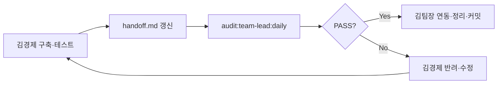

# 김팀장 · 김경제 협업 워크플로

> **목표**: 경제시스템·밸런스·아크코어 운영 고도화를 **김경제**가 구축·테스트하고, **김팀장**이 총괄 검수·연동하여 책임 체계를 명확히 한다.

## 역할

| 단계 | 김경제 `@김경제` | 김팀장 `@김팀장` |
|------|------------------|------------------|
| 설계·구현 | 경제·밸런스·일일 배치·SIM·무역 경제 **1차 구현** | v4.0·STAGE·비경제 arcCore **헌법 준수 감독** |
| 테스트 | `audit:balance-ops` · `audit:balance` · `sim:economy` · `tsc` | **1일 1회** `audit:team-lead:daily` 자동 검수 |
| Handoff | `tools/kim-team-lead/reports/kim-economy-handoff.md` 작성 | handoff **연동 대기** 항목 검수·머지 |
| 최종 책임 | 경제 축 **품질·계약** (일 1회 배치·price_elasticity=0) | **코드 연동·정리·릴리스 게이트** 총괄 |

## 일일 사이클 (KST 기준)



| 시각 (권장) | 주체 | 작업 |
|-------------|------|------|
| 수시 | 김경제 | 경제·밸런스 작업 · 게이트 실행 · handoff 갱신 |
| **09:00** | 김팀장 (자동) | `npm run audit:team-lead:daily` 또는 `start-daily-review.ps1` |
| 검수 후 | 김팀장 | handoff 연동 · UI/arcCore 비경제 연결 · FAIL 시 김경제 지시 |
| 12:00 | 앱 | `runArcCoreDailyOpsBatch` (일 1회 배치 ingest) |

## 김경제 작업 완료 체크리스트

1. v4.0 §10 계약 (고빈도 밸런스 금지 · elasticity=0)
2. `npm run audit:balance-ops` **PASS**
3. `npx tsc --noEmit -p tsconfig.client.json`
4. SIM/overlay 변경 시 `npm run sim:economy`
5. `tools/kim-team-lead/reports/kim-economy-handoff.md` — **ready-for-review**

## 김팀장 일일 검수 (자동)

```bash
npm run audit:team-lead:daily
```

산출:

- `tools/kim-team-lead/reports/daily-review-latest.md`
- `tools/kim-team-lead/reports/daily-review-state.json`

검수 항목: balance-ops · tsc · handoff 연동 대기 · 경제 축 git dirty

## 김팀장 세션 시작 (검수 이어하기)

```text
@김팀장 일일 경제 검수 이어줘. daily-review-latest.md·kim-economy-handoff.md 읽고 연동 정리.
```

## 김경제 세션 (작업 제출)

```text
@김경제 handoff ready-for-review. audit:balance-ops PASS 확인했어. 김팀장 검수 대기.
```

## 관련 문서

- `docs/KIM_TEAM_LEAD_AGENT.md` — 김팀장 운영
- `docs/KIM_ECONOMY_AGENT.md` — 김경제 운영
- `tools/kim-team-lead/README.md` — 스크립트·스케줄러
