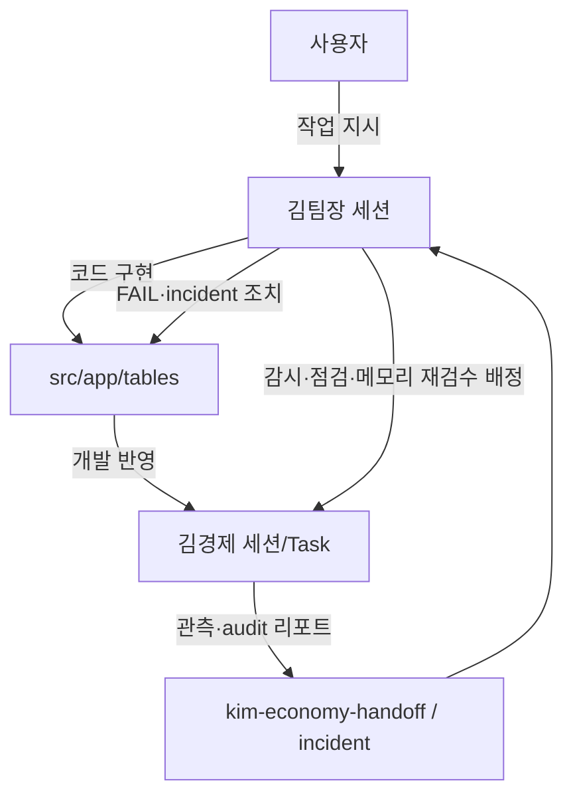
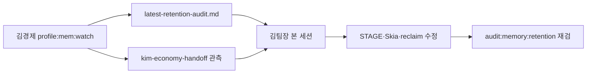

# 김팀장 · 김경제 협업 워크플로

> **2026-06-19 — 단일 지휘**: 사용자는 **김팀장 대화창 하나**에만 작업 지시.  
> **김경제** = 감시·점검·리포트만 · **코드 수정 없음** · **김팀장이 별도 배정**.

## 역할

| 구분 | 김팀장 `@김팀장` | 김경제 `@김경제` |
|------|------------------|------------------|
| 사용자 지시 | **유일한 수신** | **받지 않음** (김팀장 배정만) |
| 코드 | **전부** (경제·UI·Skia·arcCore) | **금지** |
| 감시 | 김경제 리포트 검토 → **본 세션에서 조치** | mem·crash **탐지·보고** · **개발 업데이트 시 즉각 메모리 재검수** |
| 경제 감사 | FAIL 항목 **본 세션에서 수정** | `audit:balance-ops` **실행·리포트** |
| Handoff | 관측·**retention audit** **검토·코드 반영** | `kim-economy-handoff.md` **`## [관측]`** · `latest-retention-audit.md` |

## 흐름



## 일일 사이클 (KST)

| 시각 | 주체 | 작업 |
|------|------|------|
| 상시 | 김경제 (배정) | `start-watch-30m.ps1` · `profile:mem:watch` · retention audit |
| 수시 | 김팀장 | 기능·경제 **코드** · 사용자 지시 처리 |
| **개발 반영 직후** | 김경제 (배정·자동) | **mem-post-dev-recheck** — timeline · crash · retention **즉각 재검수·handoff** |
| 수시 | 김경제 (배정) | `audit:balance-ops` 실행 → 리포트 |
| **09:00** | 김팀장 | `npm run audit:team-lead:daily` · 관측 교차 확인 · **코드 정리** |
| 12:00 | 앱 | `runArcCoreDailyOpsBatch` |

## 김팀장 → 김경제 배정 템플릿

```text
@김경제 모니터 PID 확인, mem-timeline 6h 요약, incident 있으면 handoff만. 코드 수정 금지.
```

```text
@김경제 audit:balance-ops 실행 후 FAIL만 handoff 관측 섹션. 수정은 김팀장 세션에서 할게.
```

```text
@김경제 audit:memory:retention 실행 — FAIL·플래그만 handoff 관측. 수정은 김팀장.
```

## 프로파일링 → 김팀장 코드 반영



- **FAIL** → 김팀장 **P1** (해당 STAGE 신규 기능보다 누수 수정 선행)
- 수정 후 handoff `[mem-profile-fix]` · 김경제에 **재감사만** 배정

## 김팀장 세션 (코드·기능)

```text
@김팀장 audit:balance-ops FAIL 항목 수정해줘. kim-economy-handoff 관측 섹션 참고.
```

## 금지

- 사용자가 **김팀장·김경제 두 창**에 동시에 상충하는 코드 지시
- 김경제 세션에서 **src/app/tables** 수정
- 김경제가 **sim:economy overlay** 코드 반영

## 관련 문서

- `docs/KIM_TEAM_LEAD_AGENT.md`
- `docs/KIM_ECONOMY_AGENT.md`
- `tools/kim-team-lead/README.md`
