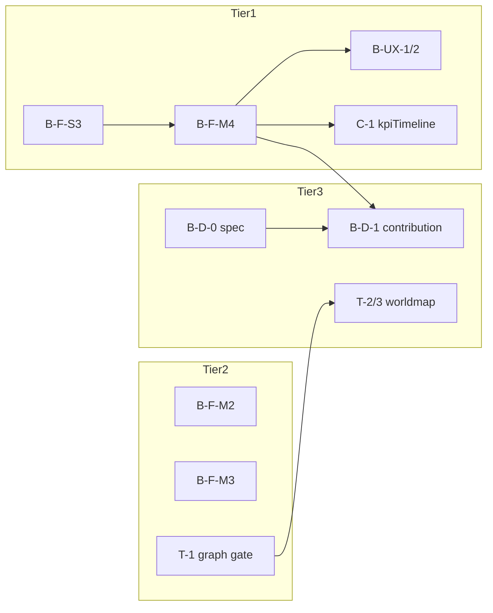

# Arcfire 깊이·학습 개발 로드맵 v1.0 — Fabric §8 · 행성개발 Bridge · Territorial · Learning/SIM

> **작성**: 2026-06-26  
> **상태**: **조사·우선순위 정본** (코드 착수 전 게이트 포함)  
> **전제**: `.cursor/rules/arcfire-memory-leak-audit-first.mdc` **1순위** · 중복 시스템·이중 store **금지**  
> **교차 참조**:  
> - Fabric: `docs/ARC_CORE_ECONOMY_FABRIC.md` §8  
> - Active Ecosystem (채택 범위): `docs/ecosystem/ARCFIRE_ACTIVE_ECOSYSTEM_ADOPTION_v1.md`  
> - Territorial: `docs/strategy/ARC_CORE_TACTICAL_AUTOMATION_AND_GALAXY_STRATEGY.md`  
> - Learning: `docs/ARC_CORE_SUSTAINABLE_LEARNING_MODEL_v1.md` (런타임 DORMANT)

---

## 0. 목표 (B + C)

| 트랙 | 목표 | **하지 않는 것** |
|------|------|------------------|
| **B — 깊이** | convoy·무역·시설·접전이 **행성 5대·무역·개발**에 **일 1회**로 수렴 | PEV·BotEngine·fleet DB·봇 자동 점유 |
| **C — 학습** | `sim:economy`·audit KPI가 **Policy Pack → 일 1회 ingest**로만 반영 | hot path Observation·3초 persist·부트 hydrate SIM |

**체감 원칙**: 플레이어에게는 **「하루에 한 번 세계가 정리된다」** + **전황 변화 시에만** 알림. 틱마다 HUD·팝업·가격·스탯 변동 **금지**.

---

## 1. 1차 조사 — 메모리·체감 리스크 매트릭스

### 1-1. 공통 금지 (B·C 공통 · 회귀 2026-06-16/17)

| ID | 금지 패턴 | 결과 |
|----|-----------|------|
| MEM-1 | `onBoot` 동기 **전 행성·전 무역소** 루프 | 부트 OOM·타이틀 멈춤 |
| MEM-2 | tick/probe마다 `JSON.stringify`+AsyncStorage | GC 톱니·PSS 피크 |
| MEM-3 | 거래·convoy마다 Learning/Observation flush | **롤백됨** — 일 1회만 |
| MEM-4 | Skia/궤도 **함량·스냅샷 Hz** 상향 | `planet.tsx` 리렌더 폭증 |
| UX-1 | 60s probe마다 전투 결과 **모달** | 피로·체감 「騒がしい」 |
| UX-2 | 실시간 스탯·가격 변동 | v4.0 §10·§14 위반 |
| UX-3 | 「활력」수치 난사·붉은 경고 남발 | economy overlay는 **등급 3~4단계**만 |

### 1-2. 트랙별 현재 baseline

| 영역 | 정본 | 빈도 | 메모리 | 체감 |
|------|------|------|--------|------|
| Fabric window/reconcile | `planetEconomyFabric.ts` | 24h window → **12:00 1회** | ✅ in-memory patch + 1 persist/planet/day | 간접 (재고·스탯) |
| Convoy daily | `runArcCoreConvoyDailySettlementPass` | **1회/일** | ✅ O(무역소 수) 배치 | 궤도 연출만 |
| Territorial | `ArcCoreTerritorialCombatSubCore` | probe **60s**, pass **3600s**, **3행성** | ⚠️ hold 변경 시 store+notice | 팝업은 **hold 변경만** |
| 행성개발 업그레이드 | `planetGenericFacilityDevelopment` | **플레이어 UI** | ✅ | 명확 |
| SIM ingest | `ingestBalanceOverlayDeltaIfPending` | **12:00 1회** | ✅ | 없음 |
| Learning runtime | `src/arcCore/learning/*` **DORMANT** | — | ✅ (비가동) | — |

### 1-3. B·C 확장 시 **반드시 지킬 계약**

```text
[허용 타이밍]
  T1  runArcCoreDailyOpsBatch (12:00 KST · catch-up 1회)
  T2  Territorial passInterval (3600s · due 행성만)
  T3  허브 진입 1회 read-only snapshot (fabric · holds)
  T4  CI/Node (sim:economy · merge-learning · audit) — RN 부트 없음

[금지 타이밍]
  X1  wall tick / rAF / postStepRef 내부
  X2  무역·mining tick마다 persist
  X3  앱 부트 동기 catch-up 전수 시뮬 (7일×N행성)
```

---

## 2. 트랙 B — Fabric §8 (깊이)

### 2-1. 항목별 조사

| ID | 작업 | 스탯/효과 | 난이도 | MEM | UX | 비고 |
|----|------|-----------|--------|-----|-----|------|
| **B-F-S1** | fabric window 플레이어 매매 누적 | R,P | S | ✅ | ✅ | **✅ 이미 구현** (`recordPlanetEconomyPlayerTrade`) |
| **B-F-S2** | 일일 reconcile → R·P nudge ±2 | R,P | S | ✅ | △ | **✅ 구현** · 체감은 **느림** → B-UX-1로 보완 |
| **B-F-S3** | 생산지 재고 합 → reconcile R 힌트 | R | S | ✅ | ✅ | `planetTradeMarketStore` **일 1회 스냅샷** |
| **B-F-M1** | supplyStockScale ↔ R·P 스냅샷 정합 | 재고 | S | ✅ | ✅ | penalty 튜닝만 |
| **B-F-M2** | 방위위성 level ↔ D 양방향 (일일 캡) | D | M | ✅ | ✅ | `runFacilityStatNudgePass`와 **중복 nudge 금지** — D만 |
| **B-F-M3** | SKU 수 = f(R, zone, stockScale) | R,T | M | ✅ | ✅ | 카탈로그 rebuild는 **배치·시나리오 pass만** |
| **B-F-M4** | convoy 행성별 profit → fabric KPI 필드 | R,P | M | ✅ | ✅ | window에 이미 부분 존재 → **reconcile meta**만 |
| **B-F-L1** | 채굴 세션 종료 → fabric window (행성 R) | R | L | ✅ | ✅ | **세션 종료 1회** record만 |
| **B-F-L2** | masterBalance ← 운영 스냅샷 보조 (캡) | 전체 | L | ⚠️ | △ | 레벨링 CSV와 **충돌 검증** 필수 |
| **B-F-XL** | TDI·R&D → `detail.development` 슬롯 | T,E,P | XL | ⚠️ | △ | **행성개발 bridge 선행 스펙** |

### 2-2. Fabric 체감 보강 (UX 전용 · MEM 안전)

| ID | 내용 | 타이밍 |
|----|------|--------|
| **B-UX-1** | `supplyStockScale` → 「침체/보통/활황/대호황」4단 라벨 | 허브 overlay **진입 1회** |
| **B-UX-2** | 「오늘의 운영」1줄 (convoy trips · trade gross · scale) | 동일 |
| **B-UX-3** | 배치 catch-up 후 **1회** 「N시간 경과」요약 Modal | **T1 직후 1회** (C1과 공유) |

---

## 3. 트랙 B — 행성개발 Bridge

### 3-1. 현재 단절 (조사 결과)

```text
수송선단 금고 (arcCoreTransportFleetBank)
  → convoy 매입/매출 ONLY
  ✗ planetGenericFacilityDevelopment (player.credits)

fabric (supplyStockScale · R/P nudge)
  → 무역 재고 · 일 1회 스탯
  ✗ 연구소 level · upgradeJob

runLaboratoryRdSpeedPass
  → 이미 설치된 lab의 rdSpeedBonusPct 캐시 ONLY
  ✗ install / startUpgrade
```

### 3-2. Bridge 설계 원칙 (이중 시스템 방지)

| 원칙 | 내용 |
|------|------|
| BR-1 | **새 vault/store 금지** — `detail.development` 슬롯 **1개**에 arc 기여·TDI 요약만 |
| BR-2 | 시설 **레벨 변경**은 기존 `writeFacilityModuleDetail` **단일 API** 경유 |
| BR-3 | 자동 업그레이드는 **플레이어 opt-in** + **일 1회 배치** + **CSV 비용·상한** |
| BR-4 | 수송 금고 → development **직접 이체 금지** — **행성별 arcContributionCr** (fabric 파생)만 |

### 3-3. Bridge 후보 (스펙 → 구현 순)

| ID | 내용 | MEM | UX | 선행 |
|----|------|-----|-----|------|
| **B-D-0** | `PlanetDevelopmentArcBridge` **스펙 1p** (자금·purge·계정 scope) | — | — | **필수** |
| **B-D-1** | fabric reconcile → `detail.development.arcContributionCr` (행성별, **일 1회 cap**) | ✅ | ✅ | B-F-M4 |
| **B-D-2** | opt-in 「아크코어 자동 투자」→ `startUpgrade` **배치 1회** (크레딧: player + contribution) | ⚠️ | △ | B-D-0 |
| **B-D-3** | TDI·lab level → fabric **T nudge 힌트** (읽기) | ✅ | ✅ | B-F-XL 스펙 |
| **B-D-4** | 연구소 Lv→`runLaboratoryRdSpeedPass` (기존) + **development 슬롯 mirror** | ✅ | ✅ | B-D-1 |

**연구소 Lv3 자발 사이클**: **B-D-0~2 완료 후에만** 가능. 그 전에는 **불가**(Adoption v1 결론 유지).

---

## 4. 트랙 B — Territorial (깊이)

### 4-1. 현재 vs 목표

| 항목 | 현재 | 목표 (전략 doc) |
|------|------|----------------|
| Pass | `draco_front` **3행성** CSV 로테이션 | **1홉 그래프** gate |
| Probe | 60s | 유지 (pass due만 실행) |
| Interval | 3600s | 유지 |
| 출발 거점 | 없음 | `planetHolds` + adjacent systems |
| 그래프 | `territorialCombatGraph` **검증만** | `AttackEligibilityResolver` |

### 4-2. Territorial 메모리·체감 조사

| 리스크 | 완화 |
|--------|------|
| 그래프 BFS every 60s | **due pass 때만** BFS · Map 캐시 `planetMemoCache` |
| hold 변경 폭주 | **passInterval** 유지 · enabled 행성만 CSV 확장 |
| 팝업 spam | **기존** `publishTerritorialHoldChangeNotice` — 변경时만 |
| clanWar store persist | 기존 coalesce 유지 · tick persist **추가 금지** |

### 4-3. Territorial Phase (전략 doc 정렬)

| Phase | ID | 산출 | MEM | UX |
|-------|-----|------|-----|-----|
| **T-0** | `GalaxyTacticalGraph` read-only + unit test | O(1) adjacency | ✅ | — |
| **T-1** | `AttackEligibilityResolver` — pass **앞단 gate** | due 행성만 | ✅ | — |
| **T-2** | draco_front → graph 순서 (CSV `campaignOrder` 유지) | 3→N 점진 | ✅ | △ 알림 copy만 |
| **T-3** | worldmap **1홉 전선** 표시 (색·아이콘) | read | ✅ | ✅ |
| **T-4** | `occupationCombatEnabled` 행성 확대 | 정책 CSV | ⚠️ | △ |

**Active Ecosystem §5 봇 force 점유** 와 **병행하지 않음** — Territorial은 **holds API** 정본.

---

## 5. 트랙 C — Learning + SIM ingest

### 5-1. 2026-06-26 회귀 교훈

| 시도 | 문제 | 조치 |
|------|------|------|
| hot path Observation + 3s debounce persist | GC·AsyncStorage 폭주 | **전면 롤백** |
| 부트 Learning hydrate + seed | 불필요 I/O | **DORMANT** |
| 일일 배치 tail learning pass | (단독은 OK) | ingest와 **통합 1 persist** |

### 5-2. 안전한 Learning 아키텍처 (C 전용)

```text
[CI / Node — RN 부트 없음]
  sim:economy → economySimOverlayDelta (git)
  audit:balance-ops → learning-state.json
  merge-learning-state.cjs → seed JSON (참고)

[RN — 일 1회만]
  runArcCoreDailyOpsBatch
    → ingestBalanceOverlayDeltaIfPending  (✅ 기존)
    → (신규) appendKpiTimelineFromFabric   (1 persist)
    → (신규) policyHistory if deltaId new  (1 row)

[금지]
  publishArcCoreObservation on trade/convoy
  Learning hydrate on boot
  Firebase onSnapshot
```

### 5-3. Learning Phase

| Phase | ID | 내용 | MEM | UX |
|-------|-----|------|-----|-----|
| **C-0** | Learning store **DORMANT 유지** · CI merge 문서화 | ✅ | — |
| **C-1** | 일일 배치: fabric reconcile KPI → `kpiTimeline` **1 append/day** | ✅ | 없음 |
| **C-2** | `policyHistory` ← ingest deltaId (ingest 성공时 **1줄**) | ✅ | 없음 |
| **C-3** | Policy Pack **타입·파일 only** (git `tools/policy-packs/`) — RN read **미연동** | ✅ | — |
| **C-4** | `npm run audit:team-lead:daily` ↔ kpiTimeline **교차 검증** | ✅ | — |
| **C-5** | Observation bus — **daily_ops.batch_complete 1건만** (optional) | ✅ | — |
| **C-6** | Firebase `policy_packs` boot **1 read** (opt-in flag) | ⚠️ | — |
| **C-7** | AiCombatTacticsSubCore · ScenarioRunner | **별도 로드맵** | ⚠️ | — |

**SIM ingest는 C-1 이전에도 동작** — C는 **관측·이력·검증 레이어** 추가.

---

## 6. 통합 개발 우선순위 (B+C · 깊이·학습 · MEM/UX 게이트 순)

> **순번 = 권장 착수 순서.** 각 단계 **DoD** 공통: `tsc` · `audit:balance-ops` · `audit:memory:all` · 김경제 `mem-post-dev-recheck`.

### Tier 0 — 조사·스펙 (코드 최소)

| 순번 | ID | 트랙 | 산출 |
|------|-----|------|------|
| **0.1** | (본 문서) | B+C | 우선순위·MEM 계약 |
| **0.2** | **B-D-0** | Bridge | `PlanetDevelopmentArcBridge` 1p 스펙 (purge·자금·opt-in) |
| **0.3** | **T-0** | Territorial | Graph read-only + 테스트 |

### Tier 1 — 저위험·기반 (체감 + fabric 깊이)

| 순번 | ID | 트랙 | 효과 |
|------|-----|------|------|
| **1.1** | **B-F-S3** | Fabric | 재고→R 힌트 |
| **1.2** | **B-F-M4** | Fabric | convoy KPI meta |
| **1.3** | **B-UX-1·2** | UX | 활력 라벨 + 오늘의 운영 |
| **1.4** | **C-1** | Learning | kpiTimeline 일 1회 (배치 only) |
| **1.5** | **C-2** | Learning | policyHistory ingest 연동 |

### Tier 2 — 중간 깊이 (게임플레이 연결)

| 순번 | ID | 트랙 | 효과 |
|------|-----|------|------|
| **2.1** | **B-F-M2** | Fabric | 방위위성↔D |
| **2.2** | **B-F-M3** | Fabric | SKU=f(R,zone,scale) |
| **2.3** | **T-1** | Territorial | 1홉 eligibility gate |
| **2.4** | **C-4** | Learning | team-lead daily ↔ KPI 교차 |
| **2.5** | **B-UX-3** | UX | 오프라인 1회 요약 (배치 후) |

### Tier 3 — Bridge·전선 (스펙 후)

| 순번 | ID | 트랙 | 효과 |
|------|-----|------|------|
| **3.1** | **B-D-1** | Bridge | arcContributionCr (일 1회) |
| **3.2** | **T-2·3** | Territorial | graph 캠페인 + worldmap 전선 |
| **3.3** | **B-F-L1** | Fabric | 채굴→fabric window |
| **3.4** | **C-3** | Learning | Policy Pack git-only draft |

### Tier 4 — 고비용·선행 다수

| 순번 | ID | 트랙 | 효과 |
|------|-----|------|------|
| **4.1** | **B-D-2** | Bridge | opt-in 자동 시설 투자 |
| **4.2** | **B-F-L2** | Fabric | masterBalance 보조 |
| **4.3** | **B-F-XL / B-D-3·4** | Bridge | TDI·development 슬롯 |
| **4.4** | **T-4** | Territorial | enabled 행성 확대 |
| **4.5** | **C-6~7** | Learning | Firebase read · Tactics SIM |

---

## 7. 트랙 간 의존성 (요약)



---

## 8. 완료 게이트 체크리스트 (매 Tier)

| # | 게이트 |
|---|--------|
| G1 | `npx tsc --noEmit -p tsconfig.client.json` |
| G2 | `npm run audit:balance-ops` |
| G3 | `npm run audit:memory:all` |
| G4 | 김경제 **mem-post-dev-recheck** (개발 반영 직후) |
| G5 | 부트·허브 **동기 장시간 루프 없음** (Kim team lead §경제 부트) |
| G6 | Skia/궤도 변경 시 `audit:skia-memory` + GL Δ ±15MB |
| G7 | UX: **hold 변경·배치 1회** 외 모달 없음 (수동 playtest 30m) |

---

## 9. 명시적 보류 (B+C에서도 하지 않음)

- `ArcBotEcosystemEngine` · PEV store · 100 fleet state  
- 봇 BLUE/RED **자동 planet owner** 변경  
- RTDB · onSnapshot · realtime price  
- Learning **hot path** Observation  
- 수송 금고 → 연구소 **직접** Lv3 자동 (Bridge 스펙 없이)  
- Territorial **probe 주기 단축** (<60s) 또는 passInterval 실시간화  

---

## 10. 다음 액션 (김팀장 세션)

1. ~~Tier 0.2~~ — `PLANET_DEVELOPMENT_ARC_BRIDGE_SPEC_v0.md` 초안 ✅  
2. ~~RTDB C-6~~ — boot sync · publish script · cloud contract ✅  
3. **Tier 2.1** — B-F-M2 방위위성↔D (facility nudge 중복 검증 후)  
4. **Tier 2.3** — T-1 AttackEligibilityResolver gate  
5. 김경제 **mem-post-dev-recheck** (RTDB·summary 반영 후)

---

*Related: [`ARCFIRE_ACTIVE_ECOSYSTEM_ADOPTION_v1.md`](./ARCFIRE_ACTIVE_ECOSYSTEM_ADOPTION_v1.md) · [`../strategy/README.md`](../strategy/README.md)*
