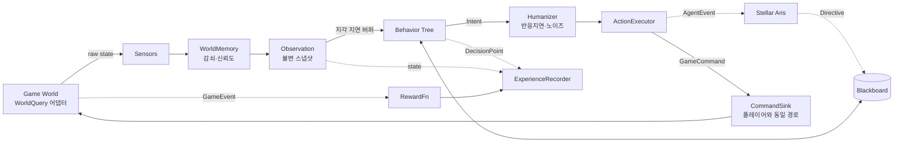
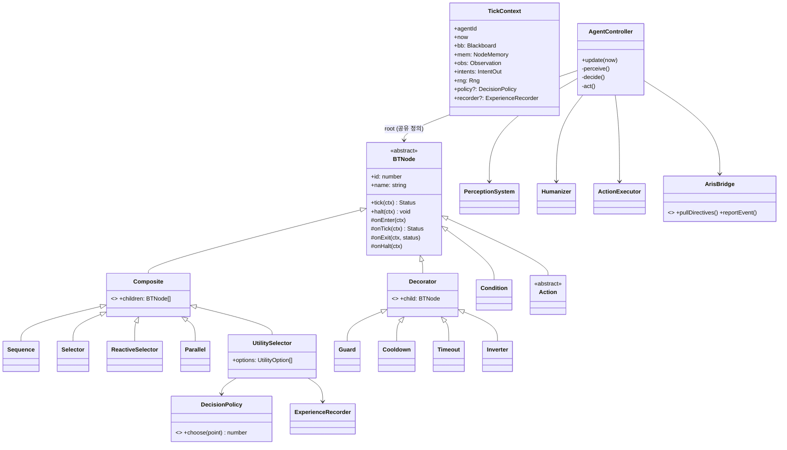

# 아크파이어(ArcFire) AI 봇/에이전트 시스템 — 기초 설계 검토 및 아키텍처 v1

> 문서 상태: **설계 검토용 초안 (개발 적용 전 리뷰 필요)**
> 작성일: 2026-10-10
> 대상: 자동 플레이(오토파일럿) 봇, NPC 에이전트(해적·광부·순찰·상인 등), 인게임 AI "스텔라 아리스" 연동
> 언어/런타임 가정: TypeScript 코어 (React Native 클라이언트 / Node 서버 양쪽에서 동일 코드 실행 가능하도록 엔진·RN 의존성 없음)

---

## 0. 전제와 확인 필요 사항 (먼저 읽어주세요)

이 문서를 작성하면서 **기존 AI 봇 설계안 원문(문서·코드)은 전달받지 못했습니다.** 또한 **스텔라 아리스의 현재 구현 방식(LLM 기반인지, 스크립트 기반인지, 서버/클라이언트 어디서 도는지, API 형태)도 확인된 정보가 없습니다.** 따라서:

- 1장의 "리뷰"는 기존 설계 원문이 아니라, **이런 종류의 봇 설계에서 반드시 확인해야 하는 진단 기준**에 대해 본 설계가 어떻게 대응하는지로 구성했습니다. 원문을 주시면 같은 기준으로 항목별 대조 리뷰를 다시 작성하겠습니다.
- 확인되지 않은 값은 추측하지 않고 `TBD`로 표기했습니다.

| # | 확인 필요 항목 | 왜 중요한가 | 현재 문서의 임시 가정 |
|---|---|---|---|
| T1 | 게임 클라이언트 엔진 (RN 단독 / RN+네이티브 렌더러 / Unity 등) | 코어 코드가 어디서 돌지, 성능 예산 | 엔진 무관 순수 TS, 어댑터로 연결 |
| T2 | 서버 권한 구조 (Server-authoritative 여부) | NPC AI를 서버에서 돌릴지 결정 | NPC=서버, 오토파일럿=클라이언트(서버 검증) |
| T3 | 스텔라 아리스 현재 구현·API | 연동 인터페이스 확정 | 비동기 지시(Directive)/이벤트 교환 인터페이스만 정의 |
| T4 | 공간 차원 (2D 평면 / 3D) | 이동·노이즈·조준 계산 | `Vec3` 사용, 2D면 z=0 |
| T5 | 동시 활성 NPC 규모 (성계당 / 서버당) | LOD·틱 예산 | 프레임당 AI 예산 상한 설정값으로 둠 |
| T6 | 학습 데이터 저장 인프라 | RL 로그 파이프라인 | 인터페이스만 정의 (이전 프로젝트의 AWS 사용 여부 미확정) |
| T7 | 봇이 "플레이어처럼 보이는" 운용을 할지 여부 | 아래 4.5절 정책 리스크 | NPC는 NPC로 표시하는 것을 기본값으로 둠 |

---

## 1. 설계 타당성 리뷰 (진단 기준 기반)

### 1.1 진단 체크리스트

| 영역 | 흔히 발생하는 결함 | 본 설계의 대응 |
|---|---|---|
| **BT 구조** | 거대한 if/else 또는 FSM 하나에 모든 상태가 몰려 상태 폭발 | Composite / Decorator / Leaf 분리, 서브트리 단위 재사용 |
| | 트리 인스턴스를 에이전트마다 복제 → 메모리 낭비 | **트리 정의는 공유, 실행 상태(NodeMemory)는 에이전트별 분리** |
| | 상위 우선순위 행동(도망)이 하위 행동(채굴)을 끊지 못함 | `ReactiveSelector` + `halt()` 전파로 선점(preemption) 처리 |
| | 실행 중 행동 중단 시 정리 로직 부재 (예: 채굴 레이저 계속 켜짐) | 모든 노드에 `onEnter / onExit / onHalt` 생명주기 |
| **지각-판단-실행** | BT 리프가 게임 엔진 객체를 직접 조회·조작 → 테스트 불가, 서버/클라 이식 불가 | 지각=`Observation`(불변 스냅샷), 판단=BT, 실행=`Intent`→`CommandSink` 로 **단방향 데이터 흐름** |
| | 매 프레임 전체 판단 → 모바일 발열·배터리 | 지각/판단/실행 **주기 분리** + 거리 기반 LOD |
| | 봇이 플레이어와 다른 "치트 경로"로 명령 실행 | 봇도 **플레이어와 동일한 커맨드 API**로만 행동 (서버 검증 동일 적용) |
| **RL/적응** | 로깅이 사후에 덧붙여져 상태·행동·보상이 시점 불일치 | 결정 시점(Decision Point) 단위로 (s, a, r, s') 기록하는 `ExperienceRecorder` 내장 |
| | 저수준 조작(조이스틱)을 RL로 학습 → 비용 대비 효과 낮음 | **행동 공간을 "옵션(서브트리 선택)" 수준으로 제한** (계층형) |
| | 정책 교체 시 전체 봇 로직 재작성 | `DecisionPolicy` 인터페이스: 휴리스틱 ↔ 학습 정책 교체 가능 |
| **인간다움** | 반응 0ms, 조준 오차 0, 직선 경로 → 기계적 | `HumanProfile` 설정 레이어: 반응 지연(로그정규), 조준 오차, 저주파 경로 노이즈, 망설임 |
| | 노이즈를 `Math.random()`으로 처리 → 재현 불가, 디버깅 불가 | 에이전트별 **시드 고정 RNG** |
| **아리스 연동** | LLM 호출을 게임 루프 안에서 `await` → 프레임 정지 | 아리스는 **느린 전략 계층**, BT 틱은 아리스를 절대 기다리지 않음 |

### 1.2 핵심 보완 포인트 요약

1. **트리 정의/실행 상태 분리** — MMO 서버에서 NPC 수백 개가 같은 트리를 공유해야 함.
2. **판단 결과를 직접 실행하지 않고 `Intent`로 출력** — 인간다움 레이어와 RL 로깅이 끼어들 수 있는 유일한 지점.
3. **RL은 처음부터 학습하지 않는다** — 1단계는 로깅, 2단계는 파라미터 튜닝, 3단계에서 특정 서브트리 선택만 학습 정책으로 교체 (8장 로드맵).
4. **아리스 = 지휘관, BT = 조종사** — 아리스는 목표·우선순위(Directive)를 블랙보드에 써주고, BT는 그것을 가중치로 반영할 뿐.

---

## 2. 전체 아키텍처

### 2.1 계층 구조

```
┌──────────────────────────────────────────────────────────────┐
│ L4 전략 계층  : 스텔라 아리스 (비동기, 수 초~수 분 주기)        │
│                 └ Directive(목표/우선순위) ↓   ↑ AgentEvent    │
├──────────────────────────────────────────────────────────────┤
│ L3 판단 계층  : Behavior Tree + UtilitySelector + Policy       │
│                 (5~10Hz, LOD에 따라 1Hz 이하)                   │
├──────────────────────────────────────────────────────────────┤
│ L2 지각 계층  : Sensors → WorldMemory → Observation            │
│                 (센서별 주기, 지각 지연 적용)                    │
├──────────────────────────────────────────────────────────────┤
│ L1 실행 계층  : Intent → Humanizer → ActionExecutor → Command  │
│                 (게임 시뮬레이션 틱마다)                         │
├──────────────────────────────────────────────────────────────┤
│ 횡단 관심사   : ExperienceRecorder(RL), BTTracer(디버그), Rng  │
└──────────────────────────────────────────────────────────────┘
```

### 2.2 데이터 흐름 (Perception → Decision → Action)



### 2.3 실행 위치 (T2 확정 전 임시안)

| 에이전트 종류 | 실행 위치 | 이유 |
|---|---|---|
| NPC (해적·순찰·상인·광부) | 서버 | 모든 플레이어에게 동일하게 보여야 함, 치트 방지 |
| 플레이어 오토파일럿 | 클라이언트 (명령은 서버 검증) | 서버 부하 절감, 오프라인 방치형 요소는 TBD |
| 학습(Training) | 오프라인 (별도 파이프라인) | 모바일·라이브 서버에서 학습 금지 |

---

## 3. 파일/디렉토리 구조

```
src/ai/
├── core/
│   ├── types.ts              # Vec3, EntityId, Faction 등 공용 타입
│   ├── Rng.ts                # 시드 고정 RNG (mulberry32)
│   ├── Blackboard.ts         # 타입 안전 키-값 저장소
│   └── Clock.ts              # 시뮬레이션 시간 (실시간 Date.now 사용 금지)
├── bt/
│   ├── Node.ts               # Status, BTNode, TickContext, NodeMemory
│   ├── composites.ts         # Sequence, Selector, ReactiveSelector, Parallel
│   ├── decorators.ts         # Inverter, Guard, Cooldown, Timeout, Retry
│   ├── leaves.ts             # Condition, Action(추상)
│   ├── UtilitySelector.ts    # 점수 기반 선택 + Policy 연동 지점
│   ├── builder.ts            # 트리 조립 DSL
│   └── BTTracer.ts           # 디버그 시각화용 실행 기록
├── perception/
│   ├── Observation.ts        # 판단 계층이 보는 유일한 입력
│   ├── Sensor.ts             # 센서 인터페이스
│   ├── sensors/              # RadarSensor, SelfStatusSensor, SystemInfoSensor
│   ├── WorldMemory.ts        # 마지막 목격 위치, 신뢰도 감쇠
│   └── PerceptionSystem.ts
├── action/
│   ├── Intent.ts             # 판단 결과 (고수준 명령)
│   ├── IntentScheduler.ts    # 반응 지연 적용 큐
│   ├── ActionExecutor.ts     # Intent → GameCommand
│   └── CommandSink.ts        # 게임 커맨드 API 어댑터 인터페이스
├── humanize/
│   ├── HumanProfile.ts       # 프리셋 (rookie / veteran / ace)
│   ├── Humanizer.ts          # 지연·조준오차·망설임
│   └── PathNoise.ts          # 저주파 경로 노이즈
├── learning/
│   ├── Experience.ts         # ExperienceStep 타입
│   ├── FeatureEncoder.ts     # Observation → 고정 길이 벡터
│   ├── RewardFn.ts           # 보상 함수 인터페이스 + 아키타입별 구현
│   ├── ExperienceRecorder.ts # 샘플링·배치 전송
│   └── DecisionPolicy.ts     # Heuristic / Bandit / Learned 정책
├── aris/
│   ├── ArisBridge.ts         # 아리스 연동 인터페이스
│   ├── Directive.ts
│   └── AgentEvent.ts
├── archetypes/
│   ├── miner.tree.ts
│   ├── pirate.tree.ts
│   ├── patrol.tree.ts
│   └── autopilot.tree.ts
├── agent/
│   ├── AgentController.ts    # 1개 에이전트의 지각-판단-실행 루프
│   └── AgentManager.ts       # LOD 스케줄링, 프레임 예산 관리
└── adapters/                 # 게임 엔진 쪽 구현 (T1 확정 후 작성)
    ├── WorldQuery.impl.ts
    └── CommandSink.impl.ts
tests/ai/                     # 시드 고정 시뮬레이션 테스트
```

**의존 방향 규칙:** `core ← bt ← archetypes`, `perception/action/learning/aris → core`. `adapters`만 게임 엔진을 import 한다. `src/ai/**` 어디에서도 `react-native`, 렌더러, 네트워크 라이브러리를 직접 import 하지 않는다.

---

## 4. 클래스 다이어그램



---

## 5. 비헤이비어 트리 코어 — 스켈레톤 코드

### 5.1 `core/Rng.ts`, `core/Blackboard.ts`

```ts
// core/Rng.ts — 에이전트별 시드 고정. Math.random() 사용 금지 (재현·리플레이 불가).
export class Rng {
  private s: number;
  constructor(seed: number) { this.s = seed >>> 0; }

  next(): number { // [0,1)
    let t = (this.s += 0x6d2b79f5);
    t = Math.imul(t ^ (t >>> 15), t | 1);
    t ^= t + Math.imul(t ^ (t >>> 7), t | 61);
    return ((t ^ (t >>> 14)) >>> 0) / 4294967296;
  }
  range(min: number, max: number): number { return min + (max - min) * this.next(); }
  gaussian(): number { // Box-Muller, 평균 0 표준편차 1
    const u = 1 - this.next(), v = this.next();
    return Math.sqrt(-2 * Math.log(u)) * Math.cos(2 * Math.PI * v);
  }
  logNormal(median: number, sigma: number): number { return median * Math.exp(sigma * this.gaussian()); }
  chance(p: number): boolean { return this.next() < p; }
}
```

```ts
// core/Blackboard.ts — 문자열 키 오타를 막기 위한 타입 키
export class BBKey<T> { constructor(readonly name: string) {} }

export class Blackboard {
  private m = new Map<string, unknown>();
  get<T>(k: BBKey<T>): T | undefined { return this.m.get(k.name) as T | undefined; }
  getOr<T>(k: BBKey<T>, fallback: T): T { return (this.m.get(k.name) as T) ?? fallback; }
  set<T>(k: BBKey<T>, v: T): void { this.m.set(k.name, v); }
  delete(k: BBKey<unknown>): void { this.m.delete(k.name); }
}

// 공용 키 정의 예시
export const BB = {
  targetId:       new BBKey<string>('targetId'),
  homeStationId:  new BBKey<string>('homeStationId'),
  fleeHullRatio:  new BBKey<number>('fleeHullRatio'),     // 튜닝/학습 대상 파라미터
  arisDirective:  new BBKey<import('../aris/Directive').ArisDirective>('arisDirective'),
} as const;
```

### 5.2 `bt/Node.ts` — 노드 기본 인터페이스

```ts
import { Blackboard } from '../core/Blackboard';
import { Rng } from '../core/Rng';
import type { Observation } from '../perception/Observation';
import type { Intent } from '../action/Intent';
import type { DecisionPolicy } from '../learning/DecisionPolicy';
import type { ExperienceRecorder } from '../learning/ExperienceRecorder';
import type { BTTracer } from './BTTracer';

export const enum Status { Success = 0, Failure = 1, Running = 2 }

/** 에이전트별 노드 실행 상태. 트리 정의(노드 객체)는 여러 에이전트가 공유한다. */
export class NodeMemory {
  private open = new Set<number>();
  private data = new Map<number, unknown>();
  isOpen(id: number) { return this.open.has(id); }
  setOpen(id: number, v: boolean) { v ? this.open.add(id) : this.open.delete(id); }
  get<T>(id: number): T | undefined { return this.data.get(id) as T | undefined; }
  set<T>(id: number, v: T) { this.data.set(id, v); }
  clear() { this.open.clear(); this.data.clear(); }
}

export interface IntentOut { emit(intent: Intent): void; }

export interface TickContext {
  readonly agentId: string;
  readonly now: number;            // 시뮬레이션 시간(ms)
  readonly obs: Observation;       // 지각 지연이 적용된 스냅샷 (읽기 전용)
  readonly bb: Blackboard;
  readonly mem: NodeMemory;
  readonly intents: IntentOut;
  readonly rng: Rng;
  readonly policy?: DecisionPolicy;
  readonly recorder?: ExperienceRecorder;
  readonly trace?: BTTracer;
}

let _nextId = 1;

export abstract class BTNode {
  readonly id = _nextId++;
  constructor(readonly name: string) {}

  /** 템플릿 메서드: 생명주기를 일관되게 보장한다. 하위 클래스는 onTick만 구현. */
  tick(ctx: TickContext): Status {
    if (!ctx.mem.isOpen(this.id)) {
      ctx.mem.setOpen(this.id, true);
      this.onEnter(ctx);
    }
    const s = this.onTick(ctx);
    ctx.trace?.record(ctx.agentId, this.id, this.name, s);
    if (s !== Status.Running) {
      ctx.mem.setOpen(this.id, false);
      this.onExit(ctx, s);
    }
    return s;
  }

  /** 상위 노드가 선점할 때 호출. 실행 중(open)일 때만 정리 로직 수행. */
  halt(ctx: TickContext): void {
    if (!ctx.mem.isOpen(this.id)) return;
    ctx.mem.setOpen(this.id, false);
    this.onHalt(ctx);
  }

  protected onEnter(_ctx: TickContext): void {}
  protected abstract onTick(ctx: TickContext): Status;
  protected onExit(_ctx: TickContext, _s: Status): void {}
  protected onHalt(_ctx: TickContext): void {}
}
```

### 5.3 `bt/composites.ts`

```ts
import { BTNode, Status, TickContext } from './Node';

export abstract class Composite extends BTNode {
  constructor(name: string, readonly children: BTNode[]) { super(name); }
  protected onHalt(ctx: TickContext) { for (const c of this.children) c.halt(ctx); }
}

/** 모두 성공해야 성공. 실행 중이던 자식 인덱스를 기억한다(메모리 시퀀스). */
export class Sequence extends Composite {
  protected onEnter(ctx: TickContext) { ctx.mem.set(this.id, 0); }
  protected onTick(ctx: TickContext): Status {
    for (let i = ctx.mem.get<number>(this.id) ?? 0; i < this.children.length; i++) {
      const s = this.children[i].tick(ctx);
      if (s === Status.Running) { ctx.mem.set(this.id, i); return s; }
      if (s === Status.Failure) return s;
    }
    return Status.Success;
  }
}

/** 하나라도 성공하면 성공. 실행 중이던 자식부터 재개. */
export class Selector extends Composite {
  protected onEnter(ctx: TickContext) { ctx.mem.set(this.id, 0); }
  protected onTick(ctx: TickContext): Status {
    for (let i = ctx.mem.get<number>(this.id) ?? 0; i < this.children.length; i++) {
      const s = this.children[i].tick(ctx);
      if (s === Status.Running) { ctx.mem.set(this.id, i); return s; }
      if (s === Status.Success) return s;
    }
    return Status.Failure;
  }
}

/**
 * 매 틱 0번(최고 우선순위)부터 재평가. 상위 자식이 활성화되면 하위 실행 자식을 halt.
 * 예: 채굴 중(Running) → 피격 → '전투/도망' 서브트리가 채굴을 선점.
 */
export class ReactiveSelector extends Composite {
  protected onEnter(ctx: TickContext) { ctx.mem.set(this.id, -1); }
  protected onTick(ctx: TickContext): Status {
    const prev = ctx.mem.get<number>(this.id) ?? -1;
    for (let i = 0; i < this.children.length; i++) {
      const s = this.children[i].tick(ctx);
      if (s === Status.Failure) continue;
      if (prev > i) this.children[prev].halt(ctx); // 선점
      ctx.mem.set(this.id, s === Status.Running ? i : -1);
      return s;
    }
    ctx.mem.set(this.id, -1);
    return Status.Failure;
  }
}

export const enum ParallelPolicy { RequireOne, RequireAll }

/** 자식을 동시에 틱. 예: '목표로 이동' + '이동 중 위협 감시'. */
export class Parallel extends Composite {
  constructor(name: string, children: BTNode[],
              private readonly successPolicy = ParallelPolicy.RequireAll,
              private readonly failurePolicy = ParallelPolicy.RequireOne) { super(name, children); }

  protected onTick(ctx: TickContext): Status {
    let ok = 0, fail = 0;
    for (const c of this.children) {
      const s = c.tick(ctx);
      if (s === Status.Success) ok++;
      else if (s === Status.Failure) fail++;
    }
    const n = this.children.length;
    const done = (p: ParallelPolicy, k: number) => p === ParallelPolicy.RequireOne ? k >= 1 : k === n;
    if (done(this.failurePolicy, fail)) { this.onHalt(ctx); return Status.Failure; }
    if (done(this.successPolicy, ok))   { this.onHalt(ctx); return Status.Success; }
    return Status.Running;
  }
}
```

### 5.4 `bt/decorators.ts`

```ts
import { BTNode, Status, TickContext } from './Node';

export abstract class Decorator extends BTNode {
  constructor(name: string, readonly child: BTNode) { super(name); }
  protected onHalt(ctx: TickContext) { this.child.halt(ctx); }
}

export class Inverter extends Decorator {
  protected onTick(ctx: TickContext): Status {
    const s = this.child.tick(ctx);
    return s === Status.Running ? s : s === Status.Success ? Status.Failure : Status.Success;
  }
}

/** 조건이 거짓이 되면 실행 중인 자식을 중단 (예: 타깃이 사라지면 공격 중단). */
export class Guard extends Decorator {
  constructor(name: string, private readonly cond: (ctx: TickContext) => boolean, child: BTNode) { super(name, child); }
  protected onTick(ctx: TickContext): Status {
    if (!this.cond(ctx)) { this.child.halt(ctx); return Status.Failure; }
    return this.child.tick(ctx);
  }
}

/** 자식 종료 후 일정 시간 재진입 금지 (예: 긴급 워프 남발 방지). */
export class Cooldown extends Decorator {
  constructor(name: string, private readonly ms: number, child: BTNode) { super(name, child); }
  // 노드 열림 여부와 무관하게 유지되어야 하므로 별도 키(음수 id) 사용
  private key() { return -this.id; }
  protected onTick(ctx: TickContext): Status {
    const readyAt = ctx.mem.get<number>(this.key()) ?? 0;
    if (ctx.now < readyAt) return Status.Failure;
    const s = this.child.tick(ctx);
    if (s !== Status.Running) ctx.mem.set(this.key(), ctx.now + this.ms);
    return s;
  }
}

/** 제한 시간 초과 시 실패 처리 (예: 경로가 막혀 영원히 이동만 하는 상황 방지). */
export class Timeout extends Decorator {
  constructor(name: string, private readonly ms: number, child: BTNode) { super(name, child); }
  protected onEnter(ctx: TickContext) { ctx.mem.set(this.id, ctx.now + this.ms); }
  protected onTick(ctx: TickContext): Status {
    if (ctx.now > (ctx.mem.get<number>(this.id) ?? Infinity)) { this.child.halt(ctx); return Status.Failure; }
    return this.child.tick(ctx);
  }
}

export class Retry extends Decorator {
  constructor(name: string, private readonly max: number, child: BTNode) { super(name, child); }
  protected onEnter(ctx: TickContext) { ctx.mem.set(this.id, 0); }
  protected onTick(ctx: TickContext): Status {
    const s = this.child.tick(ctx);
    if (s !== Status.Failure) return s;
    const n = (ctx.mem.get<number>(this.id) ?? 0) + 1;
    ctx.mem.set(this.id, n);
    return n >= this.max ? Status.Failure : Status.Running;
  }
}
```

### 5.5 `bt/leaves.ts`

```ts
import { BTNode, Status, TickContext } from './Node';

/** 순수 조건 검사. 부작용 금지 (Observation/Blackboard 읽기만). */
export class Condition extends BTNode {
  constructor(name: string, private readonly pred: (ctx: TickContext) => boolean) { super(name); }
  protected onTick(ctx: TickContext): Status { return this.pred(ctx) ? Status.Success : Status.Failure; }
}

/**
 * 행동 리프. 게임 엔진을 직접 조작하지 않고 ctx.intents.emit(...)으로 Intent만 낸다.
 * 완료 판정은 다음 틱의 Observation으로 한다 (예: 도착 여부).
 */
export abstract class Action extends BTNode {}
```

### 5.6 `bt/UtilitySelector.ts` — 휴리스틱 ↔ RL 정책 교체 지점

```ts
import { BTNode, Status, TickContext } from './Node';
import { BB } from '../core/Blackboard';

export interface UtilityOption {
  readonly key: string;                          // 행동 공간 라벨 (로그·학습에서 사용)
  readonly node: BTNode;
  readonly score: (ctx: TickContext) => number;  // 0~1 휴리스틱 점수
}

/**
 * 여러 옵션 중 하나를 고른다.
 * - policy 없음: 휴리스틱 점수 × 아리스 Directive 가중치 → 최댓값
 * - policy 있음: 정책이 선택 (학습/밴딧). 휴리스틱 점수는 정책 입력 및 폴백으로 사용
 * - 선택 시점마다 DecisionPoint를 recorder에 기록 → (s, a) 수집
 */
export class UtilitySelector extends BTNode {
  /** 실행 중 옵션을 유지하는 최소 시간. 매 틱 갈아타는 '떨림' 방지. */
  constructor(name: string, readonly options: UtilityOption[], private readonly commitMs = 1500) { super(name); }

  private state(ctx: TickContext) {
    return ctx.mem.get<{ idx: number; until: number }>(this.id) ?? { idx: -1, until: 0 };
  }

  protected onTick(ctx: TickContext): Status {
    const st = this.state(ctx);
    let idx = st.idx;

    if (idx < 0 || ctx.now >= st.until) {
      const directive = ctx.bb.get(BB.arisDirective);
      const scores = this.options.map(o => {
        const w = directive?.priorities?.[o.key] ?? 1;
        return Math.max(0, o.score(ctx)) * w;
      });

      const chosen = ctx.policy
        ? ctx.policy.choose({ agentId: ctx.agentId, selector: this.name, obs: ctx.obs,
                              optionKeys: this.options.map(o => o.key), heuristicScores: scores, rng: ctx.rng })
        : argmax(scores);

      ctx.recorder?.recordDecision({
        agentId: ctx.agentId, t: ctx.now, selector: this.name,
        actionKey: this.options[chosen].key, heuristicScores: scores,
        policyVersion: ctx.policy?.version ?? 'heuristic',
      });

      if (idx >= 0 && idx !== chosen) this.options[idx].node.halt(ctx);
      idx = chosen;
      ctx.mem.set(this.id, { idx, until: ctx.now + this.commitMs });
    }

    const s = this.options[idx].node.tick(ctx);
    if (s !== Status.Running) ctx.mem.set(this.id, { idx: -1, until: 0 });
    return s;
  }

  protected onHalt(ctx: TickContext) {
    const { idx } = this.state(ctx);
    if (idx >= 0) this.options[idx].node.halt(ctx);
    ctx.mem.set(this.id, { idx: -1, until: 0 });
  }
}

function argmax(xs: number[]): number {
  let best = 0;
  for (let i = 1; i < xs.length; i++) if (xs[i] > xs[best]) best = i;
  return best;
}
```

### 5.7 `bt/builder.ts` 와 아키타입 예시 (`archetypes/miner.tree.ts`)

```ts
// builder.ts — 가독성용 DSL
import { BTNode, TickContext } from './Node';
import { Sequence, Selector, ReactiveSelector } from './composites';
import { Guard, Cooldown, Timeout } from './decorators';
import { Condition } from './leaves';
import { UtilitySelector, UtilityOption } from './UtilitySelector';

export const seq      = (n: string, c: BTNode[]) => new Sequence(n, c);
export const sel      = (n: string, c: BTNode[]) => new Selector(n, c);
export const priority = (n: string, c: BTNode[]) => new ReactiveSelector(n, c);
export const cond     = (n: string, f: (ctx: TickContext) => boolean) => new Condition(n, f);
export const guard    = (n: string, f: (ctx: TickContext) => boolean, c: BTNode) => new Guard(n, f, c);
export const cooldown = (n: string, ms: number, c: BTNode) => new Cooldown(n, ms, c);
export const timeout  = (n: string, ms: number, c: BTNode) => new Timeout(n, ms, c);
export const utility  = (n: string, o: UtilityOption[], commitMs?: number) => new UtilitySelector(n, o, commitMs);
```

```ts
// archetypes/miner.tree.ts — 광부 NPC (탐색 / 파밍 / 전투 / 회복 / 도망)
import { priority, seq, cond, guard, cooldown, timeout, utility } from '../bt/builder';
import { BB } from '../core/Blackboard';
import { FleeToSafeStation, AttackThreat, DockAndRepair, DockAndSell, MineNearest, ExploreAnomaly, Idle } from './actions';

export const minerTree = priority('Miner.Root', [
  // 1) 도망: 선체 비율이 임계값 미만 (임계값은 BB에서 읽음 → 튜닝/학습 대상)
  seq('Flee', [
    cond('HullCritical', c => c.obs.self.hullRatio < c.bb.getOr(BB.fleeHullRatio, 0.3)),
    cooldown('FleeCD', 20_000, timeout('FleeTO', 60_000, new FleeToSafeStation('FleeToSafeStation'))),
  ]),
  // 2) 전투: 위협이 있고 이길 만할 때
  seq('Fight', [
    cond('UnderAttack', c => c.obs.threats.length > 0),
    cond('CanWin', c => c.obs.threats[0].estPower < c.obs.self.estPower * 0.8),
    guard('TargetAlive', c => c.obs.threats.length > 0, new AttackThreat('AttackThreat')),
  ]),
  // 3) 회복
  seq('Repair', [cond('Damaged', c => c.obs.self.hullRatio < 0.7), new DockAndRepair('DockAndRepair')]),
  // 4) 정산
  seq('Unload', [cond('CargoFull', c => c.obs.self.cargoRatio > 0.95), new DockAndSell('DockAndSell')]),
  // 5) 일상 업무: 점수 기반 (RL 정책 교체 지점)
  utility('Miner.Work', [
    { key: 'mine',    node: new MineNearest('MineNearest'),     score: c => c.obs.env.nearestOreDist < 50_000 ? 0.8 : 0.2 },
    { key: 'explore', node: new ExploreAnomaly('ExploreAnomaly'), score: c => c.obs.env.unexploredSignals > 0 ? 0.6 : 0.0 },
  ]),
  new Idle('Idle'),
]);
```

> 위 수치(0.3, 0.8, 50_000 등)는 **구조 설명용 초기값**이며 밸런스 근거가 없습니다. 실제 값은 플레이테스트/로그로 튜닝해야 합니다.

### 5.8 Action 리프 구현 예시 (`archetypes/actions.ts` 일부)

```ts
import { Action } from '../bt/leaves';
import { Status, TickContext } from '../bt/Node';

export class MineNearest extends Action {
  protected onTick(ctx: TickContext): Status {
    const ore = ctx.obs.env.nearestOre;
    if (!ore) return Status.Failure;
    if (ctx.obs.self.cargoRatio > 0.95) return Status.Success;
    if (ore.dist > 5_000) ctx.intents.emit({ kind: 'MoveTo', target: ore.pos, arriveRadius: 4_000 });
    else                  ctx.intents.emit({ kind: 'Mine', asteroidId: ore.id });
    return Status.Running;
  }
  // 선점당하면 채굴 모듈을 끈다 — onHalt 누락은 대표적 버그 원인
  protected onHalt(ctx: TickContext) { ctx.intents.emit({ kind: 'StopModules', group: 'mining' }); }
}
```

---

## 6. 지각-판단-실행 루프

### 6.1 지각 계층 타입

```ts
// perception/Observation.ts — 판단 계층이 볼 수 있는 유일한 입력 (불변)
export interface ContactInfo {
  id: string; faction: 'green' | 'red' | 'blue' | 'neutral' | 'npc';
  pos: Vec3; vel: Vec3; dist: number;
  estPower: number;        // 추정 전투력 (정확값 아님 — 정보 비대칭 유지)
  lastSeenAt: number;      // 레이더에서 사라져도 일정 시간 기억
  confidence: number;      // 0~1, 시간에 따라 감쇠
}

export interface Observation {
  t: number;
  self: { pos: Vec3; vel: Vec3; hullRatio: number; shieldRatio: number; energyRatio: number;
          cargoRatio: number; estPower: number; dockedAt?: string };
  contacts: ContactInfo[];
  threats: ContactInfo[];  // contacts 중 적대 + 위협도 순 정렬
  env: { systemId: string; securityLevel: number; nearestOre?: { id: string; pos: Vec3; dist: number };
         nearestOreDist: number; unexploredSignals: number; safeStationId?: string };
}

// perception/Sensor.ts
export interface WorldQuery {                       // adapters/에서 엔진별 구현 (T1)
  getSelf(agentId: string): RawShipState;
  shipsInRadius(center: Vec3, radius: number): RawShipState[];
  systemInfo(systemId: string): RawSystemInfo;
}

export interface Sensor {
  readonly name: string;
  readonly periodMs: number;                        // 센서별 갱신 주기 (레이더 500ms, 성계정보 5s 등)
  sense(agentId: string, world: WorldQuery, mem: WorldMemory, now: number): void;
}
```

`WorldMemory`는 센서가 쓰는 곳, `Observation`은 판단이 읽는 곳입니다. 레이더 범위를 벗어난 적도 `confidence`가 감쇠하는 동안 기억하므로 "시야에서 사라지면 즉시 잊는" 기계적 행동을 피합니다.

### 6.2 실행 계층 타입

```ts
// action/Intent.ts — 판단의 출력 (고수준 명령). 게임 엔진 개념에 1:1 대응하지 않아도 됨.
export type Intent =
  | { kind: 'MoveTo'; target: Vec3; arriveRadius: number }
  | { kind: 'Orbit'; targetId: string; range: number }
  | { kind: 'Attack'; targetId: string; weaponGroup?: string; aimErrorDeg?: number }
  | { kind: 'Mine'; asteroidId: string }
  | { kind: 'Dock'; stationId: string }
  | { kind: 'Warp'; destId: string }
  | { kind: 'UseModule'; moduleId: string }
  | { kind: 'StopModules'; group: string }
  | { kind: 'Idle' };

export const intentKey = (i: Intent): string => {
  switch (i.kind) {
    case 'MoveTo': return `MoveTo:${Math.round(i.target.x / 1000)}:${Math.round(i.target.y / 1000)}:${Math.round(i.target.z / 1000)}`;
    case 'Orbit': case 'Attack': return `${i.kind}:${i.targetId}`;
    case 'Mine': return `Mine:${i.asteroidId}`;
    case 'Dock': return `Dock:${i.stationId}`;
    case 'Warp': return `Warp:${i.destId}`;
    case 'UseModule': return `Use:${i.moduleId}`;
    case 'StopModules': return `Stop:${i.group}`;
    default: return i.kind;
  }
};

// action/CommandSink.ts — 플레이어 입력과 '동일한' 커맨드 API로만 행동
export interface CommandSink { submit(agentId: string, cmd: GameCommand): void; }
```

### 6.3 에이전트 루프 (`agent/AgentController.ts`)

```ts
export interface AgentConfig {
  agentId: string;
  seed: number;
  root: BTNode;                 // 공유 트리 정의
  profile: HumanProfile;
  decideHz: number;             // 기본 판단 주기 (LOD로 조정)
}

export class AgentController {
  private readonly mem = new NodeMemory();
  private readonly bb = new Blackboard();
  private readonly rng: Rng;
  private readonly obsBuffer: Observation[] = [];   // 지각 지연용 링버퍼
  private readonly pending: Intent[] = [];
  private nextDecideAt = 0;
  private lastStepObs?: Observation;
  lodScale = 1;                                     // AgentManager가 거리 기반으로 조정 (1=최상, 0.1=원거리)

  constructor(private cfg: AgentConfig,
              private perception: PerceptionSystem,
              private humanizer: Humanizer,
              private executor: ActionExecutor,
              private aris?: ArisBridge,
              private policy?: DecisionPolicy,
              private recorder?: ExperienceRecorder,
              private reward?: RewardFn) {
    this.rng = new Rng(cfg.seed);
  }

  /** 게임 시뮬레이션 틱마다 호출 (서버 틱 또는 클라 고정 스텝). 절대 await 하지 않는다. */
  update(now: number, events: GameEvent[]): void {
    // ① 지각: 센서별 주기에 맞춰 WorldMemory 갱신 → Observation 생성
    const obs = this.perception.update(this.cfg.agentId, now);
    this.pushObs(obs);

    // ② 아리스 지시 반영 (이미 비동기로 수신해 둔 것만 꺼냄 — 네트워크 대기 없음)
    const d = this.aris?.latestDirective(this.cfg.agentId, now);
    if (d) this.bb.set(BB.arisDirective, d); else this.bb.delete(BB.arisDirective);

    // ③ 판단: decideHz × lodScale 주기로만 BT 틱
    if (now >= this.nextDecideAt) {
      const perceived = this.delayedObs(now);   // 반응 지연이 적용된 '과거' 스냅샷
      this.pending.length = 0;
      this.cfg.root.tick({
        agentId: this.cfg.agentId, now, obs: perceived, bb: this.bb, mem: this.mem,
        intents: { emit: i => this.pending.push(i) }, rng: this.rng,
        policy: this.policy, recorder: this.recorder,
      });
      // 판단 간격에도 약간의 지터 → 모든 NPC가 같은 박자로 움직이지 않게
      const period = 1000 / (this.cfg.decideHz * this.lodScale);
      this.nextDecideAt = now + period * this.rng.range(0.85, 1.15);

      // ④ RL 스텝 기록: 이전 결정 이후 누적 보상
      if (this.recorder && this.reward && this.lastStepObs) {
        this.recorder.recordReward(this.cfg.agentId, now,
          this.reward.compute(this.lastStepObs, obs, events));
      }
      this.lastStepObs = obs;

      // ⑤ 인간다움: Intent에 반응 지연 스케줄링
      for (const i of this.pending) this.humanizer.schedule(this.cfg.agentId, i, now, this.rng, this.cfg.profile);
    }

    // ⑥ 실행: 지연이 끝난 Intent를 노이즈 적용해 커맨드로 변환 (매 틱)
    for (const i of this.humanizer.release(this.cfg.agentId, now)) {
      this.executor.execute(this.cfg.agentId, this.humanizer.perturb(this.cfg.agentId, i, obs, now, this.rng, this.cfg.profile));
    }

    // ⑦ 아리스로 의미 있는 이벤트만 배치 보고 (전투 개시, 사망, 도주 성공 등)
    for (const e of events) if (isReportable(e)) this.aris?.reportEvent(toAgentEvent(this.cfg.agentId, e));
  }

  private pushObs(o: Observation) {
    this.obsBuffer.push(o);
    if (this.obsBuffer.length > 64) this.obsBuffer.shift();
  }
  private delayedObs(now: number): Observation {
    const lag = this.cfg.profile.perceptionLagMs;
    for (let i = this.obsBuffer.length - 1; i >= 0; i--) if (this.obsBuffer[i].t <= now - lag) return this.obsBuffer[i];
    return this.obsBuffer[0];
  }
}
```

### 6.4 매니저 — LOD와 프레임 예산 (`agent/AgentManager.ts` 슈도코드)

```
every simulation tick:
    budgetMs = config.aiBudgetMsPerTick            # TBD (T5 확정 후)
    for agent in agents:
        agent.lodScale = lodFor(distanceToNearestPlayer(agent))
            # 근거리(전투 가능 거리) 1.0 / 같은 그리드 0.5 / 같은 성계 0.2 / 플레이어 없는 성계 → 추상 시뮬레이션
    for agent in roundRobin(agents) while elapsed < budgetMs:
        agent.update(now, eventsFor(agent))
    # 예산 초과로 못 돈 에이전트는 다음 틱 우선 처리 (기아 방지)
```

플레이어가 없는 성계의 NPC는 BT를 돌리지 않고 "시간당 채굴량/교전 결과"를 확률로 계산하는 **추상 시뮬레이션**으로 대체하는 것을 권장합니다 (서버 비용 절감). 플레이어가 진입하면 상태를 복원해 BT로 전환.

---

## 7. 인간다운 플레이 레이어 (Humanize)

### 7.1 `humanize/HumanProfile.ts`

```ts
export interface HumanProfile {
  name: string;
  reactionMedianMs: number;      // 새 Intent 반응 지연 중앙값 (로그정규)
  reactionSigma: number;         // 분산 (클수록 들쭉날쭉)
  perceptionLagMs: number;       // 상황 인지 자체의 지연
  aimErrorDeg: number;           // 조준 오차 표준편차 (타깃 각속도에 비례해 증가)
  pathNoiseAmp: number;          // 경로 측면 흔들림 진폭 (월드 단위)
  pathNoiseFreqHz: number;       // 저주파여야 자연스러움 (고주파 = 떨림)
  hesitationChance: number;      // 결정 전환 시 추가로 멈칫할 확률
  hesitationMs: [number, number];
  mistakeChance: number;         // 가끔 차선책을 고르는 확률 (UtilitySelector와 연동 가능)
}

// 아래 수치는 구조 예시용 초기값이며 검증된 값이 아님 — 플레이테스트로 튜닝 필요
export const PROFILES: Record<string, HumanProfile> = {
  rookie:  { name: 'rookie',  reactionMedianMs: 450, reactionSigma: 0.35, perceptionLagMs: 300,
             aimErrorDeg: 6, pathNoiseAmp: 400, pathNoiseFreqHz: 0.15,
             hesitationChance: 0.25, hesitationMs: [300, 1200], mistakeChance: 0.15 },
  veteran: { name: 'veteran', reactionMedianMs: 300, reactionSigma: 0.25, perceptionLagMs: 200,
             aimErrorDeg: 3, pathNoiseAmp: 200, pathNoiseFreqHz: 0.1,
             hesitationChance: 0.1, hesitationMs: [200, 600], mistakeChance: 0.05 },
  ace:     { name: 'ace',     reactionMedianMs: 220, reactionSigma: 0.2, perceptionLagMs: 120,
             aimErrorDeg: 1.5, pathNoiseAmp: 80, pathNoiseFreqHz: 0.08,
             hesitationChance: 0.03, hesitationMs: [100, 300], mistakeChance: 0.01 },
  autopilot: { name: 'autopilot', reactionMedianMs: 0, reactionSigma: 0, perceptionLagMs: 0,
             aimErrorDeg: 0, pathNoiseAmp: 0, pathNoiseFreqHz: 0,
             hesitationChance: 0, hesitationMs: [0, 0], mistakeChance: 0 }, // 플레이어 오토파일럿은 기본 무노이즈 (TBD)
};
```

### 7.2 `humanize/Humanizer.ts`

```ts
export class Humanizer {
  private queues = new Map<string, { at: number; intent: Intent; key: string }[]>();
  private active = new Map<string, string>();     // 현재 실행 중인 intentKey
  private noise = new Map<string, PathNoise>();

  /** 같은 행동의 '계속'은 지연 없음, 새로운 행동으로의 '전환'에만 반응 지연. */
  schedule(agentId: string, intent: Intent, now: number, rng: Rng, p: HumanProfile) {
    const key = intentKey(intent);
    const q = this.queues.get(agentId) ?? [];
    if (this.active.get(agentId) === key) { q.push({ at: now, intent, key }); this.queues.set(agentId, q); return; }

    let delay = p.reactionMedianMs > 0 ? rng.logNormal(p.reactionMedianMs, p.reactionSigma) : 0;
    if (rng.chance(p.hesitationChance)) delay += rng.range(p.hesitationMs[0], p.hesitationMs[1]);
    // 같은 키로 대기 중인 예약은 새 것으로 교체 (판단이 연속으로 같은 결론을 내면 중복 방지)
    const filtered = q.filter(e => e.key !== key);
    filtered.push({ at: now + delay, intent, key });
    this.queues.set(agentId, filtered);
  }

  release(agentId: string, now: number): Intent[] {
    const q = this.queues.get(agentId);
    if (!q || q.length === 0) return [];
    const ready = q.filter(e => e.at <= now);
    this.queues.set(agentId, q.filter(e => e.at > now));
    for (const r of ready) this.active.set(agentId, r.key);
    return ready.map(r => r.intent);
  }

  /** 실행 직전 오차 주입: 이동 경로 노이즈, 조준 오차. */
  perturb(agentId: string, intent: Intent, obs: Observation, now: number, rng: Rng, p: HumanProfile): Intent {
    if (intent.kind === 'MoveTo' && p.pathNoiseAmp > 0) {
      const n = this.noiseFor(agentId, rng, p);
      const dist = distance(obs.self.pos, intent.target);
      return { ...intent, target: add(intent.target, n.offset(now, dist, obs.self.vel)) };
    }
    if (intent.kind === 'Attack' && p.aimErrorDeg > 0) {
      // 조준 오차를 실제로 어떻게 반영할지는 전투 시스템의 명중 판정 방식에 따라 다름 (TBD)
      // 여기서는 오차 각도(표준편차 기반 샘플)를 Intent 필드로 전달하는 형태만 정의
      const target = obs.contacts.find(c => c.id === intent.targetId);
      const angSpeedFactor = target ? 1 + Math.min(2, length(target.vel) / 1000) : 1; // 빠른 타깃일수록 오차 증가
      return { ...intent, aimErrorDeg: rng.gaussian() * p.aimErrorDeg * angSpeedFactor };
    }
    return intent;
  }

  private noiseFor(agentId: string, rng: Rng, p: HumanProfile): PathNoise {
    let n = this.noise.get(agentId);
    if (!n) { n = new PathNoise(rng, p); this.noise.set(agentId, n); }
    return n;
  }
}
```

### 7.3 `humanize/PathNoise.ts` — 백색 노이즈가 아닌 저주파 노이즈

```ts
/**
 * 서로 다른 주파수·위상의 사인파 3개 합 → 부드럽고 반복이 티 안 나는 흔들림.
 * 진행 방향의 '측면'으로만 적용, 목적지에 가까워질수록 0으로 수렴 (도킹·정밀기동 방해 방지).
 */
export class PathNoise {
  private phase: number[]; private freq: number[];
  constructor(rng: Rng, private p: HumanProfile, private fadeDist = 10_000) {
    this.phase = [0, 1, 2].map(() => rng.range(0, Math.PI * 2));
    this.freq  = [1, 1.7, 2.9].map(m => p.pathNoiseFreqHz * m * rng.range(0.9, 1.1));
  }
  offset(nowMs: number, distToGoal: number, vel: Vec3): Vec3 {
    const t = nowMs / 1000;
    const s = (Math.sin(2 * Math.PI * this.freq[0] * t + this.phase[0])
             + 0.5 * Math.sin(2 * Math.PI * this.freq[1] * t + this.phase[1])
             + 0.25 * Math.sin(2 * Math.PI * this.freq[2] * t + this.phase[2])) / 1.75;
    const fade = Math.min(1, distToGoal / this.fadeDist);
    const side = perpendicular(normalize(vel));       // 2D면 (−vy, vx), 3D면 상향 벡터와의 외적 (T4)
    return scale(side, s * this.p.pathNoiseAmp * fade);
  }
}
```

### 7.4 설계 원칙

- **노이즈는 실행 계층에만**: BT 판단 로직은 노이즈와 무관하게 작성 → 판단 버그와 노이즈 효과를 분리해서 디버깅 가능.
- **지연은 '전환'에만**: 같은 행동을 계속하는 동안엔 지연이 없어야 함 (안 그러면 매 판단마다 멈칫거림).
- **시드 고정**: 동일 시드 + 동일 입력 → 동일 결과. 버그 리포트 재현과 학습 데이터 신뢰성의 전제 조건.
- **난이도 = 프로필**: 해적 등급(잡졸/정예/보스)을 BT를 바꾸지 않고 `HumanProfile` 교체로 구분.

### 7.5 정책 확인 사항 (T7)

봇에 인간다운 노이즈를 넣는 목적이 **NPC의 자연스러움**이면 문제없습니다. 반면 **봇을 실제 플레이어처럼 위장해 인구를 부풀리는 용도**라면 글로벌 출시 시 앱스토어 정책·각국 소비자보호 규정과 충돌할 소지가 있는지 법무 검토가 필요합니다. 이 부분은 제가 규정 적용 여부를 판단할 수 없어 확인 항목으로만 남깁니다.

---

## 8. 강화학습(RL) / 적응형 메커니즘 연동

### 8.1 인터페이스

```ts
// learning/Experience.ts
export interface DecisionRecord {
  agentId: string; t: number; selector: string;
  actionKey: string;                 // 옵션 단위 행동 ('mine', 'explore', 'engage', 'retreat' ...)
  heuristicScores: number[];
  policyVersion: string;             // 'heuristic' | 'bandit-v3' | 'ppo-2026-11-01' ...
}

export interface ExperienceStep {
  agentId: string; episodeId: string; t: number;
  archetype: string; profile: string;
  state: number[];                   // FeatureEncoder 출력 (고정 길이)
  stateSchemaVersion: number;        // 특징 정의 변경 시 증가 — 섞인 데이터로 학습 방지
  selector: string; actionKey: string; policyVersion: string;
  reward: number;                    // 이 결정 이후 다음 결정까지 누적 보상
  done: boolean;                     // 사망/도킹 종료 등
}

// learning/FeatureEncoder.ts — 학습은 Observation 원본이 아닌 정규화 벡터로
export interface FeatureEncoder {
  readonly version: number;
  readonly size: number;
  encode(obs: Observation, bb: Blackboard): number[];
}

// learning/RewardFn.ts — 아키타입별로 다름
export interface RewardFn {
  compute(prev: Observation, curr: Observation, events: GameEvent[]): number;
}

// learning/DecisionPolicy.ts
export interface DecisionPoint {
  agentId: string; selector: string; obs: Observation;
  optionKeys: string[]; heuristicScores: number[]; rng: Rng;
}
export interface DecisionPolicy {
  readonly version: string;
  choose(p: DecisionPoint): number;  // 반드시 동기·저비용 (틱 안에서 호출됨)
}

// learning/ExperienceRecorder.ts
export interface ExperienceSink { push(batch: ExperienceStep[]): void; } // 전송 구현은 T6 확정 후
export interface ExperienceRecorder {
  recordDecision(d: DecisionRecord): void;
  recordReward(agentId: string, t: number, r: number): void;
  endEpisode(agentId: string, t: number): void;
}
```

### 8.2 보상 함수 예시 (광부)

```ts
export class MinerReward implements RewardFn {
  compute(prev: Observation, curr: Observation, events: GameEvent[]): number {
    let r = 0;
    r += (curr.self.cargoRatio - prev.self.cargoRatio) * 1.0;           // 채굴 진척
    r -= Math.max(0, prev.self.hullRatio - curr.self.hullRatio) * 2.0;  // 피해
    for (const e of events) {
      if (e.type === 'Sold')      r += e.value * 0.001;
      if (e.type === 'Destroyed') r -= 10;                              // 손실
    }
    return r;
  }
}
```

> 보상 가중치는 예시입니다. 보상 설계가 잘못되면 "도망만 다니는 광부"처럼 의도치 않은 최적화가 일어나므로 단계별 검증이 필요합니다.

### 8.3 단계별 도입 로드맵 (권장)

| 단계 | 내용 | 정책 | 위험도 |
|---|---|---|---|
| **P0 로깅** | 휴리스틱 BT로 운영하며 `ExperienceStep` 수집 (샘플링률 설정, 예: NPC 5%) | `heuristic` | 낮음 |
| **P1 파라미터 튜닝** | `fleeHullRatio`, 점수 함수 계수 등 **블랙보드 파라미터**를 오프라인 분석/밴딧으로 조정 | `heuristic` + 튜닝된 값 | 낮음 |
| **P2 섀도 모드** | 학습 정책이 "무엇을 골랐을지"만 기록, 실제 행동은 휴리스틱 | `shadow:*` | 낮음 |
| **P3 부분 교체** | 특정 `UtilitySelector` 하나만 학습 정책으로 교체, A/B 비율로 점진 확대 | 학습 정책 | 중간 |
| **P4 적응형 난이도** | 플레이어 승률 데이터로 `HumanProfile` 자동 조정 | 별도 | 중간 |

**하지 않을 것:** 라이브 서버/모바일 기기에서 온라인 학습, 이동·조준 같은 저수준 조작을 RL로 대체, 생존 규칙(도망·회복)을 학습 정책에 맡기기 (안전 규칙은 상위 `ReactiveSelector`에 고정).

### 8.4 학습된 정책의 모바일 실행에 대해

학습 모델을 RN 클라이언트에서 추론하는 경우 사용할 런타임(예: ONNX 계열 RN 바인딩 등)의 Hermes/New Architecture 호환성과 앱 용량 영향은 **제가 현재 시점 기준으로 확인하지 못했습니다.** P3 진입 전 별도 기술 검증이 필요합니다. 대안으로, 옵션 수준 정책은 작은 선형 모델이나 결정 트리로도 충분한 경우가 많아 **순수 TS로 가중치 테이블만 내려받는 방식**이 가장 가벼운 선택지입니다.

---

## 9. 스텔라 아리스 연동 (기존 시스템 고도화)

> 아리스의 현재 구현을 모르므로 **연동 계약(Contract)만 정의**합니다. 아리스가 LLM 기반이든 스크립트 기반이든 이 인터페이스 뒤에 숨길 수 있습니다.

### 9.1 역할 분담

| | 스텔라 아리스 (L4) | BT 에이전트 (L1~L3) |
|---|---|---|
| 시간 단위 | 수 초~수 분 | 100~200ms |
| 결정 내용 | 무엇을 우선할지 (목표·우선순위·지역) | 지금 어떻게 할지 (이동·공격·도망) |
| 실패 시 | 지시 없음 → BT 기본 휴리스틱으로 계속 동작 | 안전 규칙(도망/회복)은 항상 우선 |
| 플레이어 노출 | 브리핑·대사·작전 설명 | 함선 움직임 |

### 9.2 인터페이스

```ts
// aris/Directive.ts
export interface ArisDirective {
  id: string;
  scope: 'agent' | 'squad' | 'faction';
  targetIds: string[];                         // 대상 에이전트/분대
  goal: 'Patrol' | 'Defend' | 'Raid' | 'Escort' | 'Expand' | 'Retreat' | 'Gather';
  area?: { systemId: string; center?: Vec3; radius?: number };
  priorities?: Partial<Record<string, number>>; // UtilityOption.key → 가중치 (기본 1)
  expiresAt: number;                           // 만료 후 자동 해제 (아리스 장애 시 고착 방지)
  narrative?: string;                          // 플레이어에게 보여줄 설명 (선택)
}

// aris/AgentEvent.ts
export interface AgentEvent {
  agentId: string; t: number;
  type: 'EngagementStarted' | 'Destroyed' | 'Fled' | 'ObjectiveReached' | 'ResourceDelivered' | 'TerritoryContested';
  systemId: string; payload?: Record<string, unknown>;
}

// aris/ArisBridge.ts
export interface ArisBridge {
  /** 동기·즉시 반환. 수신은 별도 비동기 채널이 미리 캐시에 채워 둔다. */
  latestDirective(agentId: string, now: number): ArisDirective | undefined;
  /** 내부 큐에 적재만 하고 즉시 반환. 배치 전송은 별도 주기. */
  reportEvent(e: AgentEvent): void;
}
```

### 9.3 연동 흐름 예 — 블루 영토 편입(전초기지 안정화 기간)

```
1. 플레이어가 중립 코어성계에 전초기지 설립 → 안정화 기간 시작 (기존 영토 시스템)
2. 서버 → 아리스: TerritoryContested 이벤트
3. 아리스 → 레드(크림슨 리전) NPC 분대: Directive{ goal:'Raid', area: 해당 성계, priorities:{ engage:1.5, mine:0.2 } }
           블루 순찰 NPC: Directive{ goal:'Defend', priorities:{ escort:1.3 } }
           플레이어에게: narrative 로 브리핑 ("크림슨 리전 함대가 접근 중")
4. 각 NPC의 BT는 UtilitySelector 가중치만 바뀐 상태로 평소처럼 동작
   - 선체가 위험하면 Directive와 무관하게 도망 (안전 규칙 우선)
5. NPC → 아리스: Destroyed / Fled 이벤트 집계 → 아리스가 다음 웨이브 강도 조절
```

이 흐름에서 아리스가 응답하지 않아도(네트워크 장애, LLM 지연) NPC는 `expiresAt` 이후 기본 휴리스틱으로 복귀하므로 게임이 멈추지 않습니다.

### 9.4 아리스 쪽 확인 필요 (T3)

1. 현재 아리스가 실행되는 위치(서버/클라/외부 API)와 호출 주기
2. 아리스가 이미 NPC를 직접 조종하는 코드가 있는지 — 있다면 이 설계의 `Directive`로 이관 대상
3. 아리스 출력이 자연어인지 구조화 데이터인지 — 자연어라면 `Directive` 스키마로의 파싱·검증(가드레일) 계층 필요
4. 비용 상한 (LLM 사용 시 성계/분대 단위로 호출을 묶어야 함)

---

## 10. 디버깅·테스트

- **BTTracer**: 에이전트별 마지막 N틱의 노드 경로와 상태를 기록 → 개발 빌드에서 선택한 NPC의 트리를 오버레이 표시. (지난 플레이테스트의 "전투 승리 후 해제 안 됨" 같은 상태 고착 버그 추적에 직접 쓰임)
- **헤드리스 시뮬레이션 테스트**: `WorldQuery`/`CommandSink` 목(mock)으로 엔진 없이 실행. 시드 고정으로 결정적 결과 검증.
- **필수 단위 테스트**: `ReactiveSelector` 선점 시 `onHalt` 호출 / `Cooldown` 재진입 차단 / `Timeout` 만료 / 같은 Intent 연속 시 지연 미적용 / 동일 시드 동일 결과.

---

## 11. 구현 순서 (개발 적용 시)

1. `core/`, `bt/` 및 단위 테스트 — 엔진 의존 없음, 바로 착수 가능
2. `perception/Observation`, `action/Intent` 타입 확정 — **T1·T4 확인 후**
3. `adapters/` 구현 (실제 게임 엔진 연결) — 기존 코드 스캔 후
4. `archetypes/` 광부 1종으로 수직 슬라이스 → 플레이테스트
5. `humanize/` 적용 및 프로필 튜닝
6. `learning/` P0 로깅 — **T6 확인 후**
7. `aris/` 연동 — **T3 확인 후**

### Cursor 적용 시 지시 (검토 후 적용 원칙)

```
1. 이 문서를 읽고, 먼저 기존 코드베이스를 스캔해 다음을 보고하라 (코드 수정 금지):
   - 기존 NPC/봇/오토파일럿 관련 파일 목록과 현재 구조
   - 게임 커맨드 API(플레이어 입력 처리) 위치
   - 스텔라 아리스 관련 코드 위치와 호출 방식
   - 문서의 TBD(T1~T7) 중 코드로 확인 가능한 항목의 답
2. 보고 후 승인을 받은 다음 11장 순서 1번(core/, bt/)부터 구현한다.
3. 기존 코드와 충돌하는 부분은 임의로 덮어쓰지 말고 차이점을 먼저 제시한다.
```

---

## 부록 A. 용어

| 용어 | 의미 |
|---|---|
| Composite | 자식 여러 개를 가진 제어 노드 (Sequence, Selector, Parallel) |
| Decorator | 자식 하나의 결과/실행 조건을 변형 (Guard, Cooldown, Timeout) |
| Leaf | 실제 조건 검사 또는 행동 (Condition, Action) |
| 선점(Preemption) | 상위 우선순위 행동이 실행 중인 하위 행동을 중단시키는 것 |
| Intent | 판단 계층의 출력. 실행 계층이 게임 커맨드로 변환 |
| 옵션(Option) | RL 행동 공간의 단위. 개별 조작이 아닌 "서브트리 선택" |
| 섀도 모드 | 학습 정책의 선택을 기록만 하고 실제 행동엔 반영하지 않는 검증 단계 |
| LOD | 플레이어와의 거리에 따라 AI 갱신 빈도를 낮추는 최적화 |
