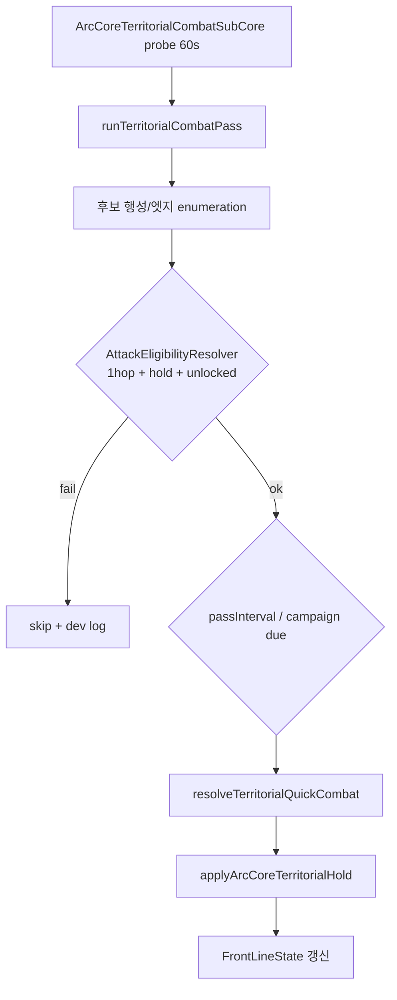

# ArcCore 자동전투 · 은하 전략(노드/라인) 시스템 구조화

> **문서 버전**: v0.1 (분석·설계 정본)  
> **작성**: 2026-06-25  
> **상태**: 분석 완료 · **코드 미착수** (Phase 0~5 로드맵만 확정)  
> **인덱스**: [`docs/strategy/README.md`](./README.md)

---

## 0. 한 줄 요약

**성계 = 노드, `connections` = 이동·공격 라인.** 공격은 **인접 1홉만** 허용(예: 시리우스→드라코 O, 시리우스→베가 X).  
지도 데이터·플레이어 이동은 이미 1홉 규칙을 따르지만, **아크코어 접전 자동전투는 행성 CSV 수동 로테이션**이라 그래프 전술과 **미연동**.  
→ **`GalaxyTacticalGraph` + `AttackEligibilityResolver`** 레이어를 추가하고 `ArcCoreTerritorialCombatSubCore` 앞단에 gate를 두면 **전성계 확장 가능**.

---

## 1. 기획 규칙 (전술 자동화 v1)

### 1-1. 핵심 계약

| # | 규칙 | 설명 |
|---|------|------|
| R1 | **1홉 공격** | `fromSystem`과 `toSystem`이 `StarSystem.connections`에 **직접** 있을 때만 자동 공격 가능 |
| R2 | **스킵 금지** | 2홉 이상 경로(중간 노드 경유)로 **직접 공격 불가** — 중간 거점 점령 후 다음 1홉만 개방 |
| R3 | **출발 거점** | 공격 주체 팩션(BLUE/RED)이 `fromSystem`에 **점유 거점**(`planetHolds`)을 보유해야 함 (정책 CSV로 완화 가능) |
| R4 | **대상 행성** | `toSystem` 내 `occupationCombatEnabled=true` 행성 + territorial policy `enabled=true` |
| R5 | **개방 성계** | `worldStore.unlockedSystemIds`에 포함된 노드만 전투 후보 (synth·일일 개방과 정렬) |
| R6 | **틱·배치** | 실시간 HP/AABS 재배치 금지 — **probe + passInterval**(현행 3600s) 유지 (v4.0 §10·§14) |

### 1-2. 기획 예시 — 동부 전선

**정본 그래프** (`tables/content/systems.csv` → `csvSystems.ts`):

| 성계 id | 표시명 | connections (발췌) |
|---------|--------|-------------------|
| `sirius` | 시리우스 | `draco_nebula`, `perseus`, `crimson_zone` |
| `draco_nebula` | 드라코 성운 | `vega_outpost`, `omega_station`, `perseus` |
| `vega_outpost` | 베가 전초기지 | `arcadia`, `new_eden`, `draco_nebula` |

**시나리오**

| 출발 | 목표 | 홉 | R1 판정 |
|------|------|-----|---------|
| 시리우스(RED) | 드라코 성운(BLUE) | **1** | **공격 가능** |
| 시리우스(RED) | 베가 전초(BLUE) | **2+** (경유: 드라코) | **공격 불가** |
| 드라코(RED 점령 후) | 베가 전초(BLUE) | **1** | **공격 가능** (새 거점 기준) |

**점유 시드** (`planet_occupation_seeds.csv`):

- `sirius_border` — RED, `occupationCombatEnabled=true`, `contestedZone=false`
- `draco_haven` — BLUE, `contestedZone=true`
- `vega_base` — BLUE, `contestedZone=false`

---

## 2. 현재 구현 스냅샷 (2026-06-25)

### 2-1. 이미 1홉 규칙을 쓰는 시스템 ✅

| 시스템 | 파일 | 동작 |
|--------|------|------|
| **플레이어 은하 이동** | `app/(game)/worldmap.tsx` | `reachableIds = current.connections ∩ unlocked` |
| **무역 거리** | `src/arcCore/economy/tradeRouteDistanceProfit.ts` | 성계 그래프 BFS `resolveSystemHopDistance` |
| **월드 확장 frontier** | `src/store/worldStore.ts` | 개방 성계와 **연결된** 잠금 synth 후보 |
| **접전 combatMode 검증** | `src/arcCore/territorial/territorialCombatGraph.ts` | 인접 성계 시드로 `blue_red` / `blue_neutral` / `red_neutral` **추론·검증** |

### 2-2. 아크코어 접전 자동전투 (현행) ⚠️

| 항목 | 내용 |
|------|------|
| **서브코어** | `ArcCoreTerritorialCombatSubCore` — 60s probe → `runTerritorialCombatPass()` |
| **활성 정책** | `arc_core_territorial_combat_policy.csv` **3행성만** `enabled=true` |
| **캠페인** | `draco_front` — `campaignOrder` **수동 CSV 로테이션** (1h당 1행성) |
| **판정** | 가중치 랜덤 + `resolveTerritorialQuickCombat` → `applyArcCoreTerritorialHold` |
| **출발 거점** | **없음** — 행성 단위 추상 전투 |
| **그래프 공격 gate** | **없음** |

**draco_front 활성 행성**

| order | planetId | systemId | combatMode |
|-------|----------|----------|------------|
| 1 | draco_haven | draco_nebula | blue_red |
| 2 | omega_hub | omega_station | blue_neutral |
| 3 | shadow_market | shadow_nexus | red_neutral |

**주의**: 위 3성계는 지도상 **연속 전선 subgraph가 아님**.  
예: `omega_station` ↔ `shadow_nexus` **직접 connection 없음** (`shadow_nexus` ↔ `titan_gate`, `dark_rift`, `abyss`).  
→ 현행 캠페인은 **스토리 시퀀스**에 가깝고, **노드/라인 전술 규칙과 불일치**.

### 2-3. 시리우스 — 정책 갭

- `sirius_border`: occupation seed **RED + combat enabled**
- `arc_core_territorial_combat_policy.csv`: **행 없음** → 자동전투 패스 **미실행**
- 기획상 시리우스→드라코 공격은 **그래프상 가능**하나 **엔진 미연결**

### 2-4. 통합 공격 골격 (inert)

| 파일 | 상태 |
|------|------|
| `src/arcCore/planetAttack/arcCoreAttackModel.ts` | 3종 카테고리 정의 (`inbound_drone`, `orbit_raid`, `transit`) |
| `src/arcCore/subcores/ArcCoreAttackSubCore.ts` | **미등록** — 부트/틱 무영향 |

---

## 3. 갭 매트릭스

| 영역 | 현재 | 목표 | 우선순위 |
|------|------|------|----------|
| 노드·라인 데이터 | `systems.csv` ✅ | 동일 정본 유지 | — |
| 이동 1홉 | worldmap ✅ | 공격 resolver와 **동일 Graph API** | P1 |
| 공격 1홉 | ❌ | `canAutoAttack(from, to, holds)` | **P0** |
| 공격 출발 거점 | ❌ | `fromSystem` + 팩션 hold | **P0** |
| 점령 후 전선 확장 | holds만 있음 | 인접 후보 재계산 | P1 |
| draco_front | CSV 순서 | **subgraph + eligibility** | P2 |
| 전성계(synth) | unlocked frontier | 동일 1홉 + unlock 필터 | P3 |
| ArcCoreAttackSubCore | inert | Territorial 안정 후 디스패치 허브 | P4 |

---

## 4. 목표 아키텍처

### 4-1. 레이어 다이어그램

```text
tables/content/systems.csv (connections)
        │
        ▼
┌───────────────────────────┐
│  GalaxyTacticalGraph      │  O(1) adjacency · optional BFS (reuse tradeRoute)
│  (신규 · shared module)    │
└─────────────┬─────────────┘
              │
planetHolds ──┼──► FrontLineState (per system / optional per edge)
              │
policy CSV ───┼──► AttackEligibilityResolver
              │         │
              │         ▼
              │   runTerritorialCombatPass (gate: eligible edges only)
              │         │
              ▼         ▼
        clanWarFoundationStore (holds · operations)
              │
              ▼
        UI: worldmap lines · news · territorial alerts
```

### 4-2. Mermaid — 패스 흐름



### 4-3. 모듈 배치 (제안)

| 모듈 (신규) | 경로 제안 | 책임 |
|-------------|-----------|------|
| `GalaxyTacticalGraph` | `src/arcCore/tactical/galaxyTacticalGraph.ts` | `listAdjacentSystems`, `areAdjacent`, `shortestHopDistance` |
| `AttackEligibilityResolver` | `src/arcCore/tactical/attackEligibilityResolver.ts` | R1~R5 gate |
| `FrontLineState` | `src/arcCore/tactical/frontLineState.ts` | holds → system faction dominance (derived, bounded) |
| `TacticalAutomationPolicy` | `src/arcCore/tactical/tacticalAutomationPolicy.ts` | CSV index (Table-First) |

**기존 모듈 확장**

| 모듈 | 변경 |
|------|------|
| `territorialCombatGraph.ts` | eligibility 입력용 adjacency **공유** (중복 제거) |
| `runTerritorialCombatPass.ts` | pass 전 `resolveAttackEligibility` gate |
| `ArcCoreAttackSubCore` | Phase 4+ inbound/transit 디스patch (territorial 안정 후) |

---

## 5. Table-First 확장 (안)

### 5-1. 기존 테이블 (유지·확장)

**`tables/balance/planet_occupation_seeds.csv`** — 유지  
- `occupationCombatEnabled`, `contestedZone`, `initialOwner`

**`tables/balance/arc_core_territorial_combat_policy.csv`** — 컬럼 추가 후보

| 신규 컬럼 (안) | 용도 |
|----------------|------|
| `requiresAdjacentFromFaction` | `BLUE`/`RED`/`ANY` — 출발 성계 hold 필요 |
| `allowedAttackerSystemIds` | CSV whitelist (비우면 그래프+hold 자동) |
| `frontId` | 전선 subgraph 그룹 (`east_front`, `draco_front_v2`) |
| `minUnlocked` | `true` — unlocked 성계만 |

### 5-2. 신규 테이블 (안)

**`tables/balance/arc_core_tactical_front_policy.csv`**

| 컬럼 | 예 |
|------|-----|
| frontId | `east_sirius_draco` |
| seedSystemId | `sirius` |
| expansionMode | `adjacent_only` |
| passIntervalSec | 3600 |
| enabled | true |
| notesKo | 동부 변경 전선 |

**`tables/balance/arc_core_tactical_edge_overrides.csv`** (선택)

- 일방통행·이벤트성 예외 (`fromSystemId`, `toSystemId`, `attackAllowed`)

### 5-3. 빌드·감사

```bash
npm run build:balance-tables
# (후속) npm run audit:strategy-graph  # 비인접 정책· unreachable campaign 행 검출
```

---

## 6. draco_front v1 → v2 매핑

| v1 (현재) | v2 (그래프 정렬) 제안 |
|-----------|----------------------|
| draco_haven @ draco_nebula | 유지 — `vega`/`omega`/`perseus`와 1홉 |
| omega_hub @ omega_station | 유지 — draco·new_eden·helios·titan과 1홉 |
| shadow_market @ shadow_nexus | **별도 front** (`north_pvp_front`) 또는 titan_gate 경유 subgraph로 분리 |
| (없음) sirius_border | **east_front** 추가 — sirius→draco eligibility |

### 6-1. draco_front 순차4·5 — 지리 우세(geo-flank) 실 구현 (2026-07-28)

위 표는 v2 **제안**(미구현)이고, 아래는 `arc_core_territorial_combat_policy.csv`에 이미 반영된 **실제** 확장이다 (`task_id=geo-flank-helios-titan-occupation-20260728`).

| 순차 | planetId | systemId | combatMode | dominant | 지리 근거 |
|------|----------|----------|------------|----------|-----------|
| 4 | `helios_core` | `helios` | `blue_neutral` | 70% | `iron_cross`(BLUE 시드)와 1홉 인접 — 블루 측방(플랭크) 거점, 레드 직접 보급 축 약함 |
| 5 | `titan_ruins` | `titan_gate` | `red_neutral` | 70% | `shadow_nexus`(레드 분쟁축, `shadow_market` 시드)와 1홉 인접 — 레드 측방 거점 |

두 행 모두 `omega_hub`/`shadow_market`과 **동일 수치**(passIntervalSec·battleWeightPct·supply 파라미터 등) 복제 — 신규 밸런스 레버 아님, `draco_front` 캠페인 순차 로테이션에 4·5번째로 합류한 것뿐이다. `planetId` TS 하드코딩 분기 없음(정책 CSV의 `combatMode`/`dominantSideWeightPct`로만 우세 표현) — `territorial/geoFlankHeliosTitanOccupation.test.ts`로 회귀 방지.

동적 분쟁지역(`__dynamic_default__` 템플릿, 플레이어 전투 편입)은 정적 멤버 뒤에 순번이 이어 붙는 구조라, 정적 5행(1~5)이 된 지금부터 동적 편입의 첫 슬롯은 **6**부터 시작한다(`seedPlanetOccupationFromBalance.test.ts`에 반영).

### 6-2. 중립 점령 런타임 보급 비대칭 P0 (2026-07-28, `task_id=neutral-adjacency-occupation-priority-20260728`)

**대표님 정본**: 중립 지역에서 노드 1홉에 적국(반대 팩션)이 없으면 인접 팩션 점령 고확률 — **전 중립 범용·최우선(P0)**.

hold가 `NEUTRAL`일 때만 `resolveEffectiveTerritorialCombatMode`(`territorial/resolveEffectiveTerritorialCombatMode.ts`)가 런타임 `supplyAdjacency`(1홉 아군 성계 수)로 CSV `combatMode`를 덮어쓴다 — 블루만 인접 → `blue_neutral` / 레드만 인접 → `red_neutral` / 둘 다 인접 → `blue_red`(접전) / 둘 다 0(고립) → 오버라이드 없음(CSV 그대로). 비중립(BLUE/RED/INDEPENDENT) hold는 이 오버라이드 대상이 아니며 항상 CSV `combatMode` 그대로 간다.

**§6-1 geo-flank CSV 행(helios_core=`blue_neutral`·titan_ruins=`red_neutral`)과 충돌 시 본 절이 우선한다** — 두 행은 여전히 **접전(양쪽 다 인접)이거나 고립(양쪽 다 미인접)** 상황의 보조 폴백으로만 쓰이고, "한쪽만 인접"인 실제 런타임 상황에서는 이 P0가 CSV 값을 덮어쓴다(예: 타이탄 게이트가 블루만 인접이면 CSV가 `red_neutral`이어도 실효 모드는 `blue_neutral`). CSV 행 자체는 수치·combatMode 무단 변경 없음 — `resolveEffectiveTerritorialCombatMode.test.ts` 3/3b번 케이스로 회귀 방지.

### 6-3. 분쟁·점령 스택 실행 정본 (2026-07-28, `task_id=territorial-stack-consistency-opt-20260728`)

전수검증 상세는 `tools/kim-team-lead/reports/TERRITORIAL_STACK_CONSISTENCY_AUDIT_20260728.md` 참조(§2 파이프라인·§4 데드/효율). 아래는 실행 순서 요약(코드 산재 방지용 단일 정본):

```text
runTerritorialCombatPassForPlanet(planetId)
  ① DEV: CSV combatMode vs 시드그래프(정적 참고 경고만·세션당 1회, §3-3 graphMismatchWarnedSystemIds)
  ② INDEPENDENT(플레이어 독립국)? → runIndependentHoldInvasionJudgment 별도 분기
       (P0 인접 오버라이드 비적용 · 주둔 억지 · 보급 최다 적대 팩션만 침공)
  ③ rollDecision(P2) — battle / neutral_declare / status_quo (CSV 가중치, 이 순위가 P0보다 바깥)
  ④ status_quo・neutral_declare → 점유 거의 불변, 종료
  ⑤ battle → effectiveCombatMode = resolveEffectiveTerritorialCombatMode(P0, §6-2, NEUTRAL 한정)
       → blue_neutral/red_neutral: resolveBinaryDominantHoldTarget(dominantSideWeightPct)
       → blue_red: resolveTerritorialQuickCombat(보급 mul) + (분쟁지역만) 전술 역전
       → applyArcCoreTerritorialHold → FrontPressure invalidate(변경 systemId+인접)
```

**우선순위**: P0(중립 인접 비대칭, NEUTRAL 한정) < P1(CSV combatMode/geo-flank, P0 미적용 시 폴백) < **P2(rollDecision이 P0보다 바깥)** < P3(FrontPressure 빈도/보급) < P4(전술 역전, 분쟁지역만). P2가 P0보다 바깥이라는 뜻은 — 중립+블루만 인접이어도 이번 패스가 `status_quo`로 롤되면 점유는 그대로라는 것(감사 §3 "일관성 갭").

---

## 7. Phase 로드맵 (개발 순서)

| Phase | 내용 | 산출물 | 코드 |
|-------|------|--------|------|
| **0** | 본 문서 v0.1 확정 · 예외 규칙(일방통행) 기획 sign-off | 본 MD | 없음 |
| **1** | `GalaxyTacticalGraph` — tradeRoute BFS·worldmap adjacency **단일화** | inert module + unit smoke | 소 |
| **2** | `AttackEligibilityResolver` + 정적 audit | `audit:strategy-graph` | 소~중 |
| **3** | `runTerritorialCombatPass` gate + **sirius→draco** CSV | east_front 시나리오 playable | 중 |
| **4** | `FrontLineState` · 점령 후 인접 후보 갱신 | holds 연동 | 중 |
| **5** | synth/unlocked · daily unlock · galaxy100 동일 규칙 | 전성계 | 중~대 |
| **6** | `ArcCoreAttackSubCore` 등록 — inbound/transit 통합 디스patch | 3종 공격 수렴 | 대 |

**권장 첫 스프린트**: Phase **0~2** (명세 확정 + Graph + Eligibility + audit).  
Territorial pass 본체는 **gate만** 추가 — Skia/전투 렌더 변경 없음.

---

## 8. v4.0 · 운영 제약

| 헌법 | 적용 |
|------|------|
| Table-First | connections·정책 **CSV 정본** — 코드 하드코딩 금지 |
| Local-AI-First | 전술 pass **100% 로컬** ArcCore |
| 일 1회 배치 | AABS/경제와 **분리** — territorial passInterval 유지 |
| 고빈도 tick 금지 | probe 60s OK · pass 내 **zero/low allocation** |
| Firestore | planet_holds 단발 병합만 — 실시간 전선 sync 금지 |
| 계정 초기화 | 전선 진행 = **ArcCore 월드** vs 플레이어 귀속 **분류 후** `purgeLocalAccountData` 등록 |

---

## 9. 파일 맵 (빠른 탐색)

```text
docs/strategy/
  README.md                                          ← 인덱스
  ARC_CORE_TACTICAL_AUTOMATION_AND_GALAXY_STRATEGY.md ← 본 문서

tables/content/
  systems.csv                                        ← nodes + connections

tables/balance/
  planet_occupation_seeds.csv
  arc_core_territorial_combat_policy.csv
  arc_core_territorial_fleet_composition.csv
  (안) arc_core_tactical_front_policy.csv
  (안) arc_core_tactical_edge_overrides.csv

src/arcCore/
  territorial/
    ArcCoreTerritorialCombatSubCore.ts
    runTerritorialCombatPass.ts
    territorialCombatGraph.ts
    arcCoreTerritorialCombatPolicy.ts
    territorialCombatCampaign.ts
  planetAttack/
    arcCoreAttackModel.ts
    ArcCoreAttackSubCore.ts          ← inert
  (안) tactical/
    galaxyTacticalGraph.ts
    attackEligibilityResolver.ts
    frontLineState.ts

src/store/
  clanWarFoundationStore.ts          ← planetHolds · operations
  worldStore.ts                      ← unlockedSystemIds

app/(game)/
  worldmap.tsx                       ← reachableIds (1hop travel)
```

---

## 10. 미완료 / 다음 스프린트 체크리스트

### P0 — 기반 (코드 착수 전)

- [ ] 기획 sign-off: R1~R6 · sirius→draco→vega 시나리오
- [ ] draco_front v2: shadow_nexus 분리 여부 결정
- [ ] `requiresAdjacentFromFaction` CSV 스키마 확정

### P1 — Phase 1~2 구현

- [ ] `GalaxyTacticalGraph` 추출 (tradeRoute + territorialGraph 중복 제거)
- [ ] `AttackEligibilityResolver` + dev-only 위반 로그
- [ ] `tools/strategy-graph-audit/` — 비인접 attacker/target 정책 FAIL

### P2 — Phase 3 연동

- [ ] `runTerritorialCombatPass` eligibility gate
- [ ] `sirius_border` + draco_haven east_front policy 행 추가
- [ ] i18n: `territorial.alert.*` 전선 방향 문구 (선택)

### P3 — 검증

- [ ] 시뮬: RED@sirius → draco pass 발생 · vega pass **미발생**
- [ ] 드라코 RED 점령 후 vega 후보 **개방** (hold mock)
- [ ] `tsc` · `audit:balance-ops` · territorial 3h watch 회귀

---

## 11. 관련 문서

| 문서 | 관계 |
|------|------|
| `docs/MISSION_SYSTEM_HANDOFF.md` | 인스턴스/transit 전투 — `TRANSIT` 공격 카테고리와 후속 통합 |
| `docs/ARC_CORE_ECONOMY_FABRIC.md` | 공격→스탯·무역 — 전선 변화가 fabric signal로 연결 가능 (Phase 5+) |
| `docs/_000_ARCFIRE_PLANET_COMPENDIUM_v1.0_20260619.md` | 행성·성계 Lore · 오메가=블루 후방 거점 등 |
| `.cursor/rules/Arcfire_Master_Spec_v4.0-*.mdc` | ArcCore·Table-First·일일 배치 헌법 |

---

## 12. 변경 이력

| 날짜 | 버전 | 내용 |
|------|------|------|
| 2026-06-25 | v0.1 | 초版 — 노드/라인 1홉 분석 · 갭 · 목표 아키텍처 · Phase 0~6 · draco_front v2 안 |

---

*다음 작업 시 에이전트는 `docs/strategy/README.md` → 본 문서 §10 체크리스트부터 이어서 진행한다.*
