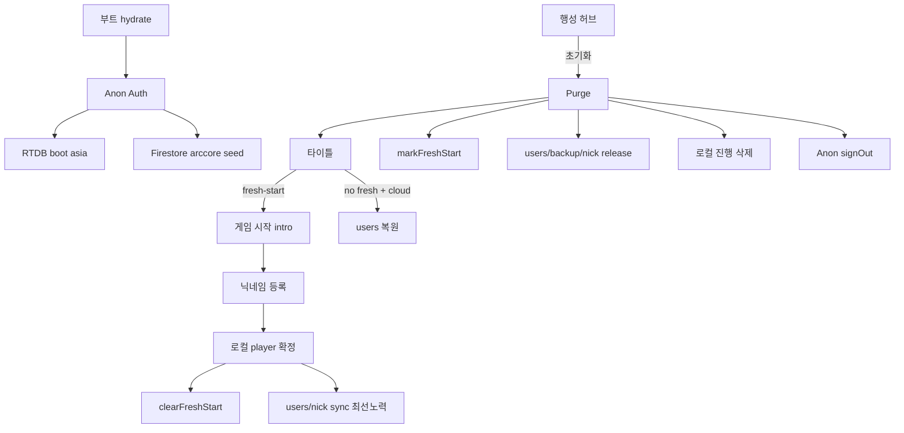

# Firebase × 플레이어 계정 전 생애주기 정밀 재검수 (2026-08-06)

대상: 계정 초기화(purge) Firebase 연동 + 생성·동기·복원·닉네임·RTDB·섀도우.

---

## 0. 이중 신원 모델 (정본)

| 신원 | 키 | 용도 |
|------|-----|------|
| **게임 uid** | `auth.ts` 기기 스코프 (`arcfire_local_auth_v1`) | `users/{uid}` · player · nickname `uidHash` · shadow pair 문서 id |
| **Firebase Auth uid** | Anonymous Auth | rules `request.auth != null` · RTDB `learning/devices/{auth.uid}/dailyKpi` |

- 두 uid는 **의도적으로 다름**. Firestore rules는 Auth 존재만 검사(게임 uid 일치 강제 없음).
- purge 시 게임 uid는 **유지**(기기 고정). Auth만 signOut → 재가입.

---

## 1. 계정 초기화(purge) Firebase 연동 — 순서

`localAccountReset.ts` → `purgeLocalAccountData`

```text
1) cancel cloud sync / backup schedule
2) markFreshStartAfterReset()          ← AsyncStorage 선기록 (강제종료 대비)
3) resolveResetUids(player + local auth) + local-guest
4) [cloud ≤15s race]
     - deleteUserCloudSave(uid…)         ← ensureAnonAuth + deleteDoc
     - purgeAllGameSaveBackups…
     - releaseNicknameReservation…       ← released=true tombstone
5) local stores reset (player/missions/world/…)
6) syncArcCoreGlobalWorldExpansionSync() ← 로컬 월드 축(Firebase 아님)
7) clearArcCoreRtdbDailyKpiPushState()
8) resetFirebaseAnonymousAuthForAccountPurge()  ← signOut (클라우드 작업 후)
```

| 항목 | 판정 | 근거 |
|------|------|------|
| fresh-start 선기록 | **OK** | 타이틀 복원 차단; 새 계정/`clearFreshStart` 때만 해제 |
| 클라우드 15s 상한 | **OK** | 오프라인 무한대기 회귀 방지; SDK 큐잉 전제 |
| Auth signOut 위치 | **OK** | delete/release **이후** — 클라우드 단계 Auth 필요 |
| 닉네임 released | **OK** | 동일 기기 uidHash면 재등록 `own` 가능 |
| 섀도우 페어 유지 | **OK** | §16-A · purge 제외 |
| 월드 금고/수수료 유지 | **OK** | ArcCore 세계 축 |
| 로컬 player null + 타이틀 1회 | **OK** | `isAccountResetInProgress` |

### 초기화 Firebase RISK

| ID | 심각도 | 내용 |
|----|--------|------|
| R1 | **P1** | `sessionBootSyncDone` · `rtdbUnavailableForSession` 가 **프로세스 수명** — purge/재온보딩해도 리셋 안 함. 이전 boot가 `wrong_host`로 session disable이면 **앱 재시작 전** RTDB KPI/boot 재시도 불가. |
| R2 | **P2** | cloud 15s timeout 후 signOut — 미완료 delete는 큐에 남음(설계). 서버 ack 전 강제종료 시 옛 `users/{uid}` 잔존 가능 → **fresh-start가 복원 차단**으로 완화됨. |
| R3 | **P2** | `resolveResetUids`의 `getCurrentUser()`는 **게임 uid**(이름 Auth와 혼동). Firebase Auth uid는 users 키로 안 씀 — 동작 OK, 네이밍만 주의. |

---

## 2. 신규 계정 생성 (온보딩)

`nickname.tsx` → `completePilotRegistration(deviceUid, nick)`

```text
soft check/reserve nickname (5s soft-offline → 로컬 진행)
createPlayer + bootstrap + solo clan + tutorial
persist local + clearFreshStart
schedulePilotCloudSync (offline면 fire-and-forget)
void runArcCoreShadowPairingPass()
```

| 항목 | 판정 |
|------|------|
| 로컬 우선 · 클라우드 실패 비차단 | **OK** (2026-07-19 회귀 방지) |
| soft-offline 닉네임 | **OK** (팝업 차단 제거) |
| fresh-start 해제 시점 | **OK** — 로컬 확정 후 · 클라우드 await 전 |
| 온라인 시 create+sync | **OK** — Auth 게이팅 있음 |

RISK: soft-offline으로 **닉네임 미예약** 상태로 로컬 시작 → 타 기기가 동일 닉 선점 가능(오프라인 샌드박스 계약). 온라인 복귀 `ensureNicknameReservedRetro`가 소급.

---

## 3. 타이틀 클라우드 복원

`app/index.tsx` · `tryRestorePlayerFromCloud`

```text
player==null && bootReady
  → wasFreshStartThisBoot / consumeFreshStartForTitle ?
       YES → 복원 스킵 (게임 시작)
       NO  → cache/server restore → setPlayer
```

| 항목 | 판정 |
|------|------|
| purge 후 복원 차단 | **OK** |
| 플래그 소비만·삭제 안 함 | **OK** (서버 delete 전 재시작 회귀 방지) |
| Auth 후 server get | **OK** |
| 수동 백업 복구 시 clearFreshStart | **OK** (`gameSaveBackupService`) |

---

## 4. 정기 동기 · 백업

| 경로 | Auth | 판정 |
|------|------|------|
| `syncUserDataWithServer` | ensureAnon | **OK** · merge users/{gameUid} |
| `scheduleUserCloudSync` 120s 최소간격 | — | **OK** · GC/요금 |
| `cancelScheduled*` on purge | — | **OK** |
| game_save_backups purge | ensureAnon | **OK** · non-cascade 보완 |

---

## 5. RTDB (asia 수정 후)

| 항목 | 상태 |
|------|------|
| URL 정본 | asia `ARCORE_RTDB_DATABASE_URL` + `getDatabase(app, url)` |
| google-services | asia로 동기화(네이티브 재빌드 권장) |
| boot Auth 선행 | `_layout` Auth await → RTDB (**타이틀 비차단**) |
| KPI path | `learning/devices/{**authUid**}/dailyKpi` — rules와 일치 |
| purge 시 KPI day 키 clear | **OK** |

잔여: **R1** 세션 플래그 purge 미리셋.

---

## 6. 프로세스 맵 (요약)



---

## 7. 종합 판정

| 영역 | 판정 |
|------|------|
| purge Firebase 연동 순서·계약 | **구조 OK** |
| fresh-start ↔ 복원 | **OK** |
| 이중 uid 설계 | **OK** (의도) |
| 온보딩 로컬 우선 | **OK** |
| RTDB URL 정합 | **수정 반영됨** (JS 명시 URL; 네이티브 재빌드 권장) |
| 세션 RTDB 플래그 × purge | **P1 RISK** — 재검수 잔여 |

### 후속 반영 (2026-08-06 · 대표님 「진행하라」)

1. `resetArcCoreRtdbBootSyncSessionForAccountPurge` + `scheduleArcCoreRtdbBootSyncAfterAccountPurge`
2. purge 끝(signOut 후) 백그라운드 RTDB boot 재시도
3. `wrong_host`/`timeout`은 세션 영구 disable 하지 않음(`not_configured`만 잠금)
4. 네이티브 재빌드(`google-services.json` asia) — 배포 시 권장(JS `getDatabase(url)`만으로도 RTDB 동작)
